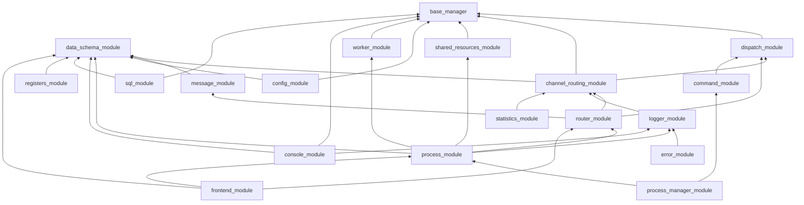

# Multiprocess Framework — Техническая спецификация (SPEC)

**Версия:** 2.0
**Обновлено:** 2026-04-25
**Статус:** Production
**Назначение документа:** Единый источник истины. Императивная спецификация фреймворка, по которой можно повторно его реализовать.

> **Связанные документы**
> - [`MODULES_OVERVIEW.md`](docs/MODULES_OVERVIEW.md) — навигатор по модулям («что из чего собирать»)
> - [`MODULE_CONTRACTS.md`](docs/MODULE_CONTRACTS.md) — контракт каждого модуля (API + инварианты)
> - [`INTERACTION_FLOWS.md`](docs/INTERACTION_FLOWS.md) — цепочки взаимодействия (lifecycle, IPC)
> - [`DESIGN_RULES.md`](docs/DESIGN_RULES.md) — императивные правила (что обязательно / что запрещено)
> - [`GLOSSARY.md`](docs/GLOSSARY.md) — термины
> - [`MODULES_STATUS.md`](MODULES_STATUS.md) — таблица модулей: размер, статус, тесты
> - [`PROBLEMS.md`](PROBLEMS.md) — известные ограничения
> - [`DECISIONS.md`](DECISIONS.md) — полный реестр ADR

---

## 1. Идея

Multiprocess Framework — **конструктор многопроцессных приложений на Python**.

Фреймворк скрывает многопроцессорную «боль» Python: spawn/fork, pickle-safe сериализацию под Windows, жизненный цикл процессов, health-check, graceful shutdown, IPC, маршрутизацию, наблюдаемость, интеграцию с внешними системами. Разработчику приложения остаётся:

1. **Описать регистры** — `SchemaBase`-наследники с `FieldMeta` + `FieldRouting`.
2. **Описать конфиги** процессов и менеджеров — те же `SchemaBase`.
3. **Реализовать процессы** — наследники `ProcessModule` с воркерами под прикладную логику.
4. **Подключить готовые «детали»** — `sql_module`, `logger_module`, `frontend_module`, `console_module`, и т.д.

**Миссия в одной фразе:** *Расширить Python до уровня C++ в части многопроцессорности и системной интеграции, ускорив (а не замедлив) разработку — за счёт конструктора и регистр-ориентированной модели как единого источника истины.*

Каждое архитектурное решение проверяется вопросом: *«упрощает ли это жизнь разработчику приложения, или это ещё одна абстракция внутрь фреймворка?»*

---

## 2. Сквозные инварианты

Действуют во всех модулях. Любое отклонение фиксируется как ADR.

| # | Инвариант | Обоснование |
|---|-----------|-------------|
| **I-1** | **Dict at Boundary.** Между процессами передаются только `dict` (`schema.model_dump()`). Pydantic — внутри процесса. | Pickle-safe для Windows spawn; единый сериализатор; декаплинг |
| **I-2** | **Регистры — единый источник истины.** Поле декларируется один раз через `SchemaBase` + `FieldMeta` + `FieldRouting`. UI, валидация, дефолты, маршруты — выводятся отсюда. | Нет дублирования между frontend и backend |
| **I-3** | **Каноничные импорты.** Внутри фреймворка — только `from multiprocess_framework.modules.<X> import Y`. Никаких top-level алиасов, `sys.path.insert`, `pythonpath`-хаков. | Установка через `pip install -e`; работает корневой фасад; нет двойной адресации |
| **I-4** | **`interfaces.py` — единственный публичный контракт.** Потребители зависят от `Protocol`/`ABC`, не от конкретных реализаций. | DI, моки, замена реализации |
| **I-5** | **Все менеджеры наследуют `BaseManager + ObservableMixin`.** Логи/метрики/ошибки идут через `_log_*`, `_record_*`, `_track_*`. | Единый стиль наблюдаемости; нет `print` и прямого `logging` |
| **I-6** | **Канал ≠ имя процесса.** `targets` (имя процесса) и `FieldRouting.channel` (канал Router) — разные сущности. См. [`docs/ROUTING_GLOSSARY.md`](docs/ROUTING_GLOSSARY.md). | Маршрутизация двухуровневая: «куда» (процесс) + «по какому каналу» |
| **I-7** | **Pickle-safe для spawn.** Любой объект, уходящий в `Queue`/`SharedResourcesManager`, проверен на сериализацию под Windows spawn. Лямбды и closures запрещены в payload. | Кросс-платформенность |
| **I-8** | **Graceful shutdown без `sys.exit()`.** Сигналы (`SIGINT`/`SIGTERM`) только устанавливают `stop_event`. Процессы выходят сами; принудительный `terminate()` → `kill()` — fallback с таймаутом. | Целостность данных при остановке |
| **I-9** | **Логирование путей через env.** `MULTIPROCESS_LOG_DIR` / `INSPECTOR_LOG_DIR`, не cwd-relative. | Корректное поведение в дочерних процессах с разным cwd |
| **I-10** | **Регистры — в прикладном коде, не во фреймворке.** Фреймворк даёт примитивы (`SchemaBase`, `FieldRouting`, `RouterManager`); приложение собирает регистры под свою предметную область. | Философия конструктора |
| **I-11** | **Backward compatibility удаляется без жалости в рамках рефакторинга.** Алиасы и shim'ы не держим — потребители мигрируются синхронно. | Чистота; меньше путей для одного и того же |

---

## 3. Слои архитектуры

19 модулей сгруппированы по слоям снизу вверх. Внутри слоя модули независимы или зависят только от нижележащих слоёв.

| Слой | Модули | Роль |
|------|--------|------|
| **L1. Foundation** | `base_manager`, `data_schema_module` | Базовые примитивы: `BaseManager`, `ObservableMixin`, `SchemaBase`, `FieldMeta`, `FieldRouting`, `SchemaRegistry` |
| **L2. Routing primitives** | `dispatch_module`, `channel_routing_module` | Маршрутизация ключ → handler (4 стратегии) и CRM как базовый класс канальных менеджеров |
| **L3. Messaging** | `message_module`, `router_module` | `Message` (Dict at Boundary) и `RouterManager` поверх CRM |
| **L4. Observability** | `logger_module`, `error_module`, `statistics_module` | Наследники CRM с каналами (файл, консоль, prometheus, UI) |
| **L5. Resources & Config** | `shared_resources_module`, `config_module` | Pickle-safe SRM (Queue/Event/SharedMemory + ConfigStore) и runtime-конфиги |
| **L6. Command & Work** | `command_module`, `worker_module` | Команды поверх dispatch и потоки-воркеры внутри процесса |
| **L7. Process** | `process_module`, `console_module` | `ProcessModule` — база дочернего процесса; `ConsoleManager` — терминальный I/O |
| **L8. Orchestration** | `process_manager_module` | `SystemLauncher`, `ProcessManagerProcess`, `ProcessRegistry`, `ProcessMonitor` |
| **L9. Storage** | `sql_module` | SQL-инструментарий (DDL, QuerySet, UoW, Repository) |
| **L10. Application kit** | `registers_module` | Runtime вокруг экземпляров регистров: pub/sub, dispatch, routing map |
| **L11. UI (опционально)** | `frontend_module` | PySide6-виджеты с привязкой к регистрам |

Подробное описание каждого модуля — в [`MODULES_OVERVIEW.md`](docs/MODULES_OVERVIEW.md) и `modules/<name>/README.md`.

---

## 4. Граф зависимостей



**Правило:** стрелка «зависит от» направлена только снизу вверх по слоям. Циклы запрещены.

---

## 5. Жизненный цикл приложения

Три фазы: **Запуск → Работа → Завершение**. Полные mermaid-диаграммы — в [`INTERACTION_FLOWS.md`](docs/INTERACTION_FLOWS.md).

### 5.1 Запуск

```
Пользовательский main.py
    │
    ├─ SystemLauncher()                         [Пульт]
    │   ├─ .add_process(name, dict)             Dict at Boundary
    │   └─ .run()                                blocking
    │       │
    │       ▼
    │   ProcessSpawner                          [Стартер]
    │       ├─ создаёт SharedResourcesManager   общая память
    │       ├─ запускает Process(ProcessManagerProcess)
    │       └─ ставит signal handlers (SIGINT/SIGTERM)
    │           │
    │           ▼
    │       ProcessManagerProcess               [Оркестратор]
    │       наследник ProcessModule
    │           ├─ ProcessRegistry              реестр процессов + per-process stop_event
    │           ├─ ProcessMonitor               heartbeat + state broadcast
    │           ├─ ProcessPriority              приоритеты ОС
    │           └─ Built-in commands            process.start/stop/restart, system.shutdown
    │           │
    │           ▼
    │       Для каждого пользовательского процесса:
    │           ├─ SRM.register_process(name, config)    очереди + события + ConfigStore
    │           ├─ build_bundle(...)                      pickle-safe dict
    │           └─ Process(run_process_function, bundle)  дочерний процесс
    │               │
    │               ▼
    │           run_process_function (top-level, pickle-safe)
    │               ├─ _build_shared_resources_from_bundle()
    │               ├─ _load_process_class(class_path)
    │               ├─ ProcessClass(name, srm, config)
    │               ├─ process.initialize()
    │               ├─ process.run()  ← основной цикл
    │               └─ process.shutdown()
```

### 5.2 Работа

Каждый дочерний процесс — `ProcessModule` с подсистемами:

```
ProcessModule
    ├── WorkerManager        потоки-воркеры (LOOP/TASK)
    ├── RouterManager        IPC: send / receive / channels
    ├── CommandManager       handle_command(msg) → handler
    ├── LoggerManager        scope-based логи
    ├── ErrorManager         severity-based ошибки
    ├── StatsManager         метрики
    └── ConsoleManager       (опционально) терминал
```

Поток сообщения между процессами:

```
Process A: msg = adapter.command(targets=["B"], command="x", args={...})
           ↓ msg.to_dict()
           RouterManager.send() → AsyncSender → middleware → channel.send() → Queue
           ↓
Process B: AsyncReceiver.poll() → middleware → message_dispatcher
           ↓
           Message.from_dict() → CommandManager.handle_command(msg)
           ↓
           handler(msg["args"]) → optional response
```

### 5.3 Graceful shutdown

```
SIGINT/SIGTERM
    ↓
ProcessSpawner._signal_handler()  (НЕ sys.exit; только set stop_event)
    ↓
ProcessManagerProcess.shutdown()
    ├─ ProcessMonitor.stop()
    ├─ ProcessRegistry.stop_all(timeout=5)
    │   └─ для каждого: stop_event.set() → join → terminate → kill
    ├─ ConsoleManager.shutdown()
    └─ super().shutdown()  (Workers, Router, Logger)
```

При зависшем процессе — два таймаута + `kill()`. Гарантия: система закрывается за 5–10 сек.

---

## 6. Контракт IPC (Dict at Boundary)

### 6.1 Каноничный способ создания сообщения

```python
# В прикладном процессе:
self.msg.command(
    targets=["detector"],
    command="detect",
    args={"frame_id": 42},
)
# → внутренне: Message-объект (Pydantic SchemaBase)
# → на границе: msg.to_dict() — plain dict с ключами
#   id, type, sender, targets, channel, priority, ts, data
```

### 6.2 Типы сообщений

| `MessageType` | Назначение | Кто слушает |
|---|---|---|
| `COMMAND` | Команда другому процессу | `CommandManager` целевого процесса |
| `LOG` | Строка лога | `LoggerManager` |
| `EVENT` | Pub/sub событие | Зарегистрированные handlers |
| `BROADCAST` | Рассылка всем | Все процессы |
| `DATA` | Поток данных (кадры, метрики) | Прикладной handler |
| `REQUEST` / `RESPONSE` | Синхронный запрос/ответ с `correlation_id` | Парный handler |
| `SYSTEM` | Системное (process.start/stop/restart) | `ProcessManagerProcess` |

### 6.3 Обязательные поля dict

```python
{
    "id": str,                # uuid4
    "type": str,              # MessageType.value
    "sender": str,            # имя процесса-отправителя
    "targets": list[str],     # имена процессов-получателей (или [])
    "channel": str | None,    # FieldRouting.channel или явный
    "priority": int,          # 0 (low) .. 10 (urgent)
    "ts": float,              # time.time()
    "data": dict,             # полезная нагрузка
}
```

### 6.4 FieldRouting

Описание поля в регистре с автоматической доставкой:

```python
class CameraRegister(SchemaBase):
    fps: Annotated[int, FieldMeta(
        description="Частота кадров",
        min_value=1, max_value=60,
        routing=FieldRouting(
            channel="camera_settings",
            process_targets=["camera"],
        ),
    )] = 30
```

При `set_field_value("CameraRegister", "fps", 60)` `RegistersManager` автоматически создаёт `Message(channel="camera_settings", targets=["camera"])` и отправляет через `RouterManager`.

---

## 7. Публичный API (что экспортируется с корня)

```python
import multiprocess_framework as mf
```

49 символов в `__all__`. Сгруппированы по слоям:

| Слой | Экспорт |
|------|---------|
| Foundation | `BaseAdapter`, `BaseManager`, `ObservableMixin`, `SchemaBase`, `FieldMeta`, `FieldRouting`, `process`, `Message`, `MessageAdapter`, `MessageType` |
| Routing | `ChannelRoutingManager`, `Dispatcher`, `DispatchStrategy`, `HandlerInfo`, `Scenario`, `ScenarioBuilder` |
| Messaging | `RouterManager` |
| Observability | `LoggerManager`, `LoggerManagerConfig`, `get_logger`, `ErrorManager`, `StatsManager` |
| Resources & Config | `ConfigManager`, `EventManager`, `EventType`, `ProcessData`, `ProcessDataKeys`, `QueueRegistry`, `SharedResourcesManager` |
| Command & Work | `CommandManager`, `ThreadConfig`, `ThreadPriority`, `WorkerManager`, `WorkerStatus` |
| Process | `ConsoleManager`, `ProcessModule` |
| Orchestration | `SystemLauncher`, `ProcessManagerProcess`, `ProcessRegistry`, `ProcessMonitor`, `ProcessPriority`, `ProcessStatus`, `ProcessSpawner`, `ProcessSchemaAdapter`, `ISystemLauncher`, `IProcessManagerProcess`, `IProcessRegistry` |
| Application kit | `RegistersManager` |

---

## 8. Минимальный пример приложения

```python
# my_app.py
from multiprocess_framework import (
    SystemLauncher, ProcessModule, SchemaBase, FieldMeta, ThreadConfig,
)


class HelloProcess(ProcessModule):
    def initialize(self) -> bool:
        self.create_worker(
            "ticker", self._tick, ThreadConfig(), auto_start=True
        )
        return True

    def _tick(self, stop_event, pause_event):
        n = 0
        while not stop_event.is_set():
            self.log_info(f"tick {n}")
            n += 1
            stop_event.wait(timeout=1.0)

    def shutdown(self) -> bool:
        return True


if __name__ == "__main__":
    launcher = SystemLauncher(processes=[
        ("hello", {
            "class_path": "my_app.HelloProcess",
            "config": {},
        }),
    ])
    launcher.run()
```

---

## 9. Что обязательно знать перед расширением

1. Прочитать [`DESIGN_RULES.md`](docs/DESIGN_RULES.md) — императивные правила (что обязано / что запрещено).
2. Прочитать [`MODULES_OVERVIEW.md`](docs/MODULES_OVERVIEW.md) — найти модуль для своей задачи.
3. Открыть `modules/<выбранный_модуль>/README.md` — детальный API.
4. При архитектурном решении — добавить ADR в локальный `modules/<X>/DECISIONS.md` (с кодом `ADR-<КОД>-NNN`) и зарегистрировать в [`docs/ADR_REGISTRY.md`](docs/ADR_REGISTRY.md).

---

## 10. Версионирование и совместимость

- Версия пакета — `multiprocess_framework.__version__` (`2.0.0`).
- В рамках Phase 1 рефакторинга **не держим** алиасы, depricated-методы, шим-модули.
- Внешние потребители (приложения на фреймворке) мигрируются синхронно с фреймворком.
- Установка — `pip install -e <проект>` (editable). После этого фреймворк доступен как:

```python
from multiprocess_framework import SystemLauncher          # каноничный путь
from multiprocess_framework.modules.data_schema_module import SchemaBase  # тоже OK
```

`from data_schema_module import ...` (без префикса) — **запрещён**.

---

## 11. Тестирование

```bash
 && python scripts/run_framework_tests.py
```

Ожидаемый результат: **1 877 passed / 30 skipped / 2 known-failing** (см. [`PROBLEMS.md`](PROBLEMS.md)).

Все импорты в тестах — каноничные. `pytest.ini` в `modules/` оставлен как точка сбора `testpaths`; никаких `pythonpath = .` хаков.
