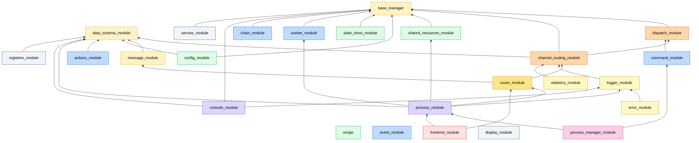
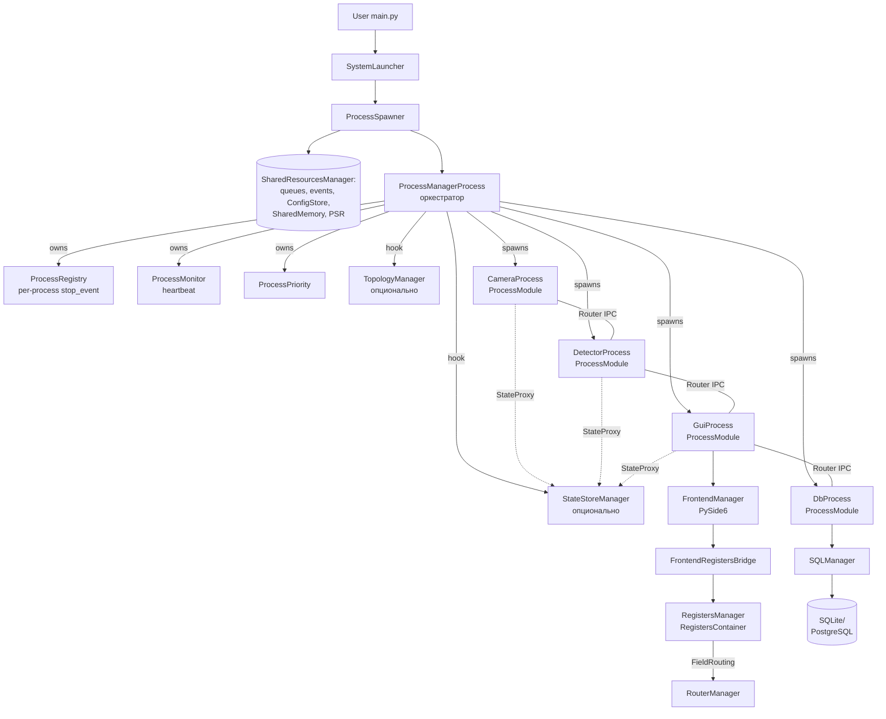
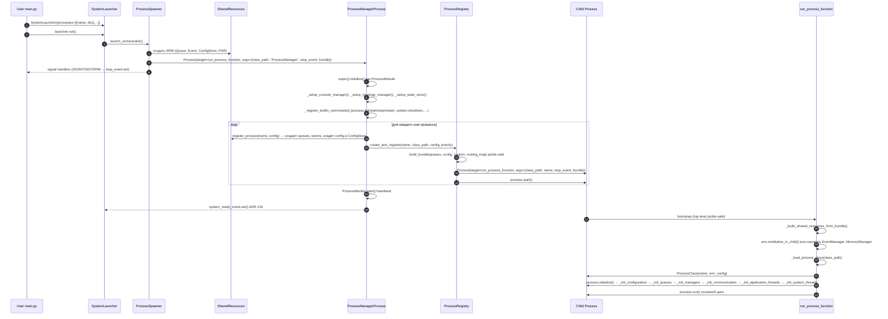
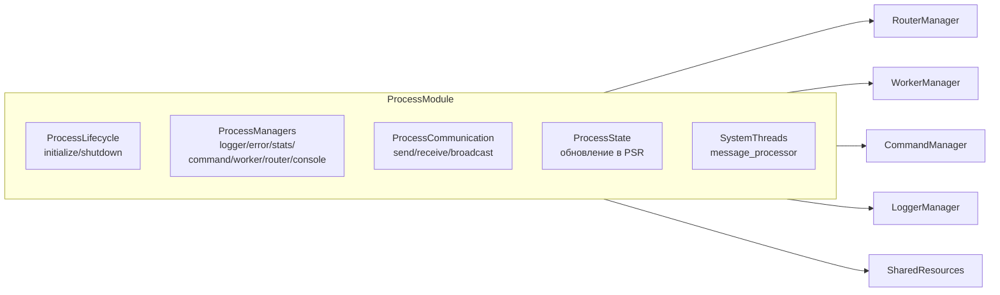
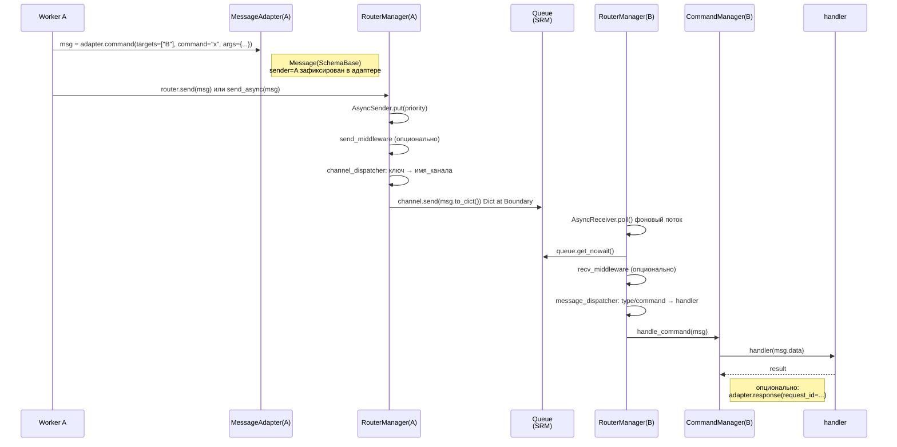
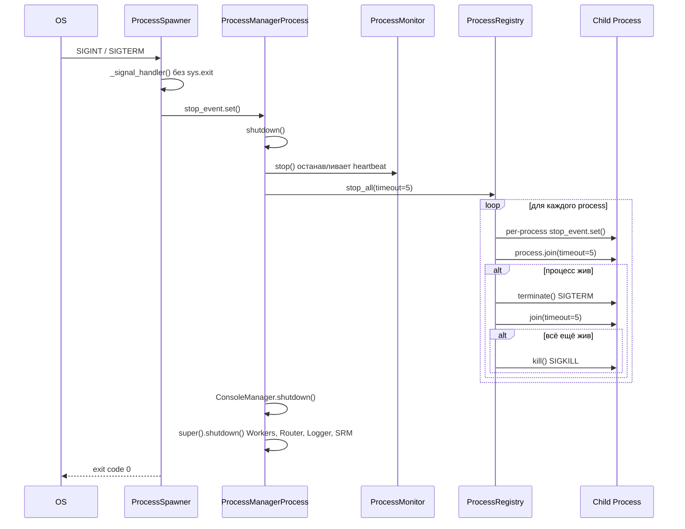

# Constructor Blueprint — Конструктор многопроцессных приложений

**Версия:** 2.3 · **Обновлено:** 2026-07-12 (C8 docs-sync: добавлен `recipe`, счётчик 24 → 25) · **Статус:** Production · **Аудитория:** разработчики и агенты, которые собирают приложения на фреймворке.

> **Цель документа.** Дать сквозную интеграционную карту: 25 модулей = 25 «компонентов», как у компьютера. Пользуясь этим документом, разработчик или агент должен уметь собрать многопроцессное приложение средней сложности (3–10 процессов, GUI, БД, IPC, регистры) без глубокого погружения в реализации. Границы ответственности (чтобы не дублировать) — [`MODULES_RESPONSIBILITY_MAP.md`](MODULES_RESPONSIBILITY_MAP.md).
>
> **Что это документ — нет.** Не API-справочник (см. `modules/<X>/README.md`), не реестр ADR (см. `DECISIONS.md` + `docs/ADR_REGISTRY.md`), не tutorial (см. `docs/QUICK_START.md`). Это **схема сборки**.

---

## 0. Аналогия с ПК (компьютером)

Фреймворк проектировался как **конструктор электронных компонентов**. Поэтому 25 модулей раскладываются на роли, знакомые любому, кто собирал ПК:

| Роль в ПК | Модуль фреймворка | Что делает |
|---|---|---|
| **Материнская плата** | `base_manager` | Несущий контур — `BaseManager` (lifecycle), `ObservableMixin` (наблюдаемость), `BaseAdapter`. Любой «чип» крепится сюда. |
| **Чертежи / спецификация компонентов** | `data_schema_module` | Декларативное описание данных (`SchemaBase` + `FieldMeta` + `FieldRouting`). Для каждого регистра — пин-аут + допустимые напряжения + куда роутить сигнал. |
| **Шина данных + протокол** | `message_module` + `dispatch_module` | `Message` — кадр на шине (Dict at Boundary), `Dispatcher` — арбитр «кому достанется этот пакет». 4 стратегии (EXACT/PATTERN/FALLBACK/CHAIN). |
| **Северный мост** (общая шина каналов) | `channel_routing_module` (CRM) | Базовый класс канальных менеджеров. Один на четверых: Logger / Router / Stats / Error реализуют его. |
| **Сетевая карта (NIC)** | `router_module` | `RouterManager` — IPC между процессами. AsyncSender (PriorityQueue + поток) на исходящих, AsyncReceiver на входящих, два dispatcher'а: `channel_dispatcher` (куда писать) и `message_dispatcher` (кто обработает). |
| **Логгер событий + S.M.A.R.T.** | `logger_module` + `error_module` + `statistics_module` | Scope-based логи, severity-based ошибки, метрики (counter / gauge / timing / histogram). Все — наследники CRM. |
| **Оперативная память (RAM, между процессами)** | `shared_resources_module` (SRM) | `Queue`, `Event`, `SharedMemory`, `ConfigStore`. Pickle-safe для Windows spawn. `ProcessHandle` — chainable доступ: `srm.for_process("cam").queue("data").send(msg)`. |
| **BIOS / реестр настроек** | `config_module` | Runtime-конфиги: dot-notation, подписки, env-fallback, sync через `ConfigStore`. |
| **Дерево состояния системы (видимое всем)** | `state_store_module` | Централизованный реактивный стор: server в `ProcessManagerProcess`, клиенты (`StateProxy`) в каждом процессе. Дельта-рассылка по glob-паттернам. |
| **BIOS-профили (сохранённые настройки)** | `recipe` | Крыша над рецептами: `RecipeEngine` (snapshot/restore config-ветвей), `RecipeManager` (CRUD + `state.recipes.active`), реестр step-миграций (`@migration`/`run_chain`), generic comment-preserving YAML-writer (`yaml_io`). Доменных схем не знает — пути и сами шаги-миграции инжектируются приложением. Leaf (stdlib + pyyaml). |
| **Шина событий-уведомлений (in-proc)** | `event_module` | `EventBus` — синхронный typed pub/sub «фактов» (`publish(event)` → подписчики по `type(event)`). Внутрипроцессная ось «что произошло». Не путать с межпроцессным `EventManager` (в SRM) и с командами (`command_module`). |
| **Контроллер прерываний (синхронный)** | `command_module` | Тонкий фасад над dispatch: `register_command("name", handler)` + `handle_command(msg)`. Sync by design — async буфер уже выше через Router. |
| **Журнал операций с откатом (Undo/Redo)** | `actions_module` | `ActionBus` — отменяемые мутации регистров из GUI: undo/redo-стеки, coalescing, опц. журнал. Ось «действие с откатом» ≠ IPC-команда. Не требует PySide6. |
| **Планировщик потоков (внутри CPU-ядра)** | `worker_module` | Lifecycle потоков-воркеров: LOOP / TASK режимы, auto-restart, паузы. |
| **Конвейер обработки (DAG)** | `chain_module` | Pipeline-движок: `ChainRunnable` (sequential), `DagRunnable` (graph), `ParallelChainRunnable` (бандлы), `WorkerPoolDispatcher` (cross-process IPC). Не зависит от других модулей. |
| **CPU (ядро)** | `process_module` | `ProcessModule` — база дочернего процесса. Композиция: `ProcessLifecycle` + `ProcessManagers` + `ProcessCommunication` + `ProcessState` + `SystemThreads`. Здесь живут все воркеры приложения. |
| **Терминал / клавиатура** | `console_module` | Терминальный I/O: passive (показ окна), active (команды), God Mode (interactive stdin → CommandManager). |
| **Северный мост + чипсет управления** | `process_manager_module` | `SystemLauncher` (точка входа, Dict at Boundary), `ProcessSpawner` (старт OS-процесса оркестратора + signal handlers), `ProcessManagerProcess` (оркестратор-процесс, наследник `ProcessModule`), `ProcessRegistry` (per-process stop_event), `ProcessMonitor` (heartbeat), `topology/blueprint.py` (`SystemBlueprint`/`ProcessConfig`/`Wire` — схема топологии всей системы, ADR-PMM-016; `infer_missing_inspectors()` — структурный вывод join/inspector из wires, ADR-PMM-017). |
| **Диспетчер устройств (Device Manager)** | `service_module` | `ServiceRegistry` — реестр long-running сервисов (камеры, БД, auth) с lifecycle-автоматом `UNREGISTERED→READY→RUNNING→STOPPED→ERROR`. `@register_service`, `discover(*dirs)`. Без hot-reload (в отличие от `PluginRegistry`). |
| **Реестр видеовыходов (framebuffer-каналы)** | `display_module` | `DisplayRegistry` — декларативный blueprint именованных SHM-каналов кадров (YAML persist). Сами SHM-сегменты создаёт SRM при старте. Generic, без vision-семантики. |
| **Накопитель (HDD/SSD) + ФС** → вынесен | `Services/sql` | *Не во фреймворке (Phase 4.1):* `from Services.sql import SQLManager` — DDL из `SchemaBase`, `QuerySet`, `UnitOfWork`, экспорт. |
| **Связь регистров с приложением (драйверы)** | `registers_module` | Runtime вокруг **именованных экземпляров** регистров: pub/sub полей, `set_field_value()` с fan-out по `FieldRouting`, `build_routing_map()`. |
| **Дисплей + GUI-периферия** | `frontend_module` | PySide6-виджеты с привязкой к регистрам через `FrontendRegistersBridge`. Координаторы, контекст, конфиг рядом с виджетом. |

**Идея конструктора одной фразой:** разработчик приложения не изобретает «как соединить процессы» — он берёт готовые модули, описывает регистры (чертёж), наследует `ProcessModule`, описывает воркеры (LOOP/TASK), и получает работающую систему с IPC, наблюдаемостью, graceful shutdown и cross-platform pickle-safety.

---

## 1. Полная карта (25 модулей, 12 слоёв)



> `event_module`, `display_module` и `recipe` — leaf-узлы (stdlib/pyyaml, без зависимостей от других модулей фреймворка) — на графе стоят обособленно. `recipe` типизирует store через `StoreProtocol` и **не импортирует** `state_store_module` (нет цикла), поэтому висит в L5 без входящих стрелок. `sql_module` из графа убран: вынесен в `Services/sql` (Phase 4.1), см. таблицу выше и [`Services/STATUS.md`](../../Services/STATUS.md).

**Правило стрелок.** Зависимость идёт **только снизу вверх** по слоям. Циклы запрещены и проверены. Внутри слоя модули независимы или зависят только от модулей более низкого слоя.

---

## 2. Эталонная сборка приложения (Reference Stack)

Минимальное многопроцессное приложение с GUI, регистрами, БД и инспекцией кадров (≈ Inspector_bottles v3) собирается как электросхема:



**Что мы собрали:**

- **«Корпус и БП»** — `SystemLauncher` + `ProcessSpawner`: точка входа и сигналы.
- **«Материнская плата»** — оркестратор `ProcessManagerProcess` (он же — обычный `ProcessModule`, но со встроенным `ProcessRegistry` + `ProcessMonitor`).
- **«ОЗУ + системная шина»** — `SharedResourcesManager` (Queue, Event, SharedMemory, ConfigStore) + `RouterManager` в каждом процессе.
- **«Глобальное состояние»** (опционально) — `StateStoreManager` (server в оркестраторе) + `StateProxy` (client в каждом процессе).
- **«CPU-ядра»** — `CameraProcess`, `DetectorProcess`, `GuiProcess`, `DbProcess` — наследники `ProcessModule`.
- **«Драйверы регистров»** — `RegistersManager` поверх `RegistersContainer` (хранение из `data_schema_module`).
- **«Дисплей»** — `FrontendManager` (PySide6) + `FrontendRegistersBridge`.
- **«Накопитель»** — `SQLManager` поверх `SchemaBase`.

Подробный пример кода — в `docs/QUICK_START.md`. Этот документ показывает **топологию**.

---

## 3. Жизненный цикл (lifecycle) — три фазы

### Фаза 1. Запуск



**Узловые моменты.**
1. `SystemLauncher` принимает только `dict` (Dict at Boundary). Это **граница**: всё, что в неё вошло, должно быть pickle-safe.
2. `ProcessSpawner` — минимален (ADR-PM-002): только SRM + signal handlers. Логгер/конфиг/ошибки создаются уже внутри `ProcessManagerProcess` как обычные подсистемы `ProcessModule`.
3. `bundle` (ADR-PM-003) — формализованный pickle-safe `dict` с `queues`, `config`, `custom`, `routing_map`. Контракт описан в `process_manager_module/launcher/bundle_contract.py`.
4. `run_process_function` — **top-level функция**, не метод. Только так она pickle-safe для Windows spawn.
5. `system_ready_event` (ADR-116) — выставляется PMP в конце `initialize()`. `SystemLauncher.wait_until_ready(timeout)` ждёт его, чтобы пользователь мог synchronously дождаться готовности системы.

### Фаза 2. Работа

Внутри каждого `ProcessModule`:



**Поток сообщения** (Process A → Process B):



**Двухуровневая диспетчеризация на стороне B:**
- `RouterManager.message_dispatcher` — по полю `type` (или `command` для COMMAND). Раздаёт по типу сообщения.
- `CommandManager.dispatcher` — по полю `command`. Раздаёт конкретный обработчик.

### Фаза 3. Завершение



**Гарантия.** Система закрывается за 5–10 секунд даже при зависании одного процесса (двойной таймаут + `kill()`).

---

## 4. Восемь ключевых паттернов фреймворка

| # | Паттерн | Где живёт | Идея |
|---|---------|-----------|------|
| 1 | **Dict at Boundary** | везде, где пересекается граница процесса | На границе — только `dict`. Pydantic — только внутри процесса. Pickle-safe для Windows spawn. |
| 2 | **CRM (ChannelRoutingManager)** | базовый класс четверых: Logger, Router, Stats, Error | `_channel_registry` + `_dispatcher` + `IBufferStrategy` — пишется один раз, переиспользуется четырьмя. |
| 3 | **`BaseManager + ObservableMixin`** | каждый менеджер | Lifecycle (`initialize/shutdown`) + наблюдаемость (`_log_*`, `_record_*`, `_track_*`) одной декларацией наследования. |
| 4 | **FieldRouting** | `data_schema_module` + `RegistersManager` + `RouterManager` | Поле декларируется один раз: тип + UI-метаданные + дефолт + маршрут между процессами. Изменение поля → автоматический fan-out. |
| 5 | **Per-process stop_event** | `ProcessRegistry` (ADR-PM-001) | Для каждого процесса — свой `multiprocessing.Event`. Остановка одного не задевает других. |
| 6 | **Bundle Contract** | `process_manager_module/launcher/bundle_contract.py` (ADR-PM-003) | Pickle-safe формализованный dict для дочернего процесса. Валидируется перед spawn'ом. |
| 7 | **Unified ProcessStatus** | `base_manager/types/process_status.py` (ADR-117) | Один `Enum` на всех. Раньше было 3 копии — устранено. |
| 8 | **Регистр vs State Store** | `registers_module` / `state_store_module` (ADR-RM-006) | Именованная схема + FieldRouting → регистр. Динамическое дерево + glob + delta-IPC → state store. Не взаимозаменяемы. |

---

## 5. Точка входа: что обязан описать разработчик приложения

Чтобы собрать приложение на фреймворке, разработчик описывает **четыре вещи**:

### 5.1 Регистры (чертёж данных)

```python
from typing import Annotated
from multiprocess_framework import SchemaBase, FieldMeta, FieldRouting

class CameraRegister(SchemaBase):
    fps: Annotated[int, FieldMeta(
        description="Частота кадров",
        min=1, max=60,
        routing=FieldRouting(
            channel="camera_settings",
            process_targets=("camera",),
        ),
    )] = 30

    exposure_us: Annotated[int, FieldMeta(
        description="Экспозиция (мкс)",
        min=10, max=100_000,
        routing=FieldRouting(channel="camera_settings", process_targets=("camera",)),
    )] = 5_000
```

### 5.2 Конфиги процессов (рантайм-параметры)

```python
class CameraProcessConfig(SchemaBase):
    device_index: Annotated[int, FieldMeta("Индекс устройства", min=0, max=10)] = 0
    buffer_size: Annotated[int, FieldMeta("Кадров в буфере", min=1, max=64)] = 8
```

### 5.3 Процессы (CPU-ядра)

```python
from multiprocess_framework import ProcessModule, ThreadConfig, ThreadPriority

class CameraProcess(ProcessModule):
    def initialize(self) -> bool:
        if not super().initialize():
            return False
        self.create_worker(
            "capture",
            self._capture_loop,
            ThreadConfig(priority=ThreadPriority.HIGH),
            auto_start=True,
        )
        self.command_manager.register_command(
            "set_fps", self._on_set_fps,
        )
        return True

    def _capture_loop(self, stop_event, pause_event):
        while not stop_event.is_set():
            if pause_event.is_set():
                stop_event.wait(timeout=0.05)
                continue
            frame = self._grab()
            self.send_message("detector", self.msg.data(
                targets=["detector"], data_type="frame", data={"frame_id": ..., "shape": frame.shape},
            ).to_dict())
            self._record_metric("camera.frames")

    def _on_set_fps(self, args):
        self._set_fps(args["value"])
        return {"status": "ok"}

    def shutdown(self) -> bool:
        return super().shutdown()
```

### 5.4 Точка входа (схема ПК → BIOS → загрузка)

```python
from multiprocess_framework import SystemLauncher

if __name__ == "__main__":
    SystemLauncher(processes=[
        ("camera", {
            "class": "my_app.CameraProcess",
            "config": CameraProcessConfig().model_dump(),
            "queues": {"system": {"maxsize": 100}, "data": {"maxsize": 50}},
            "priority": "high",
        }),
        ("detector", {
            "class": "my_app.DetectorProcess",
            "config": {},
        }),
    ]).run()
```

Всё остальное (создание Queue, реестры, IPC, signal handlers, heartbeat, graceful shutdown) — берёт на себя фреймворк.

### 5.5 GUI-таб с nav-навигацией (Tab Template, Phase 6)

`frontend_module` содержит готовый constructor-kit для вкладок с навигацией (ADR-126, ADR-127).
Расположение: `multiprocess_framework/modules/frontend_module/widgets/tabs/`.

#### Иерархия контрактов

```
_AbstractColumnarTabLayout(QWidget)            <- рама: action + nav-slot + content + undo
    DiffScrollTabLayout                        (мастер-скролл, для Settings-типа вкладок)
    StandardTabLayout                          (QScrollArea + sub-nav, для list-CRUD)

BaseColumnarTab(QWidget)                       <- nav-агностичная база Tab
    BaseTreeNavTab(BaseColumnarTab)            <- статичный nav через list[SectionSpec]
    BaseListNavTab(BaseColumnarTab)            <- динамический CRUD nav
```

#### Layout'ы

| Класс | Когда применять | ADR |
|-------|----------------|-----|
| `DiffScrollTabLayout` | Статичная многосекционная вкладка (Settings, конфигурация) | ADR-127 |
| `StandardTabLayout` | Динамический список + единый контент (Recipes, Processes, CRUD) | ADR-127 |

Выбор layout'а передаётся параметром `layout_factory` при создании таба.

#### `SectionSpec[TCtx]` — декларация секции

```python
from multiprocess_framework.modules.frontend_module.widgets.tabs import SectionSpec

specs = [
    SectionSpec(
        key="system_settings",
        title="Система",
        factory=lambda ctx: SystemSection(ctx),
        parent_key=None,
        lazy=False,
        presenter_factory=lambda ctx, sec: SystemSettingsPresenter(ctx, sec),
    ),
]
```

Поля: `key: str`, `title: str`, `factory: Callable[[TCtx], SectionProtocol]`,
`parent_key: str | None`, `lazy: bool`, `presenter_factory: Callable[[TCtx, SectionProtocol], object] | None`.

#### `BaseTreeNavTab` — таб со статичной tree-навигацией

```python
from multiprocess_framework.modules.frontend_module.widgets.tabs import BaseTreeNavTab

class MySettingsTab(BaseTreeNavTab):
    settings_saved = Signal(dict)

    def __init__(self, ctx, parent=None):
        super().__init__(
            title="Настройки",
            sections=build_my_sections(ctx),
            ctx=ctx,
            layout_factory=DiffScrollTabLayout,
            parent=parent,
        )
        self.populate()

    def _tree_object_name(self) -> str:
        return "MySettingsTreeNav"  # для QSS

    def _make_presenter(self) -> TreeNavTabPresenter:
        return MyPresenter(view=self, rm=None, ui=None, ctx=self._ctx)
```

Сигналы: `section_changed(str)`, `section_dirty_changed(str, bool)`, `section_data_saved(str, dict)`.
Property: `presenter` (доступ к presenter после инициализации).

#### `BaseListNavTab` — таб с динамическим CRUD-списком

```python
from multiprocess_framework.modules.frontend_module.widgets.tabs import BaseListNavTab

class MyRecipesTab(BaseListNavTab):
    def __init__(self, ctx, parent=None):
        super().__init__(
            title="Рецепты",
            ctx=ctx,
            layout_factory=StandardTabLayout,
            parent=parent,
        )

    def _create_item_widget(self, key: str) -> QWidget:
        return MyRecipeForm(key)  # контент для выбранного item
```

CRUD API (вызывает Presenter после своих операций):
`add_item(key, label, icon=None)`, `remove_item(key)`, `rename_item(key, label)`, `select_item(key)`.

Сигналы: `item_selected(str)`, `item_added(str)`, `item_removed(str)`, `item_renamed(str, str)`.

Опциональный хук `_make_nav_item(key, label, icon)` — кастомный `QListWidgetItem`.

#### `SectionProtocol` и `SectionWithEvents`

`SectionProtocol` — минимальный контракт секции (key, title, widget, action_buttons, on_activated).
`SectionWithEvents(Protocol)` — опциональный мixin для секций с сигналами dirty/saved и `bus_change_callback`.
`BaseTreeNavTab` проверяет `isinstance(section, SectionWithEvents)` при подключении bus-callback'а.

#### Когда что применять

| Паттерн | Когда | Пример |
|---------|-------|--------|
| `BaseTreeNavTab` + `SectionSpec` | Статичный набор именованных UI-секций | Settings, Appearance |
| `BaseListNavTab` | Динамический список data-entities с CRUD | Recipes, Processes, Plugins |
| Прямой `QWidget` (не шаблон) | Простой таб без nav | Dashboard, Preview |

#### Примечания

- `layout_factory` — обязательный параметр. `None` → `RuntimeError` при init.
- `_on_nav_changed()` вызывается только как signal handler (user-driven навигация).
  Не вызывается из `select_key()` — во избежание infinite loop (см. ADR-126).
- `_AbstractColumnarTabLayout` не наследует `ABC` (Shiboken metaclass conflict с PySide6).
  `@abstractmethod` — декоративный, без enforcement на уровне Python.
- Persistence — ответственность Presenter'а, не шаблона. `BaseListNavTab` не знает про файлы/БД.

---

## 6. Расширенные сборки

### A. Минимум — CLI-демон с IPC

`SystemLauncher` + N × `ProcessModule` + `RouterManager` + `LoggerManager`.

**Используем модули:** L1 + dispatch + crm + router + logger + srm + worker + process + pmgr.

**Когда применять:** систем-ный сервис, фоновые задачи, сборщик данных без UI.

### B. CLI с диалогом — `console_module` (God Mode)

Добавляет интерактивный stdin: пользователь набирает команды, они идут в `CommandManager` → `RouterManager`.

```python
from multiprocess_framework.modules.console_module import ConsoleProcessConfig
launcher.add_process(*ConsoleProcessConfig(interactive=True).build())
```

### C. С GUI и регистрами (полный стек)

A + `frontend_module` + `registers_module` + `config_module` + `error_module` + `statistics_module`.

**Связка:** прикладные регистры (наследники `SchemaBase` с `FieldRouting`) живут в `RegistersManager`. Виджеты `frontend_module` подписываются на регистр через `FrontendRegistersBridge`; изменения автоматически уплывают через `RouterManager` в backend-процессы по `FieldRouting`.

### D. С БД

A (или C) + `sql_module`. SQL-воркер выносится в отдельный процесс, команды — через `Dict at Boundary`. DDL генерируется из `SchemaBase` через `DDLBuilder`.

### E. Hardware (камера, контроллеры)

C + воркер с `ExecutionMode=LOOP` в `worker_module`. Кадры — через `Message(type=DATA)` в процесс детектора. Тяжёлые кадры — через `SharedMemory` (модуль SRM `MemoryManager`), с пересылкой только дескрипторов в Queue.

### F. С обработкой данных pipeline

C + `chain_module`. `ChainRunnable` (sequential), `DagRunnable` (граф с ветвлениями), `ParallelChainRunnable` (бандлы через ThreadPool), `WorkerPoolDispatcher` (cross-process round-robin с backpressure).

### G. С глобальным реактивным состоянием

C + `state_store_module`. Server (`StateStoreManager`) подключается в `ProcessManagerProcess` через хук `_setup_state_store()`. Клиенты (`StateProxy`) подписываются в каждом процессе на glob-паттерны (`cameras.*.config.*`). GUI получает дельты через `GuiStateProxy` (Qt-safe callbacks через `QMetaObject.invokeMethod`).

---

## 7. IPC-контракт (ёмкая шпаргалка)

### Создание сообщения

```python
# Внутри ProcessModule:
self.send(self.msg.command(
    targets=["detector"],
    command="detect",
    args={"frame_id": 42},
))
```

### Обязательные поля dict на границе

```python
{
    "id": str,                # uuid4
    "type": str,              # MessageType.value
    "sender": str,            # имя процесса-отправителя
    "targets": list[str],     # имена процессов-получателей (или [])
    "channel": str | None,    # FieldRouting.channel или явный
    "priority": int,          # 0 (low) .. 10 (urgent)
    "ts": float,              # time.time()
    "data": dict,             # полезная нагрузка
}
```

### Типы сообщений

| `MessageType` | Назначение | Кто слушает |
|---|---|---|
| `COMMAND` | Команда другому процессу | `CommandManager` целевого процесса |
| `LOG` | Строка лога | `LoggerManager` |
| `EVENT` | Pub/sub событие | Зарегистрированные handlers |
| `BROADCAST` | Рассылка всем | Все процессы |
| `DATA` | Поток данных (кадры, метрики) | Прикладной handler |
| `REQUEST` / `RESPONSE` | Синхронный запрос/ответ с `correlation_id` | Парный handler |
| `SYSTEM` | Системное (process.start/stop/restart) | `ProcessManagerProcess` |

### Канал ≠ имя процесса (ключевая ошибка джунов)

- **Имя процесса** (`targets`, `send_message`) — *кому* сообщение.
- **Канал Router** (`FieldRouting.channel`, `msg["channel"]`) — *по какому проводу*.

Подробнее — `docs/ROUTING_GLOSSARY.md`.

---

## 8. Анти-паттерны (что точно сломает сборку)

| Анти-паттерн | Почему плохо | Как правильно |
|--------------|--------------|---------------|
| `from data_schema_module import ...` | Битая адресация: пакет внутри `multiprocess_framework.modules`. | `from multiprocess_framework.modules.data_schema_module import ...` |
| Передача Pydantic-объекта через `Queue` | Под Windows spawn pickle падает на cross-module объектах. | `msg.to_dict()` на отправке + `Message.from_dict()` на приёме. |
| `print(...)` в коде менеджера | Не виден в логе, не маршрутизируется. | `self._log_info(...)` через `ObservableMixin`. |
| `sys.exit(0)` в обработчике сигнала | Прерывает запись данных, ломает graceful shutdown. | `stop_event.set()` — процесс выйдет сам. |
| `lambda` в payload, отправляемом через `Queue` | Lambdas не pickle-safe. | Module-level функция или строка-имя. |
| `multiprocessing.Queue()` создан в `__init__` `ProcessModule` | Не разделён между процессами. | Только через `SharedResourcesManager.register_process()`. |
| Прямой импорт `RouterManager` в воркере для отправки | Утечка ответственности. | `self.send(...)` или `self.send_message(target, msg)` фасада `ProcessModule`. |
| Регистрация поля без `FieldRouting`, ожидая fan-out | RegistersManager не сделает fan-out. | `FieldMeta(routing=FieldRouting(channel=..., process_targets=...))`. |

---

## 9. Сценарии «как сделать X»

| Задача | Сценарий |
|--------|----------|
| Запустить 3 процесса с командами | `SystemLauncher → add_process → run`. См. §5.4. |
| Отправить команду из A в B | `self.send(self.msg.command(targets=["B"], command="x", args={...}))`. |
| Подписаться на изменение поля регистра | `registers_manager.subscribe(register_name, field_name, callback)`. |
| Распилить кадр между процессами | `MemoryManager.create_memory(name, size)` в SRM, передать имя+индекс через `Message(type=DATA)`. |
| Поднять GUI поверх backend'а | Создать GUI-процесс (наследник `ProcessModule`), внутри `FrontendManager` + `FrontendRegistersBridge`. |
| Хранить состояние видимое всем | `StateStoreManager` в оркестраторе (через хук `_setup_state_store`), `StateProxy` в каждом процессе. |
| Запустить pipeline-обработку | Собрать `ChainRunnable` / `DagRunnable` в воркере детектора. |
| Сохранить данные в БД | `SQLManager` в DB-процессе, команды через `Message(type=COMMAND)`. |
| Логировать ошибки в `critical.log` | `self._track_error(exc, context={...})` — severity routing сам разведёт по уровням. |
| Перезапустить процесс из GUI | GUI отправляет `process.command` → `ProcessManagerProcess._handle_process_command` → `command_manager` → `restart_process(name)`. |

---

## 10. Куда смотреть дальше

| Цель | Документ |
|------|----------|
| Тех-спека (императивно, что обязано) | [`SPEC.md`](../SPEC.md) |
| Полный API каждого модуля | [`docs/MODULE_CONTRACTS.md`](MODULE_CONTRACTS.md) + `modules/<X>/README.md` |
| Когда какой модуль применять | [`docs/MODULES_OVERVIEW.md`](MODULES_OVERVIEW.md) |
| Готовый код для start-up | [`docs/QUICK_START.md`](QUICK_START.md) |
| Цепочки IPC | [`docs/INTERACTION_FLOWS.md`](INTERACTION_FLOWS.md) |
| Императивные правила (что нельзя) | [`docs/DESIGN_RULES.md`](DESIGN_RULES.md) |
| Архитектурные решения «почему» | [`DECISIONS.md`](../DECISIONS.md) + `modules/<X>/DECISIONS.md` |
| Канал vs имя процесса | [`docs/ROUTING_GLOSSARY.md`](ROUTING_GLOSSARY.md) |
| Известные проблемы | [`PROBLEMS.md`](../PROBLEMS.md) |
| Расширение фреймворка | [`docs/EXTENSION_GUIDE.md`](EXTENSION_GUIDE.md) + [`docs/MODULE_README_TEMPLATE.md`](MODULE_README_TEMPLATE.md) |
| Честная оценка (после правок 2026-05) | [`ASSESSMENT_2026_05.md`](../ASSESSMENT_2026_05.md) |

---

## 11. Минимальный чек-лист для агента / разработчика

Перед сборкой нового приложения:

- [ ] Прочитан этот документ целиком (CONSTRUCTOR_BLUEPRINT.md).
- [ ] Прочитан `SPEC.md` (хотя бы §2 «инварианты» и §6 «IPC-контракт»).
- [ ] Прочитан `docs/DESIGN_RULES.md` (R-1…R-20).
- [ ] Прочитан `docs/ROUTING_GLOSSARY.md` (канал ≠ имя процесса).
- [ ] Регистры описаны через `SchemaBase + FieldMeta + FieldRouting`.
- [ ] Конфиги процессов — тоже `SchemaBase`.
- [ ] Каждый процесс наследует `ProcessModule`.
- [ ] Воркеры используют `stop_event`/`pause_event` корректно.
- [ ] На границе процессов — только `dict` (Dict at Boundary).
- [ ] `print()` отсутствует; используется `self._log_*`.
- [ ] Нет `sys.exit()` в обработчиках сигналов.
- [ ] `tests/<process>/test_*.py` пишутся параллельно с кодом.
- [ ] Прогон `python scripts/run_framework_tests.py` — зелёный.
