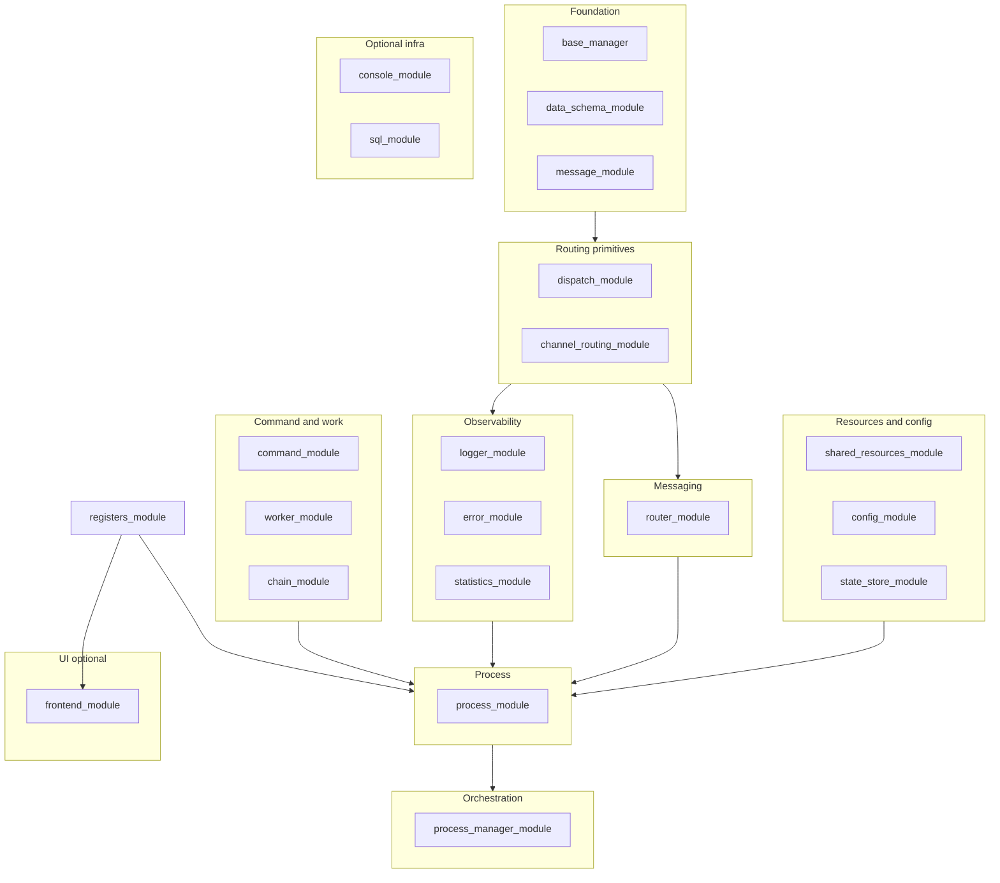
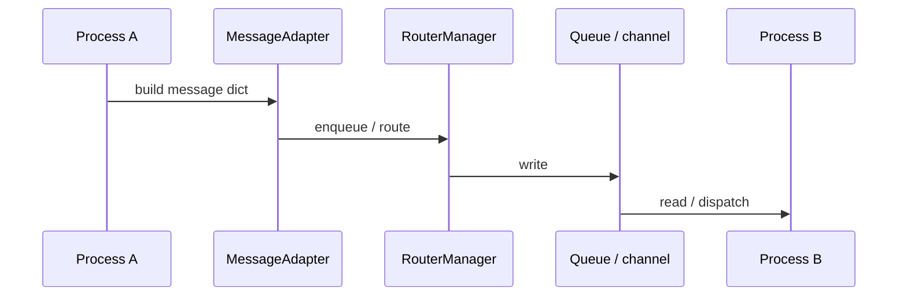
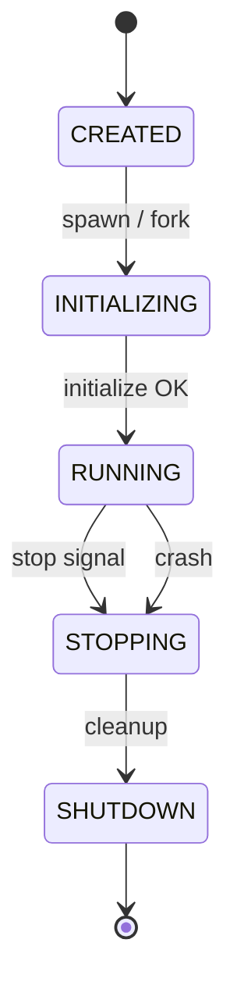
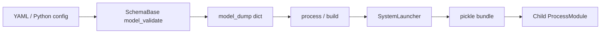
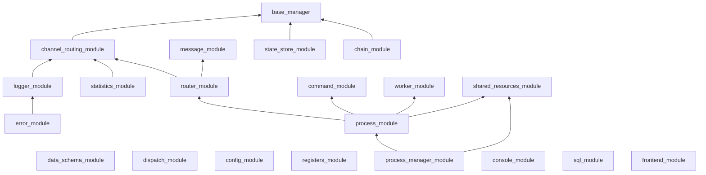
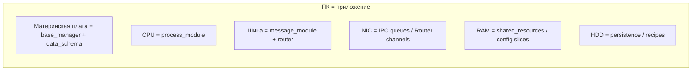

# Диаграммы (Mermaid)

Сводка визуализаций для `ARCHITECTURE.md`, обзоров и презентаций. Рендер: VS Code / GitHub / Typora.

---

## 1. Architecture layer cake

Одиннадцать слоёв, 21 пакет в `modules/`. Снизу вверх — от примитивов к приложению.

---

## 2. Message flow (IPC)

---

## 3. Process lifecycle

---

## 4. Config data flow

---

## 5. Module dependency graph (21 packages)

---

## 6. Constructor analogy

**Смысл:** фреймворк поставляет «комплектующие»; приложение подключает драйверы (воркеры, схемы, процессы) по контракту Dict at Boundary.
