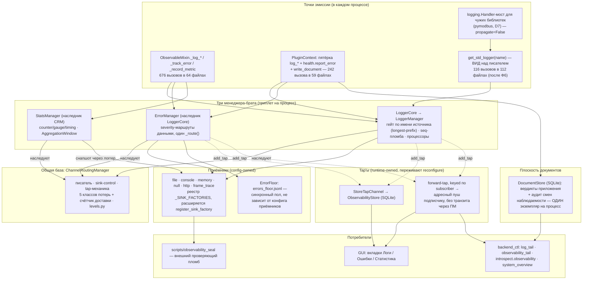

# Карта наблюдаемости — логи, ошибки, статистика, документы

> Обновлено **2026-08-10**, коммит **`b04a0c12`**. Предыдущая редакция (2026-07-28) описывала
> середину плана `observability-unified-routing` и рисовала снятый `BatchBuffer`.
> **Это карта и навигация.** Подробности — в четырёх справочниках, они же единственное место, где
> утверждения держатся якорями в коде:
> [`observability/CONNECTORS.md`](observability/CONNECTORS.md) — разъёмы, поля записи, классы потерь ·
> [`observability/SINKS_MAP.md`](observability/SINKS_MAP.md) — приёмники, маршруты, хранилища ·
> [`observability/CONTROL_PANEL.md`](observability/CONTROL_PANEL.md) — слои, команды, вердикт ·
> [`observability/NEW_MODULE_RECIPE.md`](observability/NEW_MODULE_RECIPE.md) — как подключить модуль.
>
> План, закрывший фазы A–D: [`plans/observability-review-remediation.md`](../../plans/observability-review-remediation.md).
> Предшественник: [`plans/observability-unified-routing.md`](../../plans/observability-unified-routing.md).

---

## 1. Четыре плоскости

У наблюдаемости **четыре** плоскости, и различаются они не важностью записи, а **вопросом, на
который отвечают**:

| Плоскость | Отвечает на | Разъём | Где оседает | Срок |
|---|---|---|---|---|
| **Логи** | что происходило | `_log_*`, `ctx.log_*` | `system.log`, `messages.log`, `performance.log` | ротация 10 МиБ × 5; ретеншен **выключен по умолчанию** |
| **Ошибки** | что сломалось | `_track_error`, `ctx.health.report_error` | `errors.log`, `critical.log`, `warnings.log` + пол `errors_floor.jsonl` | там же; пол не подметается, ротирует себя сам |
| **Статистика** | сколько и как быстро | `_record_metric`, `_record_timing` | снапшот окна агрегации → `performance.log` | там же |
| **Документы** | что **решено** | `ctx.write_document` | SQLite `DocumentStore` | `retention_sec` **по роду документа** |

Плоскость документов — не «логи поважнее». Вердикт о качестве изделия живёт годами, диагностика —
днями, поэтому правило допуска там **структурное** (свой приёмник), а не «фильтр по уровню, который
надо не забыть настроить» (ADR-CRM-013, ADR-PM-028).

**Телеметрия (FPS/latency) — вторая половина плоскости метрик** и живёт мимо `StatsManager`:
self-publish в дерево состояния по такту heartbeat с publisher-gate (ADR-PM-018), чтение —
локальный read-model без блокирующего IPC (ADR-136). Их объединение — первая фаза плана телеметрии
(она же задача C1, см. §5).

---

## 2. Общая схема

Чего в схеме больше **нет** и почему: `BatchBuffer` снят целиком в Ф7.4 (ADR-LOG-008) — батчинг
файловой записи не давал экономии на границе ОС и портил хвост эмитента (p99 1348 против 75 мкс);
запись синхронна на всех уровнях. `_LoggerSlotSplitter` снят вместе с лог-буфером hub'а: живой
хвост даёт tap, а инварианты «дубль» и «потеря при SIGKILL» стали невозможны по построению.

---

## 3. Кто пишет

Цель владельца: **в пределе один писатель**, всё остальное — вид поверх него или доказанное
исключение.

| Кто | Роль сегодня |
|---|---|
| `LoggerCore` | **единственный писатель** |
| `get_std_logger` | **вид** над ним: 116 вызовов в 112 файлах — результат Ф6 |
| `emergency_log` | аварийный выход: отказ писателя нельзя рассказать через писателя |
| `ErrorFloor` | приёмник последней инстанции; прикладной код звать его **не должен** — соглашение, а не запрет: класс публичен, стража нет (F1 воспроизвела вызов) |
| голый `logging.getLogger` | **7 файлов**, каждый с обязательной причиной в страже `test_std_logger_guard.py` (AST, четыре формы написания, протухшая строка whitelist'а — красный) |

**Ф6 закрыта числом, а не намерением:** было **107 файлов**, писавших в пустоту (у stdlib-root в
живых процессах хендлеров не подключает никто; под `pythonw` теряется вообще всё). Стало 7
исключений с причинами. Объём логов при этом **не вырос** (5.4 → 4.78 МБ/час) — миграция не
добавила записей, она вернула им адрес.

Три формата в одной консоли сведены к одному в D7: loguru в `Services/modbus` переведён на вид,
чужой `pymodbus` — на мост, `topology/blueprint.py` — тоже на вид. Полный список — в
[`CONNECTORS.md §5`](observability/CONNECTORS.md).

---

## 4. Ручки управления

Полностью — в [`CONTROL_PANEL.md`](observability/CONTROL_PANEL.md). Здесь только карта:

| Слой | Кто владеет | Чем правится |
|---|---|---|
| **L0** код (`ObservabilityConfig`) | фреймворк | — |
| **L1** `system.yaml` | машина | правка файла + hot-reload watcher |
| **L2** рецепт и спутник | конвейер | `switch`, `observability.persist` |
| **L3** память процесса | оператор | `config.reload` inline, срок по умолчанию **300 с** |

Канонические имена команд: `config.reload`, `observability.persist`,
`observability.sink.enable/disable/tail` (алиасы `logger.sink.*`),
`observability.tail.subscribe/unsubscribe[_all]`, `introspect.observability`, `health.report`.
Применение везде идёт одним путём — `apply_observability_layers`, **пересборка из источников**, а
не дельта поверх живого.

Чтение без мутации: `introspect.observability` → `effective` + `counters` + `provenance` + `ttl` +
`documents` + аудит. Доказательство применения: `config_reload_verified` → трёхзначный `verdict`
(`confirmed`/`failed`/`unverifiable`) **и отдельно** `delivering`/`losing`/`silent_source` с
вычетом цены самого опроса.

---

## 5. Что не так сегодня (честный список с адресами)

### 5.1. Открыто

* **У плагина нет stats-разъёма.** `IProcessServices` не объявляет stats-методов, 0 использований
  на ~30 плагинов, `kind=stats` до стора не доезжает. Развилка Р-2 решена владельцем как **(в)**:
  задача C1 уехала первой фазой в план телеметрии. Ветку `KIND_STATS` в drain трогать нельзя — на
  ней стоит это решение.
* **`observability.documents` и `observability.history` не действуют на лету.** Слои их принимают,
  но сток документов и политика истории сшиваются один раз на `initialize()`; действуют со
  следующего старта процесса. Найдено при написании справочников (E1).
* **Чужое дерево логов фреймворк называет только одно** — `<cwd>/logs`. Второй известный пример
  (`multiprocess_prototype/logs/`) он структурно назвать не может: импорт прототипа запрещён
  правилом слоёв. Хук `_foreign_log_root_candidates()` переопределяемый — работа композиционного
  корня прототипа.
* **Отказ переполненной очереди живого GUI неотличим по счётчику от отсутствия приёмника** —
  роутер считает оба случая одним ключом. Назван в D8, кандидат в [`plans/QUEUE.md`](../../plans/QUEUE.md).
* **Ретеншен логов выключен по умолчанию** (`retention_days`/`retention_total_mb` = 0). Механизм
  построен и оттестирован; включать чистку молча нельзя — это решение приложения.

### 5.2. Принято осознанно (не костыли, но названо)

* поток, вошедший в блокирующий `write()` стока, не ограничен ничем — лесенка перегрузки
  (ADR-LOG-009) спасает остальных, свою жертву не спасает;
* per-callsite тумблеры отвергнуты: в Python выключенное состояние не бесплатно, гранулярность —
  источник или группа;
* mojibake русских строк в консоли Windows (cp866); `events_page` на бутстрапе ~114 КБ;
* Linux-вердикты подтверждены CI на ubuntu, но живого Linux-прогона не было — машины нет.

### 5.3. Закрыто в последнем заходе (фазы A–D, 2026-08-09…10)

`level` подписчика доезжает до процесса (A1) · пятёрка `log_*` у плагина (A2) · темп стат-плоскости
действует и читается из живого окна (B1) · мусор не доживает до слоя (B2) · порядок останова, error
и stats гасятся вообще (B3) · у плагина появилась дорога в плоскость ошибок (C2, ADR-PM-030) ·
документ без приёмника имеет голос и счётчик (C3) · реентрантный tap не даёт лавину (D1) · тестовая
сетка перестала врать (D2) · миграция `auto_vacuum` (D3, ADR-CRM-014) · доменное имя ушло из
универсального слоя (D4, ADR-137) · ПМ метёт всё дерево логов (D5) · один писатель в консоли (D7) ·
headless-шторм в `gui` снят (D8, ADR-PMM-025).

---

## 6. Сколько это стоит

Замер **2026-08-10** (`.py`, без `__pycache__`; тесты считаются отдельно):

| Область | Production | Тесты |
|---|---|---|
| `channel_routing_module` | 3 782 | 4 279 |
| `logger_module` | 6 936 | 18 213 |
| `error_module` | 910 | 1 862 |
| `statistics_module` | 1 327 | 1 186 |
| `telemetry_readmodel_module` | 359 | 282 |
| обвязка `process_module` (`observability_*` + слои + аудит) + брокер + листы (`observability_declarations`, `_fallback`) | 5 176 | 11 165 |
| внешний проверяющий пломб (`scripts/observability_seal`) | 302 | — |
| GUI-вкладка «Наблюдаемость» (прототип) | 979 | 606 |
| **Итого** | **19 771** | **37 593** |

Соотношение тестов к коду — **1.9 : 1**; у одного `logger_module` — 2.6 : 1. Это цена
доказанности после Ф0, где 12 зелёных тестов закрепляли неверную модель.

**Что публикуется наружу для сверки учёта.** Прежняя редакция карты приводила здесь равенство с
`dropped` и `in_flight_records` — это был инвариант **снятого** `BatchBuffer`, и сегодня половины
его членов не существует. Сейчас наружу едут два независимых набора:

* у менеджеров — пять классов потерь + счётчик доставки `channel_written_records` (единый список
  `LOSS_COUNTER_KEYS`, он же реестр публикации `PLANE_COUNTER_KEYS`);
* у окна агрегации — `total_enqueued` / `total_flushed` / `total_flushes` / `flush_failed` /
  `pending_metrics` / `flush_interval`. Равенство «сколько положили = сколько сбросили + в очереди»
  сторожит `test_stats_no_double_count.py` (число `record_metric`-вызовов против `total_enqueued`).

Цена защиты реентрантности tap'а (D1, бенч 5 × 200 000 вызовов, медиана): база эмиссии
0.36–0.41 мкс, с защитой 0.52 мкс. При живом темпе плоскости (~44 записи/с) это ~7 мкс/с.

---

## 7. Куда идти дальше

| Вопрос | Документ |
|---|---|
| «чем писать из моего кода» | [`observability/CONNECTORS.md`](observability/CONNECTORS.md) |
| «подключаю новый модуль» | [`observability/NEW_MODULE_RECIPE.md`](observability/NEW_MODULE_RECIPE.md) |
| «куда физически попала запись» | [`observability/SINKS_MAP.md`](observability/SINKS_MAP.md) |
| «как покрутить на живом стенде» | [`observability/CONTROL_PANEL.md`](observability/CONTROL_PANEL.md) |
| «какие решения приняты и почему» | [`../DECISIONS.md`](../DECISIONS.md) + локальные `DECISIONS.md` модулей |
| «что ещё не сделано» | [`plans/observability-review-remediation.md`](../../plans/observability-review-remediation.md) |
