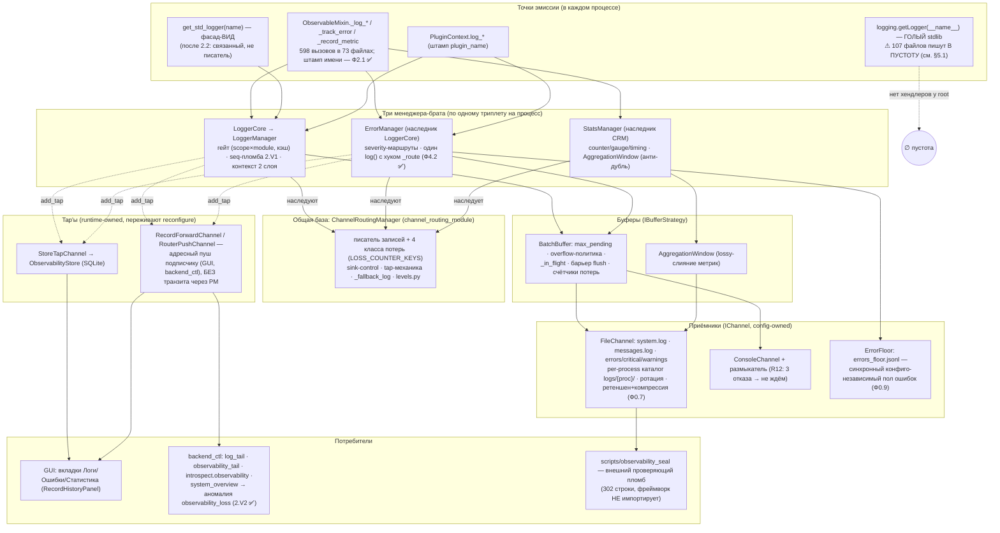

# Карта наблюдаемости — логи, ошибки, статистика, телеметрия

> Обновлено: 2026-07-28 (ревью середины плана `observability-unified-routing`, Ф2.2 в работе).
> Все числа сверены с кодом на коммите `7ec6dad1` (граф graphify 30215 узлов, той же даты).
> Родственные документы: [план](../../plans/observability-unified-routing.md) ·
> [анализ 2026-07-26](../../docs/audits/2026-07-26_observability-architecture-analysis.md) ·
> [индустриальная планка](../../docs/audits/2026-07-26_observability-industrial-baseline.md)

Документ отвечает на три вопроса: **как запись едет от call-site до глаз**, **какими ручками
это управляется** и **что ещё не так** (с привязкой к задачам плана).

---

## 1. Общая схема

**Телеметрия (FPS/latency) едет отдельно** — self-publish в дерево состояния по такту
heartbeat с publisher-gate (`GATED_METRICS`, 5 метрик, ADR-PM-018), чтение — локальный
read-model без блокирующего IPC (ADR-136). Это **вторая половина плоскости метрик**,
живущая мимо `StatsManager`; их объединение — Ф8.1/8.2 (за GATE).

**Пилотный тракт hub'а** (только `worker_module`): на `ObservabilityHub` (bounded-буфер,
drain по heartbeat) подменяется **один слот — `stats`**. `logger` и `error` — реальные
менеджеры, write-through. `_LoggerSlotSplitter` снят в 2.2 вместе с лог-буфером: живой
хвост sub-ERROR логов даёт `log.tail` (tap на `logger_manager` с уровнем подписчика), а
инварианты R1 (дубль) и R3 (потеря при SIGKILL) стали невозможны по построению —
переигрывать и терять нечего. Как **второй механизм доставки** hub остаётся для метрик;
его судьба — Ф8.3.

---

## 2. Кто сегодня ПИШЕТ (счёт писателей 2.2)

Цель владельца: **в пределе один писатель**; всё остальное — вид поверх него или
доказанное исключение. Решение: `7 → 2 писателя + 1 вид`.

| # | Кто | Строк | Статус |
|---|---|---|---|
| 1 | `LoggerCore` | 1304 | **остаётся — единственный писатель** |
| 2 | `emergency_log` | 18 | исключение по устройству: отказ писателя нельзя рассказать через него. ✅ **выход теперь один** — `CRM._fallback_log` и четыре точки `log_channel` стали именованными вызовами этой функции; страж-тест считает прямые `getLogger` по AST |
| — | `StdLoggerFacade` | 221 | ✅ стал ВИДОМ (95b0db19) |
| — | `_ProcessLogger` | 57 | ✅ снят (edb674a9) |
| — | `FallbackLogger` | 111 → handle | ✅ стал handle'ом (489d084e), 1743→961 нс |
| — | `LoggerAdapter` | 145 | ✅ снят — потребителей ноль, внутри жила **вторая таблица** «уровень → scope» (DEBUG→`business` против канонического `debug`) |
| — | `_LoggerSlotSplitter` | ~60 | ✅ снят вместе с причиной — лог-буфером hub'а; R1/R3 закрыты по построению |
| 3 | голый `logging.getLogger(__name__)` | 107 файлов | группа-писатель «в пустоту»: Ф6 (см. §5.1) |
| вне счёта | `ErrorFloor` | 178 | внутренний приёмник последней инстанции, прикладной код его позвать не может |

---

## 3. Ручки управления (конфиги логирования)

Требование владельца: у каждого модуля/подмодуля — конфиг логирования; ручки работают
**и до запуска (дефолты), и в реальном времени**, постоянные правки живут **в прототипе**.

| Слой | Ручка | Где | Гранулярность |
|---|---|---|---|
| До запуска (дефолты фреймворка) | `LoggerManagerConfig`: `channels` / `scopes` / `modules` / `default_level` / батчинг / ретеншен | `logger_module/configs/logger_manager_config.py` | scope × module (плоско; иерархия — Ф2.2) |
| До запуска (постоянные правки приложения) | секция `observability` в `system.yaml` прототипа | `multiprocess_prototype/configs/` | процесс |
| Реальное время (файлом) | hot-reload watcher секции `observability` (debounce, Option B, ADR-CRM-006) + `config.reload` → `apply_observability_reconfigure` с валидацией-до-применения и откатом (R9 ✅) | `observability_reload.py` (407 строк) | процесс; пороги по scope |
| Реальное время (командой) | `logger.sink.enable/disable` с `manager=logger\|error\|stats` (whitelist, роутер НЕ адресуем) | `builtin_commands.py` | канал по имени |
| Чтение без мутации | `introspect.observability` → `effective` + `counters` (все классы потерь) | там же (Ф0.3/Ф5.1) | процесс |
| Телеметрия | publisher-gate: вкл/выкл + частота per-метрика (`GATED_METRICS`), GUI-секция, `telemetry_set/reconfigure` | `telemetry_publish_config.py` | группа метрик на процесс |
| Сводка | `system_overview` → карточка `observability_losses`, аномалии `observability_loss` / `observability_unavailable` (2.V2 ✅) | backend_ctl | вся система |

**Чего в ручках ещё нет** (и где это в плане): иерархическое имя + longest-prefix +
группы-ярлыки (Ф2.2–2.5) · произвольная группа без правки кода (Ф2.4) · `configured` /
`effective` / `observed_rate` тремя колонками (Ф5.2) · `null`=унаследовано и сброс (Ф5.3) ·
батч/glob (Ф5.4) · verified-смена (Ф5.7) · TTL/авто-откат (Ф5.8) · аудит смен (Ф5.9) ·
симметрия namespace на все четыре плоскости (Ф5.10).

---

## 4. Сколько это стоит (LOC, тесты, перф — замерено)

| Модуль | Production | Тесты |
|---|---|---|
| `channel_routing_module` (база + буферы + hub + store/forward) | 3 637 | 3 731 |
| `logger_module` | 3 865 | 9 297 |
| `error_module` | 808 | 1 806 |
| `statistics_module` | 1 114 | 873 |
| обвязка в `process_module` (`observability_wiring` 351 + `observability_reload` 407) | 758 | 1 367 |
| `observability_config.py` (схема секции) | 213 | — |
| `_fallback.py` (handle + `emergency_log`) | 111 | 276 |
| `telemetry_readmodel_module` | 359 | 282 |
| GUI-вкладка «Наблюдаемость» (прототип) | 826 | 358 |
| внешний проверяющий пломб | 302 | 215 (сам проверен 10 слом-инъекциями) |
| **Итого плоскость** | **11 993** | **18 205** |

Соотношение тестов к коду — **1.5 : 1**; у одного `logger_module` — 2.4 : 1 (9 297 строк
тестов): цена доказанности после Ф0, где 12 зелёных тестов закрепляли неверную модель.

Перф (эта машина, отклонённая запись): гейт 460 → **236 нс** (identity-ключ);
фасад 1102 → **760 нс** (цель ≤ 400 — не взята, остаток в трёх кадрах `_route` и счётчике);
миксин 1812 нс. На реальной нагрузке (8 процессов × 21 Гц) вся цена ≈ **0.03 % одного ядра** —
перф признан гигиеной, а не доводом.

Инвариант учёта, публикуемый наружу и проверяемый в любой момент:
`total_enqueued == total_flushed + Σ pending + dropped + flush_failed + in_flight_records`.

---

## 5. Что НЕ ТАК сегодня (честный список, с адресами в плане)

### 5.1. Самая большая живая потеря ценности: 107 файлов пишут в пустоту

Замер 2026-07-28 (production-код, без тестов): голый `logging.getLogger(__name__)` —
**56 файлов** в `multiprocess_prototype` + **16** в `Services` + **2** в `Plugins` +
**33 во фреймворке** (из них 16 — `frontend_module`). Хендлеров у stdlib-root в живых
процессах не подключает никто (проверено grep'ом `basicConfig|addHandler`: только
CLI-скрипты миграций и `ml_train/__main__`). Через фасад `get_std_logger` — **2 файла**.

Нюанс честности: `WARNING+` спасает stdlib `lastResort`-хендлер (stderr) — при запуске из
консоли эти строки видны; `INFO`/`DEBUG` теряются всегда, а под `pythonw` (GUI-запуск на
Windows) stderr мёртв и теряется вообще всё (проверено раундом 3 плана).

→ Ф6 в плане охватывала только прототип и занижала масштаб. **Правка плана 2026-07-28:
скоуп Ф6 расширен на фреймворк (задача 6.5), счёт обновлён.** Исключения-по-устройству
(например `channel_routing_manager._fallback_logger`, `config_module` ниже слоя логгера)
называются поимённо, а не молча.

Смежная находка конфига: **ретеншен (Ф0.7) в прототипе ВЫКЛЮЧЕН** — `retention_days` /
`retention_total_mb` / `compress_rotated` в `system.yaml` не заданы (дефолт 0/0/false).
Механизм построен и оттестирован, но 291 МБ логов в проде он не подметает, пока владелец
не включит поля. Рекомендация ревью: включить в `system.yaml` прототипа осознанными
значениями (например 14 дней / 500 МБ / компрессия on).

### 5.2. Лишних писателей-классов не осталось

`LoggerAdapter` (145) и `_LoggerSlotSplitter` (~60) сняты. Из счёта остаются
`LoggerCore` (писатель), `emergency_log` (исключение по устройству) и группа голых
`logging.getLogger` (§5.1, Ф6).

Открытые долги, которые НЕ закрылись вместе с ними:

* **каскад `BaseAdapter._log`** (4 приоритета, два `except: pass` — класс «проглоченный
  сбой»). Прежняя редакция этого пункта утверждала, что каскад уходит вместе с
  `LoggerAdapter`. Неверно: он живёт в **базовом** классе и общий для шести адаптеров
  (worker/stats/command/router/console/…). Адресуется отдельно.

Прямых обращений к stdlib в плоскости осталось **два, и оба по устройству**:
`emergency_log` (аварийный выход) и `StdLoggerFacade._fallback` (виду нужно куда-то
писать, когда писателя ещё/уже нет). Счёт держит страж-тест по AST — текстовый поиск
ложно срабатывал на упоминании в докстринге. Вне плоскости остаётся
`shared_resources/queues` — модуль лежит ниже слоя логгера и назван исключением поимённо.

### 5.3. Два механизма доставки наружу

Config-owned каналы (файл/консоль) и runtime-owned tap'ы + пилотный hub-тракт с дренажем
(**после 2.2 — только для метрик**: лог из hub'а ушёл, доставка лога подписчикам осталась
одна — tap `log.tail` на `logger_manager`).
Различие «канал живёт от конфига, подписка — от подписчика» — структурное и остаётся;
лишний здесь только **пилотный hub-тракт** (третий путь) — судьба в Ф8.3.

### 5.4. Плоскость метрик расщеплена надвое

`StatsManager` (counter/gauge/timing → файлы) и self-publish телеметрия heartbeat
(FPS/latency → дерево состояния) не знают друг о друге; реестры порогов — три
(`scopes` / `GATED_METRICS` / `_level_to_channel`). Схлопывание — Ф8.1/8.2, за GATE.

### 5.5. Адресация всё ещё плоская и с хардкодом

Enum шести зон + прикладные имена (`camera`, `robot`…) в дефолтах **фреймворка** —
второе приложение унаследует `robot.log`. Лечится Ф2.2–2.7 (иерархия, произвольные
группы, перенос имён в прототип, объявление источников рядом с модулем).

### 5.6. Известные ограничения, принятые осознанно (не костыли, но названы)

- `stop()` при подвисшем стоке — до 2×таймаут на канал последовательно, худший случай
  ≈ 120 с на 12 каналах (F1, отдельная задача «общий бюджет»).
- Поток, вошедший в блокирующий `stream.write()` консоли, не ограничен (R2/R12 —
  размыкатель снял системную цену, остаток задокументирован).
- Каталоги умерших процессов не метёт никто (R10 — разовая уборка).
- Linux-вердикты раундов 3–4 подтверждены документацией и CI-тестами на ubuntu, но
  **живого Linux-прогона не было** (машины нет) — честно помечено в плане.
- Per-callsite тумблеры («вкл/выкл каждое сообщение») отвергнуты индустриальным доводом:
  в Python выключенное состояние не бесплатно; гранулярность — источник/группа (Ф2), и
  этого достаточно (Envoy/Spring/.NET живут так же).

---

## 6. Как первоначальная идея владельца легла на реализацию

| Идея (2026-07-26 и ранее) | Как реализовано |
|---|---|
| `logger_manager` держит всю логику, остальные его используют | `LoggerCore` — единственный писатель (2.2); фасад и миксин — виды над ним |
| Знает, **кто** отправил и **когда** | Штамп имени источника (Ф2.1 ✅, 43 различимых имени live) + `seq`-пломба (2.V1 ✅) + двухслойный контекст (Ф0.5 ✅) |
| Вкл/выкл каждого сообщения через конфиг | Гейт до аргументов (Ф1 ✅) + иерархия источников (Ф2.2, в работе); per-callsite — отвергнуто осознанно (§5.6) |
| Родственник `router_manager` | Оба — наследники CRM; транспорт отделён whitelist'ом от плоскости наблюдаемости (Ф0.6 ✅) |
| Братья error/stats, одна база, без дублей | Подъём sink-control/tap/потерь/писателя в CRM (Ф0.6, P5 ✅); `ErrorManager.log` больше не развилка (Ф4.2 ✅) |
| Лаконично | Писатели 7 → 5 → цель 2+1 вид; три реестра → один каталог (Ф8.1) |
