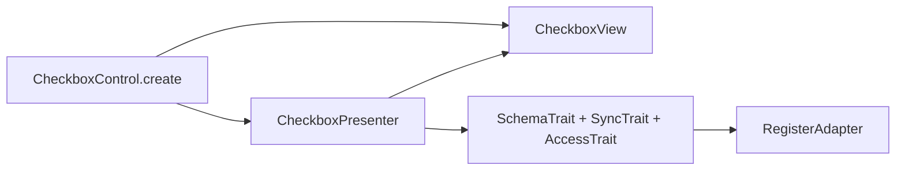
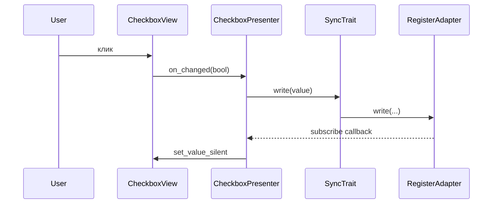
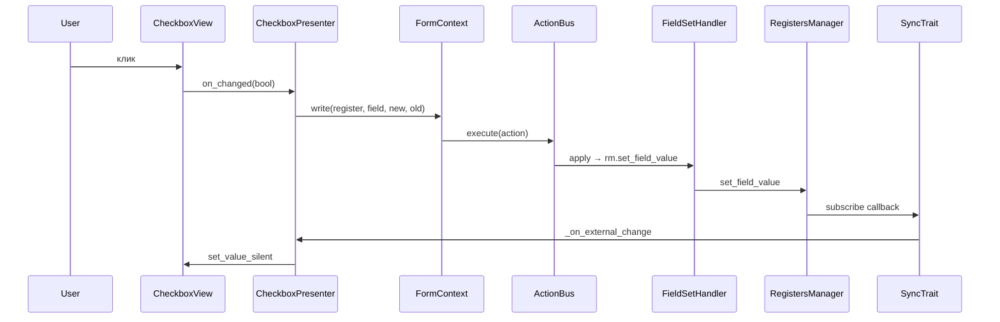

# Checkbox v2

Чекбокс с привязкой к регистру: **View** (`CheckboxView`) + **Presenter** (`CheckboxPresenter`) + **Facade** (`CheckboxControl`).

Те же порты, что и в [`base/README.md`](../base/README.md): `IFieldBinding`, `IRegisterPort`, `RegistersManagerLike`. Опционально **`ControlHooks`** в `CheckboxControl.create(..., hooks=...)` — отклонённая/успешная запись в регистр.

## Слои



## Поток значения



## Binding-aware mode (form_ctx)

Когда `CheckboxControl.create(..., form_ctx=form_ctx)` получает `FormContext` — все записи идут через
`ActionBus` с coalescing, undo/redo и IPC bridge (`TopologyBridge`). Это **обязательный** путь для
plugin-форм (PluginsTab, InspectorPanel, ServicesTab).



Для **undo**: `bus.undo()` → `FieldSetHandler.revert` → тот же путь через subscribe-callback →
`set_value_silent` — view возвращается к старому значению без лишней перезаписи.

**Шаблон для тиражирования:** копируй `CheckboxControl.create(..., form_ctx=...)` при реализации
SpinBoxControl, SliderControl, NumericControl и других builders. Контракт `form_ctx` / `None` должен
соблюдаться во всех новых controls.

## Отличия от числового контроля

- Нет **DebounceTrait** и **ValueTransformer** — булево пишется сразу по `on_changed`.
- **on_finished** у view — намеренный no-op (см. `IControlView`).
- **LegacySync** не подключён; при необходимости мост к v1 добавляют в presenter по образцу `NumericPresenter`.

## Пример

```python
from frontend_module.components.base.config import BindingConfig
from frontend_module.components.checkbox import (
    CheckboxControl,
    CheckboxViewConfig,
)

result = CheckboxControl.create(
    registers_manager,
    BindingConfig(register_name="renderer", field_name="show_mask"),
    CheckboxViewConfig(position="left"),
)
layout.addWidget(result.widget)
```

## Тесты

- `frontend_module/tests/test_checkbox_v2.py` — unit: presenter без Qt, smoke фасада.
- `frontend_module/tests/test_controls_v2_hooks.py` — колбэки on_write_committed / on_write_rejected.
- `frontend_module/tests/integration/test_form_context_integration.py` — integration:
  round-trip click→write→undo→rollback через реальный `ActionBus` (`test_checkbox_form_ctx_roundtrip`)
  и блокировка UI по `access_level` (`test_checkbox_disabled_when_user_level_below_access_level`).
