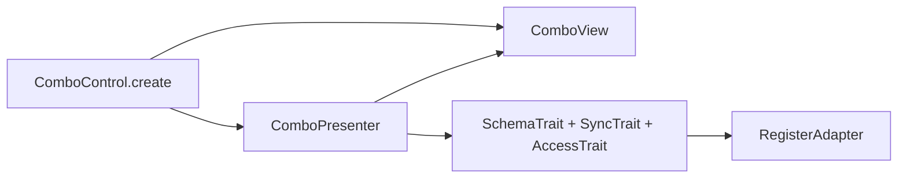
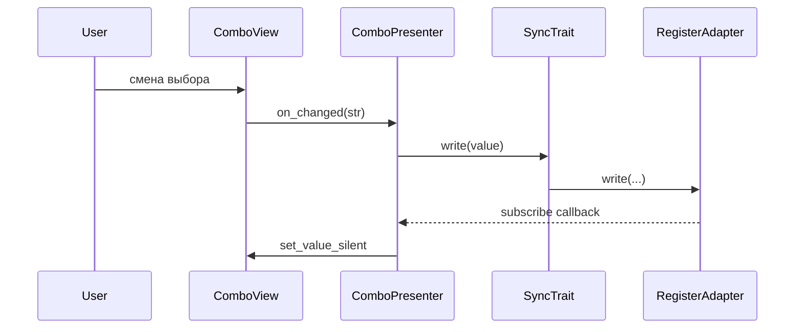
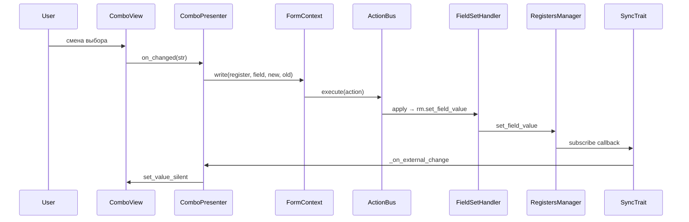

# Combo v2

Выпадающий список с привязкой к регистру: **View** (`ComboView`) + **Presenter** (`ComboPresenter`) + **Facade** (`ComboControl`).

Те же порты, что и в [`base/README.md`](../base/README.md): `IFieldBinding`, `IRegisterPort`, `RegistersManagerLike`. Опционально **`ControlHooks`** в `ComboControl.create(..., hooks=...)` — отклонённая/успешная запись в регистр.

`ComboView` дополнительно поддерживает `set_items(values)` — динамическое обновление вариантов выбора (используется фабрикой форм для Literal-полей).

## Слои



## Поток значения



## Binding-aware mode (form_ctx)

Когда `ComboControl.create(..., form_ctx=form_ctx)` получает `FormContext` — все записи идут через
`ActionBus` с coalescing, undo/redo и IPC bridge (`TopologyBridge`). Это **обязательный** путь для
plugin-форм (PluginsTab, InspectorPanel, ServicesTab).



Для **undo**: `bus.undo()` → `FieldSetHandler.revert` → тот же путь через subscribe-callback →
`set_value_silent` — view возвращается к старому значению без лишней перезаписи.

**Шаблон для тиражирования:** копируй `ComboControl.create(..., form_ctx=...)` при реализации
других строковых контролов. Контракт `form_ctx` / `None` должен соблюдаться во всех новых controls.

## Отличия от числового контрола

- Нет **DebounceTrait** и **ValueTransformer** — строковое значение пишется сразу по `on_changed`.
- **on_finished** у view — намеренный no-op (см. `IControlView`).
- **items** передаются через `ComboControl.create(..., items=[...])` либо через `ComboViewConfig.items`; динамическая смена — `ComboView.set_items(values)`.
- При `_on_external_change` значение кастуется к `str` для безопасной установки в QComboBox (актуально для Literal-полей с int-значениями).

## Пример

```python
from frontend_module.components.base.config import BindingConfig
from frontend_module.components.combo import (
    ComboControl,
    ComboViewConfig,
)

result = ComboControl.create(
    registers_manager,
    BindingConfig(register_name="renderer", field_name="mode"),
    ComboViewConfig(),
    items=["auto", "manual", "off"],
)
layout.addWidget(result.widget)
```

## Тесты

- `frontend_module/tests/test_combo_v2.py` — unit: presenter без Qt, smoke фасада, `ComboRegister`.
- `frontend_module/tests/test_combo_form_ctx.py` — form_ctx round-trip.
