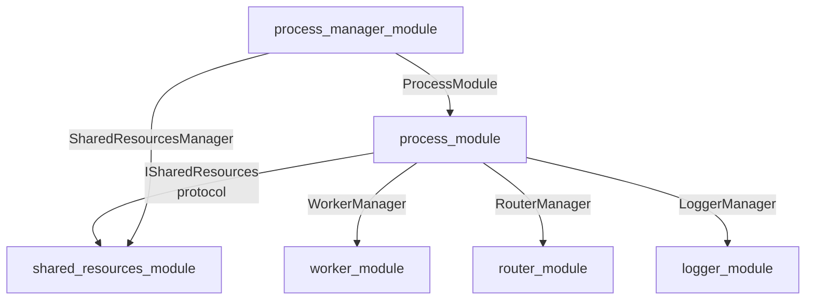

# Process Module — Управление процессами в фреймворке

**Status:** ✅ Production Ready (49/49 tests passing, Refactoring Phase 8/8 Complete)

Модуль `process_module` отвечает за **создание, инициализацию, управление и мониторинг процессов** в многопроцессном фреймворке. Это центральный компонент, который координирует работу конфигурации, коммуникации, менеджеров и воркеров (через `worker_module`).

**Эталонные примеры конфигурации (plain dict):** [`docs/examples/process_config_canonical_examples.py`](docs/examples/process_config_canonical_examples.py). Поведение `ProcessConfigHandler` — в [`tests/test_process_config.py`](tests/test_process_config.py).

**Конфигурация в коде процесса:** после `initialize()` читайте параметры через **`IProcessModule.get_config` / `update_config`** или **`self.config_handler`** — это единая точка (фасад), без прямого разбора `bundle` или `SharedResourcesManager` в прикладной логике. Общая картина «schema→dict и ветки доставки»: [../../docs/CONFIG_GUIDE.md](../../docs/CONFIG_GUIDE.md).

---

## Быстрый старт

### Импорты

```python
from multiprocess_framework.modules.process_module import (
    ProcessModule,
    ProcessStatus,
    ProcessConfigDict,
)
```

### Создание простого процесса

```python
import time
from multiprocess_framework.modules.process_module import ProcessModule

class MyProcess(ProcessModule):
    def initialize(self) -> bool:
        """Инициализация процесса."""
        self.log_info("Инициализация MyProcess...")
        self.is_initialized = True
        return True

    def shutdown(self) -> bool:
        """Завершение работы процесса."""
        self.log_info("Завершение MyProcess...")
        self.is_initialized = False
        return True

    def run(self):
        """Основной цикл процесса."""
        counter = 0
        while not self.should_stop():
            counter += 1
            self.log_info(f"Итерация {counter}")
            time.sleep(1)

# Использование
process = MyProcess("my_process")
try:
    process.initialize()
    process.run()
finally:
    process.shutdown()
```

### Процесс с воркерами

```python
from multiprocess_framework.modules.worker_module import (
    ThreadConfig,
    ThreadPriority,
    ExecutionMode,
)

class WorkerProcess(ProcessModule):
    def initialize(self) -> bool:
        """Инициализация процесса с воркерами."""
        self.log_info("Инициализирую воркеры...")

        # Получить менеджер воркеров (автоматически создан ProcessModule)
        manager = self.worker_manager

        # Создать воркер обработки данных
        def data_worker(stop_event, pause_event):
            while not stop_event.is_set():
                if pause_event.is_set():
                    time.sleep(0.05)
                    continue
                self.log_info("Обработка данных...")
                time.sleep(1)

        config = ThreadConfig(
            priority=ThreadPriority.NORMAL,
            execution_mode=ExecutionMode.LOOP,
        )
        manager.create_worker("data_processor", data_worker, config, auto_start=True)

        self.is_initialized = True
        return True

    def run(self):
        """Основной цикл с мониторингом воркеров."""
        while not self.should_stop():
            status = self.worker_manager.get_all_workers_status()
            self.log_info(f"Статус воркеров: {status}")
            time.sleep(5)
```

---

## Архитектура модуля

```
process_module/
├── __init__.py                  # Публичный API
├── interfaces.py                # IProcessModule, ISharedResources, IProcessCommunication
├── types/
│   ├── __init__.py
│   └── types.py                 # ProcessStatus, ManagerType, QueueType, TypedDict
├── core/
│   ├── __init__.py
│   └── process_module.py        # ProcessModule (главный класс)
├── lifecycle/
│   ├── __init__.py
│   └── process_lifecycle.py     # Жизненный цикл: initialize/shutdown
├── managers/
│   ├── __init__.py
│   ├── process_managers.py      # Инициализация менеджеров
│   ├── observability_wiring.py  # Сшивка плоскостей: hub, стор, tap'ы, документы, отбор широких записей
│   ├── observability_flight.py  # Flight recorder: дамп кольца записей процесса по вызову (ADR-PM-037)
│   ├── observability_reload.py  # Пересборка конфига из слоёв + readback + вердикт
│   └── observability_ttl.py     # Авто-возврат рантайм-правок по истечении срока
├── communication/
│   ├── __init__.py
│   └── process_communication.py # IPC через router_module
├── configs/                     # Схемы конфига (Pydantic)
│   ├── observability_config.py  # Секция observability + expand в manager-конфиги
│   ├── observability_layers.py  # Слои L0-L3, провенанс, сроки, валидация секций
│   ├── observation_policy.py    # Политика порта наблюдений: glob по пути (Ф4, ADR-PM-041/042)
│   └── telemetry_publish_config.py # Легаси-секция telemetry.publish (именованный источник)
├── config/
│   ├── __init__.py
│   └── process_config_handler.py # Парсинг конфигурации
├── state/
│   ├── __init__.py
│   └── process_state.py         # Делегирует в shared_resources_module
├── threads/
│   ├── __init__.py
│   └── system_threads.py        # Управление системными потоками
├── adapters/
│   ├── __init__.py
│   ├── process_adapter.py       # ProcessAdapter(BaseAdapter)
│   └── schema_adapter.py        # SchemaAdapter для конфигов
├── tests/                       # Unit-тесты (49 тестов)
├── README.md                    # Этот файл
├── STATUS.md                    # Карточка здоровья
└── ARCHITECTURE.md              # Детальное описание дизайна
```

---

## Ключевые концепции

### 1. Жизненный цикл процесса

```
initialize()
    ↓
[INITIALIZING] → инициализация менеджеров, воркеров, конфига
    ↓
[READY]
    ↓
run()
    ↓
[RUNNING] ← основной цикл процесса
    ↓
stop() / should_stop() → возврат True
    ↓
[STOPPING] → остановка воркеров
    ↓
shutdown()
    ↓
[STOPPED]
```

### 2. Компоненты ProcessModule

| Компонент | Класс | Назначение |
|-----------|-------|-----------|
| **Менеджер воркеров** | `WorkerManager` | Создание, управление и мониторинг потоков |
| **Маршрутизатор** | `RouterManager` | Межпроцессная коммуникация через каналы |
| **Конфиг-обработчик** | `ProcessConfigHandler` | Парсинг и валидация конфигурации |
| **Коммуникация** | `ProcessCommunication` | Отправка/получение сообщений |
| **Логгер** | `LoggerManager` | Логирование с категоризацией |

### 3. Опциональная конфигурация менеджеров (managers)

Через `proc_dict["managers"]` можно включить дополнительные возможности (все опциональны, обратная совместимость сохранена):

| Ключ | Назначение | Условие |
|------|------------|---------|
| `managers.logger` | Полный dict-конфиг LoggerManager (channels, scopes, modules) | При наличии `channels` |
| `managers.error` | ErrorManager (errors.log, critical.log, warnings.log) | При непустом dict |
| `managers.router.duplicate_messages_to_logger` | Дублирование сообщений в LoggerManager для отладки | При `True` |

Без `managers` в конфиге процессы работают как раньше (только LoggerManager, StatsManager, RouterManager по умолчанию).

### 4. Разрыв циклической зависимости (Рефакторинг)

**Проблема была:** `process_module` ↔ `shared_resources_module` (циклическая зависимость)

**Решение:** Используется `ISharedResources` (Protocol) для Dependency Injection:

```python
class ProcessModule(BaseManager, ObservableMixin):
    def __init__(
        self,
        name: str,
        config: Optional[dict] = None,
        shared_resources: Optional[ISharedResources] = None,
    ):
        self.shared_resources = shared_resources
        # Получаем через protocol, а не прямой импорт
        self.queue_registry = getattr(shared_resources, 'queue_registry', None)
        self.memory_manager = getattr(shared_resources, 'memory_manager', None)
```

Это обеспечивает **однонаправленный** граф зависимостей.

### 5. Dict at Boundary

Все данные, пересекающие границу процессов, передаются как обычные `dict`:

```python
# Конфигурация процесса (границ процесса)
config_dict = {
    "name": "process_1",
    "workers": {
        "worker_1": {
            "class": "my_module.Worker1",
            "thread": {"priority": "NORMAL"},
        }
    }
}

# Внутри процесса: типизированные объекты
process = ProcessModule("process_1", config=config_dict)
```

### 6. IPC через RouterManager

```python
# Отправить сообщение другому процессу
self.send_message(
    target="process_2",
    message={
        "command": "execute",
        "data": {"task": "compute", "value": 42},
    }
)

# Трансляция всем (broadcast)
self.broadcast_message({
    "event": "status_changed",
    "status": "running",
})
```

---

## ProcessModule API

### Жизненный цикл

```python
# Инициализация
success = process.initialize()  # → bool

# Основной цикл
process.run()  # Блокирует до stop()

# Остановка
process.stop()  # Сигнал к остановке

# Завершение
success = process.shutdown()  # → bool

# Проверка
is_stopping = process.should_stop()  # → bool
```

### Коммуникация

```python
# Отправить сообщение
process.send_message("target_process", {"command": "execute"})

# Трансляция
process.broadcast_message({"event": "ready"})

# Получить сообщение
msg = process.receive_message(timeout=1.0)
```

### Конфигурация

```python
# Получить текущую конфигурацию
config = process.get_config()  # → ProcessConfigDict

# Обновить конфигурацию
process.update_config({
    "workers": {"worker_2": {...}}
})
```

### Статистика

```python
# Получить статистику
stats = process.get_stats()  # → ProcessStatsDict
# {
#     "name": "process_1",
#     "running": True,
#     "queues": {...},
#     "workers": {...},
# }

# Получить статус
status = process.get_status()  # → ProcessStatus enum
```

### Воркеры

```python
# Получить менеджер воркеров
manager = process.worker_manager

# Создать воркер
manager.create_worker("worker_1", func, config, auto_start=True)

# Получить статус всех воркеров
all_status = manager.get_all_workers_status()
```

---

## Зависимости

- **Зависит от:**
  - `base_manager` (BaseManager)
  - `worker_module` (WorkerManager)
  - `router_module` (RouterManager)
  - `logger_module` (LoggerManager)
  - `shared_resources_module` (QueueRegistry, MemoryManager)
  - `data_schema_module` (SchemaAdapter)

- **Используется в:**
  - `process_manager_module` (оркестрация процессов)
  - `process_1`, `process_2` (прототип)

---

## Примеры

### Пример 1: Простой процесс с логированием

```python
class SimpleProcess(ProcessModule):
    def initialize(self) -> bool:
        self.counter = 0
        return True

    def run(self):
        while not self.should_stop():
            self.counter += 1
            if self.counter % 10 == 0:
                self.log_info(f"Counter: {self.counter}")
            time.sleep(0.1)

    def shutdown(self) -> bool:
        self.log_info(f"Final counter: {self.counter}")
        return True

# Запуск
process = SimpleProcess("simple")
process.initialize()
process.run()
process.shutdown()
```

### Пример 2: Процесс с коммуникацией

```python
class Producer(ProcessModule):
    def run(self):
        for i in range(10):
            self.send_message(
                "consumer",
                {"data": i}
            )
            time.sleep(1)

class Consumer(ProcessModule):
    def run(self):
        while not self.should_stop():
            msg = self.receive_message(timeout=2.0)
            if msg:
                data = msg.get("data")
                self.log_info(f"Получено: {data}")
```

### Пример 3: Процесс с воркерами и конфигом

```python
config = {
    "process": {"name": "data_processor"},
    "workers": {
        "fetcher": {
            "class": "myapp.DataFetcher",
            "thread": {
                "priority": "NORMAL",
                "execution_mode": "loop",
            }
        },
        "processor": {
            "class": "myapp.DataProcessor",
            "thread": {
                "priority": "NORMAL",
                "restart_on_failure": True,
            }
        }
    }
}

process = ProcessModule("data_processor", config=config)
process.initialize()
process.run()
process.shutdown()
```

---

## Тестирование

Модуль включает полный набор unit-тестов (49 тестов):

```bash
# Запустить все тесты process_module
pytest multiprocess_framework/modules/process_module/tests/ -v

# Запустить конкретный тест
pytest ...tests/test_process_lifecycle.py::test_initialize -v

# С покрытием
pytest ...tests/ --cov=process_module --cov-report=html
```

**Тестовое покрытие:**
- `test_types.py` (12 тестов) — Enum, TypedDict, сериализация
- `test_process_lifecycle.py` (13 тестов) — initialize/shutdown/run/stop
- `test_process_communication.py` (14 тестов) — send/receive/broadcast
- `test_process_config.py` (10 тестов) — конфигурация, обновление

---

## Стандарты и соглашения

### Потокобезопасность

Все публичные методы потокобезопасны благодаря `RouterManager`, `WorkerManager` и `LoggerManager`:

```python
# Безопасно вызывать из разных потоков
process.send_message(...)
process.log_info(...)
process.worker_manager.create_worker(...)
```

### Абстракции и интерфейсы

Внешние модули должны зависеть только от `interfaces.py`:

```python
from process_module.interfaces import IProcessModule

def manage_process(process: IProcessModule):
    process.initialize()
    process.run()
    process.shutdown()
```

### Обработка ошибок

```python
try:
    process.initialize()
    process.run()
except Exception as e:
    process.log_error(f"Ошибка процесса: {e}")
finally:
    process.shutdown()
```

---

## Структура репозитория



---

## Наблюдаемость процесса: три файла обвязки

> Сверено **2026-08-10**, коммит `b04a0c12`. Плоскость целиком —
> [`docs/observability/`](../../docs/observability/CONNECTORS.md); здесь только то, что делает
> **этот** модуль.

Процесс не просто «имеет логгер»: он **сшивает четыре плоскости, держит слои конфигурации и умеет
отвечать, что действует сейчас**. За это отвечают три файла в `managers/` плюс три схемы в
`configs/` (`observability_config.py`, `observability_layers.py`, `observability_audit.py`).

| Файл | Что делает | Когда зовётся |
|---|---|---|
| `observability_wiring.py` | сшивает `ObservabilityHub`, `ObservabilityStore` + store-tap'ы на **оба** менеджера (`logger` и `error`), forward-tap'ы живого хвоста (keyed по subscriber), плоскость документов (`wire_document_sink`), отбор широких записей (`wire_event_selector` → `WideEventSelector`, ADR-PM-036) и политику истории (`resolve_history_policy`) | **один раз** на `initialize()` (`ProcessModule._wire_observability_hub`); ручки отбора широких записей после этого перенастраиваются пересборкой (`apply_event_selector`) |
| `observability_flight.py` | flight recorder: политика дампа (`FlightRecorder`), сшивка `wire_flight_recorder`, пересборка `apply_flight_recorder`, readback `flight_plane_report`. Кольцо берёт у логгера (`read_sink_tail`), путь — дорогой файлов журнала (`log_paths.process_log_directory`); своего кольца и своей дороги записи не заводит (ADR-PM-037) | сшивка — **один раз** на `initialize()`; ручки после этого перенастраиваются пересборкой; сам дамп — по вызову `ctx.flight_dump` |
| `observability_reload.py` | **единственное** место, где секция раскладывается (`expand_observability`) и применяется (`apply_observability_layers`): пересборка из слоёв L0→L3, readback из живых менеджеров, трёхзначный вердикт | и файловый watcher, и IPC-команда `config.reload` |
| `observability_ttl.py` | авто-возврат правок L3 по истечении срока; исполняет такт heartbeat, а не свой таймер | каждый heartbeat процесса |

**Что из этого следует практически:**

* **`observability.documents` и `observability.history` на лету не действуют.** Слои их принимают,
  но сшивка идёт только на `initialize()` — новое значение вступит в силу со следующего старта
  процесса. В `observability_reload.py` этих имён нет вовсе.
* **Пересборка — из источников, а не дельта поверх живого.** Дельта не умеет выразить «ключ удалён
  из слоя → вернись к нижнему», а с четырьмя слоями «вернуть как было» — основная операция.
* **`log_directory` приходит из машинного контекста** (`resolve_base_log_dir`: явный аргумент →
  `MULTIPROCESS_LOG_DIR` → `INSPECTOR_LOG_DIR` → `logs`) и переопределяется только явным ключом
  слоя. Иначе частичный reload уводил бы файлы логов в чужой каталог (живая находка 2026-07-22).
* **Срок правки исполняется не везде.** Процесс без heartbeat подметальщика не имеет; команда
  обязана ответить `ttl_enforced: false`, а не делать вид, что срок принят.
* **Порядок останова — часть контракта** (`lifecycle/process_lifecycle.py`):
  `console → command → router → error → stats → статус и итоговая INFO → logger последним`.
  Отказ гашения логгера не проглатывается — о нём говорит `emergency_log`.

---

## `observability.observation`: политика порта наблюдений одним glob (Ф4, ADR-PM-041/042)

Секция `observability.observation` (`ObservationPolicyConfig`, `configs/observation_policy.py`)
отвечает на вопрос «поедет ли ЭТОТ лист и как часто» **по ПУТИ дерева**, а не по имени листа.
До Ф4 решение принималось по суффиксу (`telemetry.publish.metrics.<имя>`), и это было не
неудобством, а невыразимостью: плагинный `fps` (`processes.<P>.state.plugins.<w>.fps`) и агрегат
фреймворка (`processes.<P>.state.fps`) делили один ключ решения, поэтому правило про один
неизбежно задевало другой.

```yaml
observability:
  observation:
    subtree_enabled: true          # действует ли дефолтное правило поддерева порта
    subtree_interval_sec: 1.0      # ЯВНАЯ частота этого правила — предохранитель значением
    rules:                         # правила оператора: {glob-путь: {enabled, interval_sec}}
      "processes.*.state.plugins.*.fps": {interval_sec: 1.0}
```

**Кто решает — четыре источника, и провенанс называет их вслух** (`introspect.observability` →
`observation.provenance.sources`):

| Литерал | Кто | Пример паттерна |
|---|---|---|
| `rule` | явное правило оператора | `processes.*.state.plugins.capture.fps` |
| `subtree_default` | дефолт поддерева порта (вариант «в») | `processes.*.state.plugins.**` |
| `whitelist` | легаси-секция `telemetry.publish` (белый список + её `default_enabled`) | `**.fps` / `**` |
| `ungated` | легаси-секции нет вовсе — гейта нет, как и до Ф4 | `**` |

**Порядок при пересечении — ЯВНОСТЬ, затем longest-prefix** (`resolution_key`; ред. по ревью Ф4,
решение владельца 2026-08-25). Старший разряд ключа — ступень явности источника, и только внутри
одной ступени спор решает `pattern_specificity` (число литеральных сегментов, затем число
сегментов, затем сам паттерн):

| Ступень | Кто | Почему здесь |
|---|---|---|
| 1 (старшая) | явное правило по пути `observation.rules` | оператор адресовал путь руками |
| 2 | ЯВНАЯ запись `telemetry.publish.metrics.<имя>` | оператор написал это имя намеренно |
| 3 | дефолт поддерева порта | умолчание, но названное значением |
| 4 (младшая) | `default_enabled` / «легаси-секции нет» | зонтик над ВСЕМИ именами |

**Цена ступени 2, которую обязан знать оператор** (названа ревью Ф4, итерация 2; замерено на
боевой секции прототипа). Запись `metrics.<имя>` матчится по ИМЕНИ через ВСЁ поддерево порта,
поэтому она перекрывает дефолт поддерева не только по `enabled`, но и по ЧАСТОТЕ. При боевом
белом списке `{fps, latency_ms}` правка `observation.subtree_interval_sec: 0.2` ускорит
`…plugins.capture.drops` (0.2, `subtree_default`) и НЕ ускорит `…plugins.capture.fps` и
`…plugins.capture.latency_ms` (остаются 1.0, `whitelist`) — при том что оба сверщика потолков
назовут `0.2` так, будто она управляет всем поддеревом. То есть `subtree_interval_sec` —
предохранитель варианта «в» — не управляет именами из белого списка. Адресовать такие листья
можно правилом по ПУТИ (`observation.rules`, ступень 1). Литералы `1.0`/`0.2` пришпилены в
`tests/test_observation_policy_review_f4.py::TestAWhitelistEntryOutranksTheSubtreeFrequencyToo`.

До этой редакции ступеней не было, и умолчание перебивало заявление: при
`{default_enabled: false, metrics: {fps: {enabled: false}}}` — то есть при ЗАПРЕЩЁННОМ оператором
`fps` — путь `processes.<P>.state.plugins.<w>.fps` резолвился `enabled=true` источником
`subtree_default` (у дефолта 3 литерала против 1 у суффиксной формы `**.fps`). На стенде это
означало, что чекбокс и частота ПЛАГИННЫХ строк пульта не делают ничего, а команда отвечает
`success`. Владелец согласился на «два умолчания в одной секции», но не на «умолчание перебивает
явное заявление».

Внутри верхней ступени порядок прежний и намеренно расходится с соседом
`telemetry_reload._central_rule_for_metric`, который на том же пространстве паттернов берёт
строжайший интервал: у соседа роль предохранителя IPC, здесь — заявка оператора. Довод и условие
возможной унификации — ADR-PM-042.

**Два умолчания в одной секции — названная цена варианта «в».** Внутри `processes.*.state.plugins.**`
умолчание allow (новая метрика плагина едет при НУЛЕВЫХ правках конфига — критерий М1: у новой
метрики записи в `metrics` НЕТ, поэтому легаси отвечает зонтиком, а зонтик младше дефолта
поддерева); вне его всё как было — deny-by-default с белым списком `telemetry.publish`. Поэтому
без провенанса оператор не отличит «разрешено дефолтом» от «разрешено руками».

**Что из этого следует практически:**

* **Пульт тот же, новых команд ноль.** Ключи едут слоями L1/L2/L3 и применяются единственной
  раскладкой `apply_observability_layers` → `apply_observation_policy`; подтверждаются
  `config_reload_verified` (секция `observation` заведена в `expected` рядом с `events`/`flight`);
  видны в `introspect.observability`.
* **Рантайм-правка живёт по сроку.** L3 снимается TTL (дефолт 300 с), и политика возвращается к
  нижнему слою — «гейт закрыт» имеет срок годности, замер длиннее TTL обязан ехать слоем L1/L2
  или `observability.persist`.
* **Набор правил — ОДИН ключ слоёв** (`observation.rules` в `OPAQUE_LAYER_PATHS`): ключи набора —
  glob-паттерны с точками, и per-ключевая бухгалтерия резала бы паттерн на сегменты пути. Цена:
  срок и слой-владелец один на весь набор, а не на правило.
* **Опечатка в ПУТИ правила не судится схемой и не может судиться** (имя процесса прикладное).
  Её голос — `observation.provenance.rules_matched_nothing`: правила, не совпавшие ни с чем.
  Пустой сегмент в паттерне (`a..b`) схема отвергает.
* **Потолки видят правила по пути — и оба сверщика видят ОДНО множество.** `capped_metrics`
  называет glob-правило, чья частота ниже телеметрийного тика; `detect_throttle_caps` — правило,
  которое молча срезал бы центральный троттл (ADR-PM-017 «no silent caps»). Множество кандидатов
  у обоих собирает `cap_candidates` — правила оператора ПЛЮС дефолт поддерева; до ревью Ф4 второй
  сверщик получал только `rules`, и назначенный предохранитель варианта «в» не судился вовсе.
  Правило по ПУТИ сверяется с central-правилом ПЕРЕСЕЧЕНИЕМ ГЛОБОВ (`_globs_intersect`), а не по
  последнему сегменту: суффиксное сравнение молча не видело `…plugins.capture.*`, `…plugins.**` и
  сам дефолт поддерева. Отсутствие троттла отдаётся отдельным полем `throttle_checked: false` —
  «сверять было не с чем» и «потолков нет» разные факты, и оба поля лежат в ОТВЕТЕ команды
  (`config.reload` → `observation_applied`), а не только внутри пересборки.
  **Названный потолок остался у ключа `metrics.<имя>`:** он сверяется по СУФФИКСУ
  (`_central_rule_for_metric`), потому что это ИМЯ метрики, а что оно значит в дереве, знает
  только прикладной слой — framework обязан остаться generic. Правило по пути и central-правило
  могут иметь один последний сегмент и адресовать разные поддеревья; там отчёт по-прежнему может
  назвать потолок, которого на этом пути нет (ошибка в безопасную сторону).
* **Провенанс — счётчик, а не «ноль/не ноль».** `observation.provenance.rules_matched_nothing`
  отвечает на «правило не совпало ни с чем», `effective.rule_hits` — на «сколько раз совпало»
  (правило раз в час и правило каждый такт различимы). Диагностическое чтение счёт НЕ ведёт, а
  пересборка политики чужой правкой его НЕ обнуляет — обе половины находки ревью Ф4.
* **Названный потолок:** политика консультируется только там, где гейт СОБРАН (есть секция
  `telemetry.publish`). У процесса без неё гейта нет вовсе, всё публикуется каждый тик — паритет
  с поведением до Ф4, а не защита.

---

## `telemetry.publish.default_enabled`: белый список одним полем (ADR-PM-039)

Секция `telemetry.publish` (`TelemetryPublishConfig`, `configs/telemetry_publish_config.py`) —
publisher-gate: какие метрики процесс считает и публикует в дерево StateStore и как часто (см.
также «Уровни плагина» ниже). До этой ручки «выключить» означало перечислить ВЕСЬ каталог метрик
поимённо — каталог per-process (5-8+ имён) и растёт молча на каждом `declare_metric`, поэтому
перечисление протухало без единого голоса.

`default_enabled: bool = True` отвечает на вопрос «что делать с метрикой, для которой в `metrics`
нет правила»:

| `default_enabled` | Поведение неперечисленной метрики |
|---|---|
| `True` (дефолт, обратная совместимость) | ВКЛЮЧЕНА с `default_interval_sec` — конфиг только сужает/переопределяет |
| `False` | ВЫКЛЮЧЕНА — секция становится белым списком; включают только явные `metrics.<имя>.enabled: true` |

**Обратная совместимость трёхзначна, а не двузначна.** Секции `telemetry` нет вовсе →
`_build_telemetry_gate()` возвращает `None` (гейта нет, легаси-путь: публикуется всё без
рейт-лимита). `telemetry.publish.default_enabled: false` → гейт ЕСТЬ и активно молчит на весь
каталог. Эти состояния выглядят похоже на первый взгляд, но физически противоположны: `_loop`
передаёт в `build_worker_telemetry` `allowed_metrics=None` («всё разрешено») в первом случае и
`allowed_metrics=set()` («ничего не разрешено») во втором.

**Слияние с рецептом.** Глобальный `telemetry.publish` (`system.yaml`) и per-process
`blueprint.processes[].telemetry` конкретного рецепта сливаются `deep_merge`'ом
(`BlueprintAssembler._resolve_telemetry`,
`multiprocess_prototype/backend/assembly/assembler.py:206-226`) — рецепт, переопределяющий только
`metrics`, НЕ стирает глобальный `default_enabled`, если сам его не задаёт.

**Флип РТ-2 исполнен** (`plans/telemetry-stage6.md`, 2026-08-18, ADR-PM-040 в `DECISIONS.md`
этого модуля): боевой конфиг прототипа `multiprocess_prototype/backend/config/system.yaml`
с этой даты держит секцию `telemetry.publish` активной с `default_enabled: false` — push
уровней в дерево StateStore погашен по умолчанию для ВСЕХ процессов (GUI живёт опросом,
`introspect.telemetry` → `levels`). Каталог метрик — per-process и растёт молча импортом
(`declare_metric` на каждый импорт производителя), поэтому включать метрику обратно нужно
ИМЕНЕМ (`metrics.<имя>.enabled: true`) — перечислять весь каталог для восстановления
публикации не нужно и вредно: список протухнет без единого голоса на первом же новом
`declare_metric`, тот же аргумент, которым выше отвергли явное перечисление («Отвергнуто с
причиной»).

**Рантайм-правка в режиме `replace` (по умолчанию) СНИМАЕТ флип, если тело правки не повторяет
`default_enabled`.** `telemetry.reconfigure`/расширенный `config.reload` без `telemetry_mode:
merge` пересобирают `publish` ЦЕЛИКОМ из присланного тела; отсутствующий в теле `default_enabled`
берёт схемный дефолт (`true`), а не текущее значение живого гейта. Чтобы точечная правка (включить
одну метрику, поправить интервал) пережила флип — присылайте `telemetry_mode: merge`, либо
повторяйте `default_enabled: false` в каждой `replace`-правке. Голоса об этом нет: ответ команды
не отражает смену `default_enabled` (находка ревью Б1, закреплено
`test_telemetry_default_enabled_hazards.py::TestReplaceModeDropsDefaultEnabledSilently`).

---

## Уровни плагина: объявить и отдать (Task 3.5 / Ф1 «порт наблюдений», ADR-PM-038)

> Сверено **2026-08-20** (`plans/observation-port/plan.md`, Task 1.2 + фазовое ревью Task 1.5).
> Раздел отражает **дополнение ADR-PM-038 по Ф1**: адрес переехал с ПАРЫ `(имя, публикатор)` на
> ПУТЬ `state.plugins.<писатель>.<имя>`, арбитраж владения удалён целиком — не ослаблен. Прежняя
> (вторая) редакция раздела, где хранилище ключевалось парой и сборщик сверял объявленного
> владельца с публикатором (Р3.5-11), **ОТМЕНЕНА** этим дополнением; см. явную отмену в
> [ADR-PM-038](DECISIONS.md). Текст ниже описывает действующий механизм.

Плагину доступны две дороги для «сколько СЕЙЧАС», и они **разные плоскости**:

| Дорога | Разъём | Куда едет | Что даёт |
|---|---|---|---|
| **Уровень** дерева состояния | `ctx.declare_metric(имя)` + `ctx.publish_metric(имя, значение)` | `processes.<процесс>.state.plugins.<писатель>.<имя>` сборщиком телеметрийного тика | одно текущее число, publisher-gate, опрос `introspect.telemetry → levels` |
| **Агрегат** плоскости stats | `ctx.gauge(имя, значение)` (и остальная четвёрка) | `StatsManager` → окно → стор | агрегат за окно + история |

Имена соседние намеренно и означают РАЗНОЕ: `record_metric` — счётчик за окно, `publish_metric` —
текущее значение в дерево. Путать их — тот же класс, на котором фаза уже обжигалась; развилка
названа в [ADR-PM-038](DECISIONS.md).

**Правило первое: уровень публикует фреймворк.** Прямой `state_proxy.merge` из плагина в
`processes.<p>.state` едет **мимо** publisher-гейта, мимо сборщика тика и мимо опроса. Доказано
измерением: гейт `camera_0` закрыт на `fps` (readback `enabled=false`, `gate_active=true`), за
41.1 с чисто-тиковые `latency_ms` и `shm.boundary_crossings` дали **0** дельт, а `state.fps` —
**35**, потому что его писал плагин напрямую.

**Правило второе (действует с Ф1): адрес — путь, а не право на имя.** `declare_metric` — запись в
КАТАЛОГ имён (по нему publisher-gate резолвит правила конфига, GUI строит авто-строки), а не
право на имя: повторное объявление того же имени — идемпотентный no-op, `ValueError` на конфликт
двух владельцев у МЕТРИК больше нет (у лог-источников он остался намеренно — там имя по-прежнему
адрес правила, расхождение объяснено в шапке `observability_declarations.py`). Хранилище
`PluginLevels` ключуется ПИСАТЕЛЕМ (`writer → {имя → значение}`), и сборщик кладёт каждого
писателя в СВОЁ поддерево — `plugins.<писатель>.<имя>`. Два плагина, объявившие одно и то же имя,
дают ДВА РАЗНЫХ листа (`plugins.a.fps` и `plugins.b.fps`): спорить за имя стало **синтаксически
невозможно** — писатель определяет путь построением ключа, конфликт не проверяется и не
отбрасывается, потому что не существует как достижимое состояние.
До Ф1 здесь стояла сверка объявленного владельца с публикатором (парный ключ `(имя, публикатор)`,
Р3.5-11) и голос про самозванца при попытке украсть чужой лист — оба сняты целиком вместе с
классом дефектов, который они чинили точечными починками (четыре живых дефекта одного корня к
моменту снятия, разбор — досье S-8 плана `plans/observation-port/plan.md`). Явная отмена
формулировки — дополнение к [ADR-PM-038](DECISIONS.md), 2026-08-20.

**Весь тик — один `proxy.merge`** (Р3.5-12): воркеры + агрегат + `shm` + уровни плагинов в одном
payload под `processes.<name>`. Три отдельных merge были той самой парой записей, которую
арбитрировал троттл; заодно 3 IPC-сообщения на тик → 1. Ф1 сборку payload'а не меняла.

**Снятие адресуется ПИСАТЕЛЕМ: ушёл плагин — ушёл весь его узел (Ф2, 2026-08-23).**
`PluginLevels.retract(writer)` зовёт фреймворк в `ProcessModulePlugin._do_shutdown`, ПОСЛЕ
пользовательского `shutdown`. Он делает две вещи: убирает писателя из хранилища целиком
(`pop(writer)` — следующий тик и опрос его уже не показывают) и записывает уход в ведомость
`_departed` с запасом `DEPARTED_DELETE_BUDGET = 3`. Тик heartbeat'а ПЕРВЫМ шагом
(`_delete_departed_subtrees`) шлёт по каждому ушедшему `proxy.delete("processes.<p>.state.plugins.<писатель>")`
и списывает одно утверждение — **только если вызов вернулся без исключения**.

- **Запас конечен и тратится на успехе.** Дорога `state.delete` — fire-and-forget
  (`StateProxy._send` → `router.send_async`, ошибку транспорта ловит сам), подтверждения
  доставки у отправителя нет вовсе. Повтор — единственная доступная страховка от тихой
  потери; конечность делает цену пропорциональной событию (одна остановка ≤ 3 сообщения), а
  не времени жизни процесса. Исключение означает, что сообщение из процесса не вышло, —
  запас за него не списывается.
- **Живая публикация отменяет отложенное снятие СВОЕГО писателя** (`publish` снимает ключ с
  ведомости в той же критической секции). Пары «имя ↔ чужой писатель» не существует нигде:
  ключ ведомости — тот же сегмент пути, что и ключ значений.
- **Порядок в тике существен:** снятие идёт ДО сборки уровней и ДО раннего выхода «нечего
  слать». Иначе процесс, чей последний писатель только что ушёл, не снял бы ничего никогда
  (сторожится `test_writer_retraction_hazards.py`, инъекция «снятие в конец тика» красит 8
  тестов), а публикация вернувшегося писателя теряла бы лист до следующего тика.
- **`None` как «показания нет» не существует.** Нет писателя — нет поддерева, а не лист с
  надгробием.

Прежнее поимённое снятие с запасом переутверждений (`_retracted`, `pending_retractions`,
`confirm_retracted`, `RETRACTION_REASSERT_TICKS`, `None`-надгробия) удалено вместе с арбитражем
Ф1 и заменено не поимённо, а по писателю: его страж стоял на каталожном владении
(`metric_owners()`), которого после Ф1 нет, а во вложенной форме этот страж был бы всегда
истинен и клал бы надгробие на плоский путь при живом писателе (форма-дефект, найден при
планировании).

### Реестр НЕмигрированных писателей

Мигрирован **один** плагин — `Plugins/sources/capture` (уровни `capture_fps`, `frame_count`,
`drops`; адрес после Ф1 — `state.plugins.capture.<имя>`, был `state.<имя>`); объём выбран
владельцем (Р3.5-5): механизм судится на одном настоящем потребителе, а не на семи сразу.
Остальные семь прямых писателей в `processes.<p>.state*` на HEAD 2026-08-16 — здесь, с причиной у
каждого; список сверен с фактом 2026-08-16 после второй редакции ADR-PM-038 и переездом путей не
затронут — ни один из семи не публикует через `declare_metric`/`publish_metric`, поэтому Ф1 их
адреса не меняла. Реестр обязан переживать задачу: без него «почему у этих гейт не работает»
пришлось бы выяснять грепом заново.

**Имя `capture_fps`, а не `fps`** (Р3.5-13): это ДВЕ разные физические величины. `fps` фреймворка —
`max(effective_hz)` по running-воркерам, то есть частота ЦИКЛА; `capture_fps` — сколько кадров в
секунду реально прочитано с камеры. Пока они ехали под одним именем, лист осциллировал бы даже при
идеальной доставке. Следствие названо: в исторической колонке `fps` у `camera_0` есть ступенька —
до 2026-08-16 измеренная частота захвата (~12.5), после частота цикла (~21.4). Миграции данных нет
намеренно; `capture_fps` персистится сам, JSON-колонкой `extra` стока телеметрии — переезд в
поддерево сменил и ключ `extra` (`state.capture_fps` → `plugins.capture.capture_fps`), непрерывность
истории по старому ключу рвётся осознанно (принятая цена Ф1, `plans/observation-port/plan.md`
Task 1.1).

| Писатель | Путь | Почему не мигрирован |
|---|---|---|
| `Plugins/processing/color_mask` | `…state` (`processed_count`, `avg_latency_ms`) | **кандидат №1**: два настоящих уровня. Не тронут только объёмом задачи; `status` в том же merge — фронт |
| `Services/ml_inference` | `…state` (`last_latency_ms`, `inference_fps`, …) | уровни есть, но в том же merge едут `loaded_model` / `last_label` / `active_providers` — **не уровни, а факты и фронты**; миграция требует разделить merge, это своя задача |
| `Plugins/utility/pilot_widgets` | `…state` (`tick_count`, `tick_value` + весь регистр) | публикует **весь регистр** ради отладки пути GUI←worker; уровни здесь не цель |
| `Plugins/processing/word_layout` | `…state.word_layout` | **прогресс раскладки**, а не измерение: `word`, `next_letter`, `slots_filled` меняются событием |
| `Plugins/sources/camera_service` | `…state.cam.actual` | **actual-параметры камеры** — константы на срок сессии, меняются командой |
| `Services/control_panel` | `…state.control_panel` | блоб из ~50 контролов; **не телеметрия вовсе** |
| `Services/phone_gateway` | `…state.phone` | слово/seq (фронты) + base64-миниатюра; уровнем не является ничего |

Отдельно, **вне** этого namespace и потому вне задачи: `Plugins/calibration/camera_robot`
(`calibration.state.*`) и `Plugins/hub/device_hub` (путь из конфига).

### Границы, которые задача НЕ закрывает

* `uptime` / `status` / `pid` пишет **ProcessManager** о ЧУЖОМ процессе из своего `first_seen`.
  Опрос процесса их отдать не может по построению — это граница, а не долг (ADR-PM-038).
  `uptime` при этом крупнейший источник дельт: 83 из 158 на `camera_0` за окно замера.
* `state.pid` мёртв: `None` у всех семи процессов живьём, писателя нет (seed `bootstrap.py`).
  Задача его не оживляет и не удаляет.

---

## Версия и совместимость

- **Версия**: 2.0.0 (Refactored, Phase 8/8)
- **Python**: 3.8+
- **Зависит от**: `base_manager`, `worker_module`, `router_module`
- **Обратная совместимость**: ✅ Да (старые процессы используют ProcessModule как раньше)

---

## Ссылки

- **ARCHITECTURE.md** — детальное описание дизайна (500+ строк, диаграммы)
- **REFACTORING_ASSESSMENT.md** — честная оценка рефакторинга (до/после, выводы)
- **STATUS.md** — карточка здоровья модуля, итоговые оценки, чеклист
- **interfaces.py** — публичные контракты (IProcessModule, ISharedResources, IProcessCommunication)
- **types/types.py** — типы и перечисления (ProcessStatus, ProcessConfigDict, и т.д.)
- **Plan** — `process_module_refactoring_40da2b2c.plan.md`
