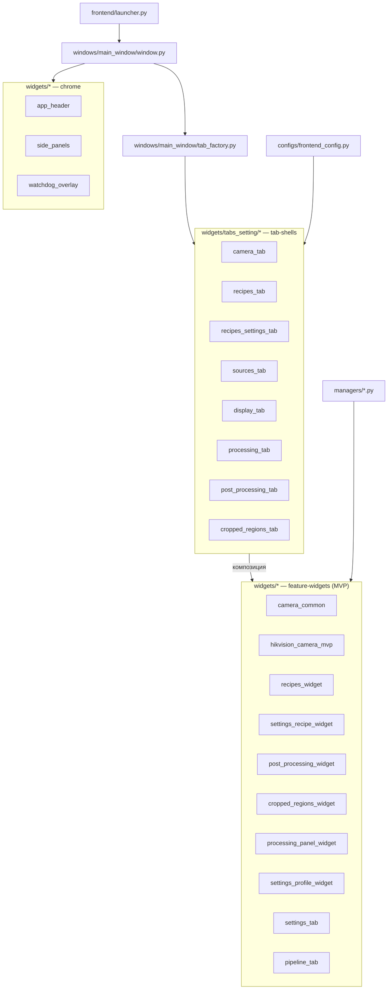
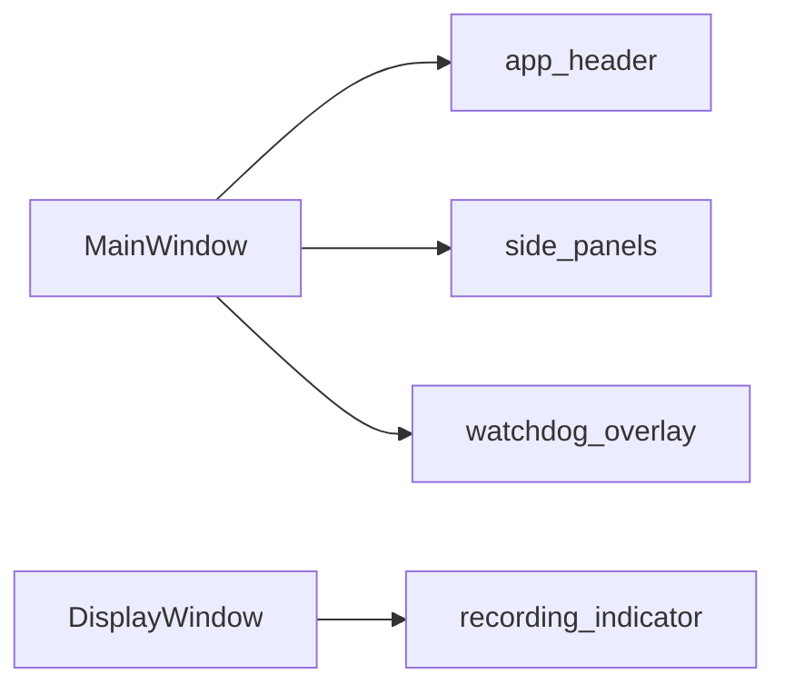
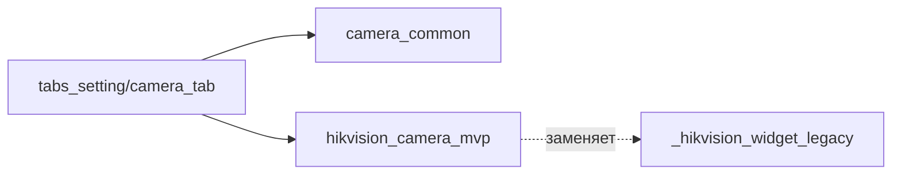
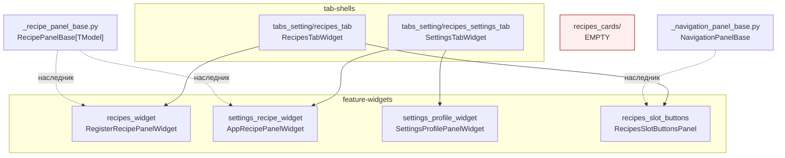
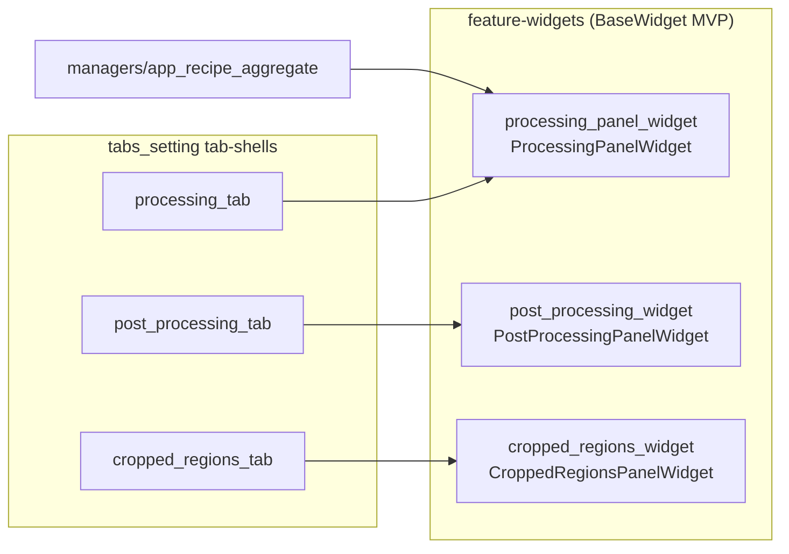
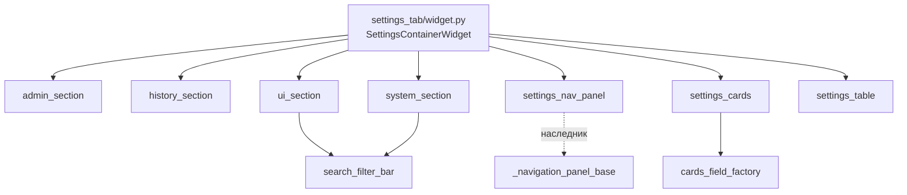
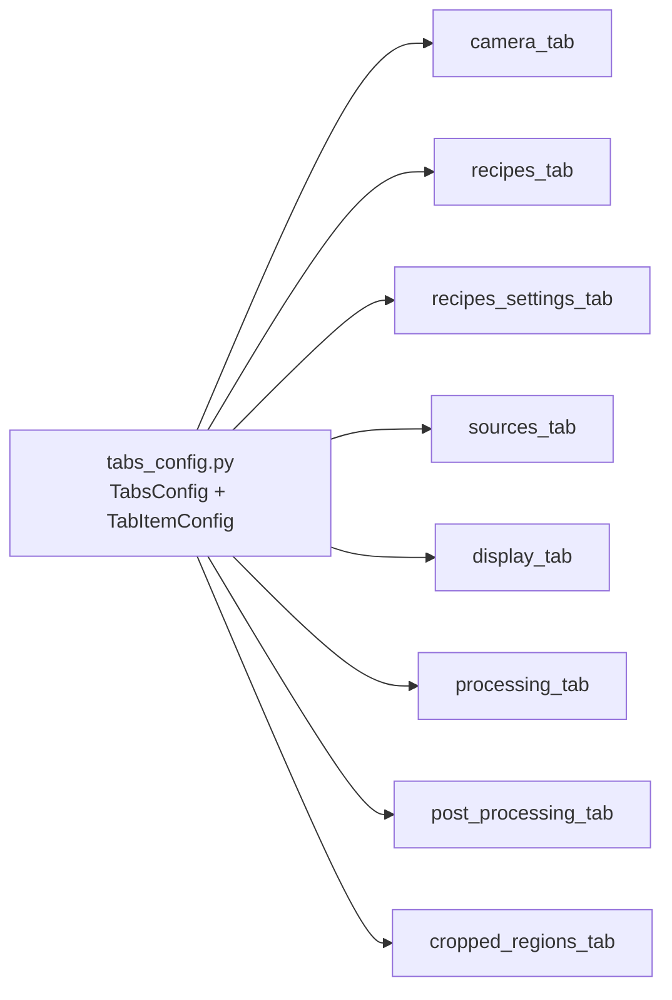

# FRONTEND_WIDGETS_MAP — карта виджетов прототипа v3

> **Назначение.** Полный аудит `frontend/widgets/` — что есть, кто использует, какие паттерны, где дубли и мёртвый код. Дата снимка: **2026-04-27**.
>
> **Контекст.** Прототип v3 базируется на `multiprocess_framework/modules/frontend_module/` (PySide6, Qt). В каталоге `widgets/` 28 пакетов + 2 базовых файла + один legacy-каталог. Документ нужен, потому что папка стала плохо обозримой — необходимо понять, что к чему относится, прежде чем браться за рефакторинг.
>
> **Соглашения.** *Feature-widget* — сама бизнес-фича (BaseWidget + MVP). *Tab-shell* — тонкая оболочка вкладки в `tabs_setting/`, которая композирует feature-widget. *Chrome* — окружение окна (header, side panels, overlays). *Legacy* — помечено `_` префиксом.

---

## 1. Слои фронтенда (откуда виджеты вызываются)



**Точки входа** (где появляются ссылки на пакеты `widgets/`):

| Файл | Что подключает |
|------|----------------|
| `frontend/launcher.py` | `DisplayWindow`, конфиги вкладок |
| `frontend/windows/main_window/window.py` | `AppHeaderWidget`, `CollapsibleSidePanel`, `WatchdogOverlay` |
| `frontend/windows/main_window/tab_factory.py` | `*TabWidget` через ленивые реэкспорты `widgets/__init__.py` |
| `frontend/configs/frontend_config.py` | `TabsConfig`, `SettingsTabConfig`, `RecipesTabConfig`, `*UiConfig` (Pydantic-схемы) |
| `frontend/managers/window_manager.py` | `DisplayWindow` (модальные окна просмотра) |
| `frontend/managers/app_recipe_aggregate.py` | `ProcessingPanelWidget`, `AppRecipePanelWidget`, `SettingsContainerWidget` |

**Ленивая загрузка.** `widgets/__init__.py` использует `__getattr__` для отложенной загрузки Qt-классов вкладок — pure-Python тесты импортируют пакеты типа `recipes_widget/slot_combo_model` без поднятия PyQt. Это нужно сохранить при любом рефакторинге.

---

## 2. Классификация по паттернам

| Паттерн | Что значит | Примеры |
|---------|-----------|---------|
| **A. MVP (full)** | `view.py` + `presenter.py` + `model.py` + `widget.py` поверх `BaseWidget[TModel]` | `camera_common`, `hikvision_camera_mvp`, `cropped_regions_widget`, `post_processing_widget`, `settings_profile_widget` |
| **B. MVP (partial)** | Есть presenter+model, но логика смешана с widget'ом (нет `view.py`) | `processing_panel_widget`, `catalog_editor`*, `chain_editor`* |
| **C. RecipePanelBase** | Наследует общий абстрактный `_recipe_panel_base.RecipePanelBase` | `recipes_widget`, `settings_recipe_widget` |
| **D. Tab-shell** | Тонкая оболочка-вкладка из `tabs_setting/`; композирует feature-widget | Все 8 пакетов в `tabs_setting/` |
| **E. Pure widget (chrome)** | Простой `QWidget`/`QFrame` без MVP — UI-хром | `app_header`, `side_panels`, `watchdog_overlay`, `recording_indicator`, `view_mode_toggle`, `search_filter_bar`, `display_window` |
| **F. Composite (no MVP)** | Большой контейнер без MVP | `pipeline_tab` (NodeGraph-редактор), `settings_tab` (multi-section), `recipes_slot_buttons` |
| **G. Utility / factory / base** | Не виджет в чистом виде | `cards_field_factory`, `_navigation_panel_base`, `_recipe_panel_base` |
| **L. Legacy** | Префикс `_*_legacy` — не используется, ждёт удаления | `_hikvision_widget_legacy` |

\* `catalog_editor` и `chain_editor` написаны частично-MVP, но **не подключены никуда** (см. §6).

---

## 3. Полная таблица виджетов

LoC посчитан без `__pycache__` и тестов. **Статус:** `live` — в текущем потоке выполнения; `dead` — нигде не импортируется; `empty` — пакет фактически пуст; `legacy` — отмечено явно.

| # | Пакет | Главный класс | LoC | Паттерн | Статус | Потребитель |
|---|-------|---------------|-----|---------|--------|-------------|
| 1 | `app_header/` | `AppHeaderWidget` | 366 | E | live | `MainWindow` |
| 2 | `camera_common/` | `SimWebcamWidget` | 434 | A | live | `tabs_setting/camera_tab` |
| 3 | `cards_field_factory/` | `create_field_widget()` | 89 | G | live | `settings_tab/settings_cards.py` |
| 4 | `catalog_editor/` | `CatalogEditorWidget` | 267 | B | **dead** | — |
| 5 | `chain_editor/` | `ChainEditorWidget` | 929 | B | **dead** | — |
| 6 | `cropped_regions_widget/` | `CroppedRegionsPanelWidget` | 1291 | A | live | `cropped_regions_tab`, `frontend_config` |
| 7 | `display_window/` | `DisplayWindow` | 370 | E | live | `launcher`, `managers/window_manager`, `display_tab`, `pipeline_tab/preview_bridge` |
| 8 | `hikvision_camera_mvp/` | `HikvisionCameraMvpWidget` | 574 | A | live | `tabs_setting/camera_tab` |
| 9 | `pipeline_tab/` | `PipelineTabWidget` | **4829** | F | live | `tab_factory` (через `widgets/__init__.py`) |
| 10 | `post_processing_widget/` | `PostProcessingPanelWidget` | 884 | A | live | `post_processing_tab`, `frontend_config` |
| 11 | `processing_panel_widget/` | `ProcessingPanelWidget` | 331 | B | live | `managers/app_recipe_aggregate`, `processing_tab` |
| 12 | `recipes_cards/` | — (нет файлов) | 0 | — | **empty** | — |
| 13 | `recipes_slot_buttons/` | `RecipesSlotButtonsPanel` | 161 | F | live | `tabs_setting/recipes_tab` |
| 14 | `recipes_widget/` | `RegisterRecipePanelWidget` | 1048 | C | live | `tabs_setting/recipes_tab` |
| 15 | `recording_indicator/` | `RecordingIndicator` | 177 | E | live | `display_window` |
| 16 | `search_filter_bar/` | `SearchFilterBar` | 155 | E | live | `recipes_tab`, `settings_tab/{system,ui}_section` |
| 17 | `settings_profile_widget/` | `SettingsProfilePanelWidget` | 623 | A | live | `tabs_setting/recipes_settings_tab` |
| 18 | `settings_recipe_widget/` | `AppRecipePanelWidget` | 490 | C | live | `recipes_settings_tab`, `frontend_config`, `app_recipe_aggregate` |
| 19 | `settings_tab/` | `SettingsContainerWidget` | 836 | F | live | `tab_factory`, `app_recipe_aggregate` |
| 20 | `side_panels/` | `CollapsibleSidePanel` | 141 | E | live | `MainWindow` |
| 21 | `tabs_setting/` (ядро) | `TabsConfig`, `TabItemConfig` | (см. §5) | D | live | `frontend_config`, `tab_factory` |
| 22 | `view_mode_toggle/` | `ViewModeToggle` | 65 | E | live | `recipes_tab`, `settings_tab` |
| 23 | `watchdog_overlay/` | `WatchdogOverlay` | 68 | E | live | `MainWindow` |
| 24 | `_hikvision_widget_legacy/` | `HikvisionWidget` | 700 | L | **legacy/dead** | — |
| 25 | `_navigation_panel_base.py` | `NavigationPanelBase` | 79 | G | live | наследники: `recipes_slot_buttons`, `settings_tab/settings_nav_panel` |
| 26 | `_recipe_panel_base.py` | `RecipePanelBase` | 297 | G | live | наследники: `recipes_widget`, `settings_recipe_widget` |

**Итого:** 28 узлов; ~16 100 LoC. Из них **4 dead/empty/legacy** (~1 900 LoC), которые можно безопасно убрать.

---

## 4. Кластеры по доменам

Это «карта» — группировка по тому, какой пользовательский поток они обслуживают.

### 4.1. Chrome (окружение главного окна)



| Виджет | Роль |
|--------|------|
| `app_header` | Шапка окна: лого, кнопки действий, переключение режимов |
| `side_panels` | `CollapsibleSidePanel` — левая (дисплеи) и правая (статусы) сворачиваемые панели |
| `watchdog_overlay` | Жёлтый оверлей при отсутствии кадров от backend'а |
| `recording_indicator` | Красная точка-индикатор записи поверх видеопотока |

Все простые pure-widget, оправданно лежат в корне `widgets/`.

### 4.2. Camera-family



| Виджет | LoC | Что делает |
|--------|-----|-----------|
| `camera_common` (A) | 434 | SimWebcam: симулятор + USB веб-камера, FPS-секция |
| `hikvision_camera_mvp` (A) | 574 | Промышленная камера Hikvision через MVP |
| `_hikvision_widget_legacy` (L) | 700 | Старая реализация, заменена `hikvision_camera_mvp`. **Никем не импортируется** |
| `tabs_setting/camera_tab` (D) | 677 | Multi-camera селектор: StackedWidget + собственный presenter |

**Наблюдение.** `camera_tab` сложнее обычной tab-shell (есть свой `CameraTabPresenter`), потому что оркестрирует переключение между типами камер. Это нормально для multi-source кейса.

### 4.3. Recipes-galaxy (самый сложный кластер — 6 пакетов)



| Виджет | LoC | Назначение |
|--------|-----|-----------|
| `_recipe_panel_base` | 297 | Generic-база: «слот → combo → load/save → tree» |
| `recipes_widget` | 1048 | Рецепты **регистров** (значения железа) |
| `settings_recipe_widget` | 490 | Рецепты **UI-конфигов** приложения |
| `settings_profile_widget` | 623 | Профили настроек (выбор/сохранение/удаление) |
| `recipes_slot_buttons` | 161 | Левая навигация по слотам |
| `tabs_setting/recipes_tab` | 767 | Tab-shell поверх `recipes_widget` |
| `tabs_setting/recipes_settings_tab` | 226 | Tab-shell поверх `settings_recipe_widget` + `settings_profile_widget` |
| `recipes_cards` | 0 | **Пустой пакет** (только `__pycache__/cards_view.pyc`) |

**Здоровье.** Архитектура корректная: `RecipePanelBase` → 2 наследника без копипаста. Tab-shells тонкие. Единственная проблема — `recipes_cards/` пуст и должен быть удалён.

### 4.4. Processing-galaxy



| Виджет | LoC | Назначение |
|--------|-----|-----------|
| `processing_panel_widget` | 331 | Управление основной обработкой (processor/renderer регистры) |
| `post_processing_widget` | 884 | Постобработка: фильтры, морфология, дерево параметров |
| `cropped_regions_widget` | 1291 | ROI/crop-regions: рисование, редактирование, дерево областей |

**Разделение feature/shell применено везде.** Имена `processing_panel_widget` vs `post_processing_widget` похожи, но это **разные домены**: первый — про активный конвейер, второй — про финальную обработку результата. Не сливать.

### 4.5. Pipeline-editor (NodeGraph)

`pipeline_tab/` — самый крупный пакет (4829 LoC, 18 файлов). Это редактор графа обработки на базе `NodeGraphQt`. Внутри видна неявная структура:

| Подгруппа (предложение) | Файлы | LoC |
|-------------------------|-------|-----|
| Граф/canvas | `adapter.py`, `model.py`, `auto_layout.py`, `linearity_check.py` | ~1640 |
| Inspector-панель | `inspector_node.py`, `inspector_panel.py`, `params_form.py` | ~1000 |
| Library palette | `library_palette.py`, `context_menu.py` | ~550 |
| Table view + переключение | `table_view.py`, `view_switch.py`, `_layout_constants.py` | ~800 |
| Bridges & combos | `preview_bridge.py`, `display_target_combo.py`, `process_id_combo.py` | ~630 |
| Корень | `widget.py`, `__init__.py`, `constants.py` | ~220 |

**Связанные dangling-пакеты:** `catalog_editor` (267 LoC) и `chain_editor` (929 LoC) — оба написаны как табличные редакторы операций, оба ссылаются друг на друга, оба нигде не импортируются. Похожи на отброшенный прототип, перешедший в `pipeline_tab`.

### 4.6. Settings (вкладка настроек)



| Файл секции | Что | LoC (оценка) |
|-------------|-----|--------------|
| `admin_section.py` | Настройки администратора |  |
| `history_section.py` | История undo/redo (после переноса из header) |  |
| `system_section.py` | Системные параметры |  |
| `ui_section.py` | UI-настройки |  |
| `settings_nav_panel.py` | Левая навигация (наследует `NavigationPanelBase`) |  |
| `settings_cards.py` | Композиция карточек полей |  |
| `settings_table.py` | Таблица параметров |  |
| `prefs_store.py` | Хранилище preferences |  |
| `ui_preferences_schema.py` | Pydantic-схема |  |

Паттерн «секции» здесь — **разумный**, потому что `settings_tab` действительно представляет несколько доменов настроек.

### 4.7. Tabs-shells (`tabs_setting/`)



| Подпакет | Главный класс | LoC | Композирует |
|----------|---------------|-----|-------------|
| `camera_tab` | `CameraTabWidget` | 677 | `camera_common`, `hikvision_camera_mvp` |
| `cropped_regions_tab` | `CroppedRegionsTabWidget` | 82 | `cropped_regions_widget` |
| `display_tab` | `DisplayTabWidget` | 291 | `display_window` |
| `post_processing_tab` | `PostProcessingTabWidget` | 43 | `post_processing_widget` |
| `processing_tab` | `ProcessingTabWidget` | 33 | `processing_panel_widget` |
| `recipes_settings_tab` | `SettingsTabWidget` | 226 | `settings_recipe_widget`, `settings_profile_widget` |
| `recipes_tab` | `RecipesTabWidget` | 767 | `recipes_widget`, `recipes_slot_buttons`, `search_filter_bar`, `view_mode_toggle` |
| `sources_tab` | `SourcesTabWidget` | 737 | (без feature-widget; самостоятельная вкладка) |

Тонкие shell'ы (33–82 LoC) — образец разделения. Толстые (`camera_tab`, `recipes_tab`, `sources_tab` 700+ LoC) — это «вкладки с собственной координацией», что нормально, но кандидаты на дальнейшее разделение в Phase 2.

---

## 5. Найденные проблемы

### 5.1. Мёртвый код и legacy (приоритет — высокий)

| # | Пакет | LoC | Подтверждение |
|---|-------|-----|--------------|
| 1 | `recipes_cards/` | 0 | Пустая директория с `__pycache__/cards_view.pyc` (исходник удалён, кэш остался) |
| 2 | `_hikvision_widget_legacy/` | 700 | Не импортируется ни одним `.py`/`.md`/`.yaml` файлом |
| 3 | `catalog_editor/` | 267 | Не импортируется нигде; внешних упоминаний нет |
| 4 | `chain_editor/` | 929 | Не импортируется нигде; нет упоминаний в planах/документации |

**Итого:** ~1 900 LoC можно убрать без последствий после явного подтверждения от пользователя.

### 5.2. Гигантизм `pipeline_tab/` (приоритет — средний)

4 829 LoC в одном пакете без явных подкатегорий. Внутри видны 5 логических подгрупп (см. §4.5), но они лежат «плашмя» — все в корне пакета. Чтение и навигация затруднены.

### 5.3. Нарушения MVP в `catalog_editor`/`chain_editor` (если оставлять)

Оба пакета — paritial-MVP: есть `presenter.py` + `model.py`, но нет `view.py` (UI-логика смешана с `panel_widget.py`). Если их решат сохранить как заготовку, нужно дотянуть до полного MVP по образцу `cropped_regions_widget`.

### 5.4. Устаревшая документация виджетов

Текущий `widgets/README.md`:
- Не упоминает `pipeline_tab`, `app_header`, `side_panels`, `chain_editor`, `catalog_editor`, `display_window`, `recipes_cards`, `recipes_slot_buttons`, `recording_indicator`, `view_mode_toggle`, `watchdog_overlay`, `settings_tab`, `_navigation_panel_base`, `_recipe_panel_base`.
- Ссылается на `docs/FRONTEND_MAP.md` — **этот файл отсутствует**.
- Содержит каталог `hikvision_widget/` — он теперь `_hikvision_widget_legacy/`.

### 5.5. Кандидаты на вынос во framework (приоритет — низкий, при стабилизации)

| Кандидат | Обоснование |
|----------|------------|
| `cards_field_factory` | Универсальная фабрика «тип значения → редактор» — типичная Qt-паттерн |
| `_recipe_panel_base.RecipePanelBase` | Generic «slot + combo + load/save + tree» — переиспользуемо за пределами Inspector |
| `_navigation_panel_base.NavigationPanelBase` | `QListWidget`-навигация со стилем — простой, переиспользуемый компонент |

Эти компоненты сейчас живут в проекте, но соответствуют framework-first принципу. Перенос — задача Phase 2.

---

## 6. Предложения по рефакторингу (3 уровня риска)

### Уровень 1 — низкий риск, можно делать сразу (1–2 часа)

1. **Удалить мёртвый код** после подтверждения:
   - `widgets/recipes_cards/` (включая `__pycache__/`)
   - `widgets/_hikvision_widget_legacy/`
   - `widgets/catalog_editor/`
   - `widgets/chain_editor/`
2. **Обновить `widgets/README.md`** — текущий не отражает фактический состав; заменить ссылку `docs/FRONTEND_MAP.md` на этот документ.
3. **Создать `STATUS.md`** в каждом feature-пакете с одной строкой: live/legacy/wip + дата.

### Уровень 2 — средний риск, требует короткого ТЗ (полдня)

4. **Подкатегоризация `widgets/` по доменам.** Цель — сократить когнитивную нагрузку при навигации. Пример целевой структуры:

   ```
   widgets/
   ├── _base/                          # _navigation_panel_base, _recipe_panel_base, cards_field_factory
   ├── chrome/                         # app_header, side_panels, watchdog_overlay,
   │                                   # recording_indicator, view_mode_toggle, search_filter_bar
   ├── camera/                         # camera_common, hikvision_camera_mvp
   ├── display/                        # display_window
   ├── recipes/                        # recipes_widget, settings_recipe_widget,
   │                                   # settings_profile_widget, recipes_slot_buttons
   ├── processing/                     # processing_panel_widget, post_processing_widget,
   │                                   # cropped_regions_widget
   ├── pipeline/                       # pipeline_tab (с внутренней разбивкой — см. п.5)
   ├── settings/                       # settings_tab + секции
   └── tabs_setting/                   # 8 tab-shells (как сейчас)
   ```

   **Риски:** ленивые реэкспорты в `widgets/__init__.py` и пути в `tab_factory`/`frontend_config` — нужно аккуратно перенести импорты. Тесты `recipes_widget/slot_combo_model` импортируются по конкретным путям — они должны сохранить pure-Python поведение.

5. **Разбить `pipeline_tab/`** на подпакеты по §4.5. Не меняя класс `PipelineTabWidget`, организовать файлы:
   ```
   pipeline_tab/
   ├── widget.py             # фасад
   ├── canvas/               # adapter, model, auto_layout, linearity_check
   ├── inspector/            # inspector_node, inspector_panel, params_form
   ├── library/              # library_palette, context_menu
   ├── views/                # table_view, view_switch, _layout_constants
   └── bridges/              # preview_bridge, *_combo
   ```

### Уровень 3 — крупный риск, требует Manager+ТЗ (2–3 дня)

6. **Перенести универсальные базы во framework** (`cards_field_factory`, `RecipePanelBase`, `NavigationPanelBase`). Согласовать API заранее.
7. **Доработать `processing_panel_widget` до полного MVP** (отделить `view.py`).
8. **Tab-shells `recipes_tab` и `sources_tab`** (700+ LoC) — выделить из них презентеры/координаторы во избежание разрастания.

---

## 7. Метрики здоровья

| Категория | Оценка | Комментарий |
|-----------|--------|-------------|
| Соответствие BaseWidget/MVP | **8/10** | Большинство feature-widgets корректны; partial-MVP в `processing_panel_widget`, нарушения в dead-пакетах |
| Code reuse | **8/10** | `RecipePanelBase`/`NavigationPanelBase` снимают дублирование |
| Разделение feature/shell | **9/10** | Применено почти везде; sources_tab — исключение |
| Навигация (DX) | **6/10** | 28 пакетов в плоском списке; нужна подкатегоризация |
| Чистота от dead-кода | **6/10** | ~1 900 LoC мёртвого/legacy; явная разметка через `_*_legacy` помогает, но не везде применена |
| Документация | **5/10** | README устарел; нет STATUS.md в пакетах; ссылка на отсутствующий документ |
| **Итого здоровье** | **7/10** | Архитектурная база здоровая. Основные проблемы — навигация и cleanup, не дизайн |

---

## 8. Связанная документация

- `multiprocess_framework/modules/frontend_module/widgets/tabs/TAB_STRUCTURE.md` — устройство tab-shells
- `multiprocess_framework/modules/frontend_module/widgets/tabs/MVP_TEMPLATE.md` — шаблон MVP
- `multiprocess_framework/modules/frontend_module/widgets/base_widget/README.md` — `BaseWidget`
- `multiprocess_prototype/docs/ARCHITECTURE.md` — общая архитектура прототипа
- `multiprocess_prototype/frontend/widgets/README.md` — операционный обзор пакетов (нуждается в обновлении)
- `multiprocess_prototype/frontend/managers/README.md` — domain managers, на которые опираются presenter'ы
