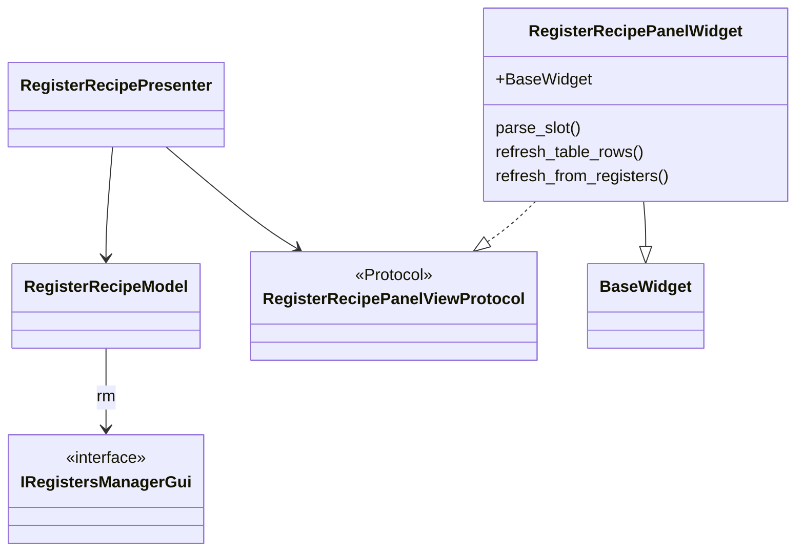
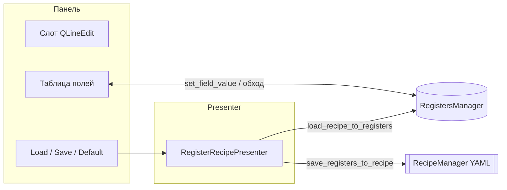

# recipes_widget

Пакет вкладки **recipes** (регистры / алгоритм). Здесь управляется **группа рецептов значений регистров**: `register_recipes` в YAML ↔ живой `RegistersManager`. Параллельно (другая группа, другой слой YAML) — [`settings_recipe_widget`](../settings_recipe_widget/) для UI-пресетов (`app_recipes`); принцип слотов/таблицы похож, но схемы другие.

**Register recipe** panel: slot index, load/save/default, `StructuredTableWidget` of algorithm fields from `RegistersManager` + `FieldMeta` / `AccessContext`.

## Классы и MVP



## Поток: рецепт регистров



## Files

| Файл | Классы / содержимое |
|------|---------------------|
| `panel_widget.py` | `RegisterRecipePanelWidget` |
| `presenter.py` | `RegisterRecipePresenter` |
| `model.py` | `RegisterRecipeModel` — `rm`, `recipe_manager`, колбэки |
| `view.py` | `RegisterRecipePanelViewProtocol` |
| `recipe_rows.py` | `build_recipe_rows`, `format_value_for_cell`, `coerce_string_to_value` |

## Dependencies

- **`RecipeManagerProtocol`** (`managers/recipe_manager_protocol.py`) for YAML recipe I/O (optional; `None` disables load/save)
- **`RecipesTabConfig`** from `settings_recipe_widget.schemas`

## Embedding

`tabs_setting.recipes_tab.RecipesTabWidget` composes this panel inside a scroll area.

## Роль таблицы vs панели фич

- **Таблица** (`build_recipe_rows` / `StructuredTableWidget`) даёт **единый обзор** всех полей регистров и позволяет править скаляры и (как JSON) вложенные dict — удобно для контроля снимка и экспорта мысленной модели.
- **Основное редактирование** вложенных структур (ROI, постобработка): вкладки **«Регионы обрезки»**, **«Постобработка»** и т.д., которые пишут в регистры через `set_field_value`; после правок — **Load** слота рецепта или **Save** в слот.
- Поток: загрузить рецепт → при необходимости подправить значения в панелях → сохранить слот. См. [docs/DATA_MODEL_NESTED.md](../../../docs/DATA_MODEL_NESTED.md).

## Проверка контура `register_recipes`

**Автоматически:** из корня текущий каталог (рядом с каталогом `multiprocess_prototype`):

```powershell
$env:PYTHONPATH = "$PWD;$PWD\multiprocess_framework\modules"
python -m pytest multiprocess_prototype/tests/test_recipe_manager.py multiprocess_prototype/tests/test_recipe_manager_unified.py -v
```

Ожидается **6 passed** (round-trip, legacy crop-миграция, legacy `recipes` → `register_recipes`, `build_recipe_rows`, новый формат YAML).

**Структура слота в YAML:** под `register_recipes.<slot>` — ключи **`camera`**, **`processor`**, **`renderer`** (как в [`registers/factory.py`](../../../registers/factory.py)). Слот **`"0"`** — заводской пресет; **`"1"`**… — сорта. Пример: [`data/recipes.yaml`](../../../data/recipes.yaml). Пресеты UI — в отдельном [`data/settings_recipes.yaml`](../../../data/settings_recipes.yaml) (всегда два файла; см. `RecipeManager`, [`recipe_yaml_stores.py`](../../../managers/recipe_yaml_stores.py), ADR-098).

**Вручную в UI:** вкладка «Рецепты» — ввести номер слота → **Загрузить** / **Сохранить** / **По умолчанию** (`default_value`); после сохранения проверить файл `recipes_path` из конфига (по умолчанию `multiprocess_prototype/data/recipes.yaml`).

**Заметки (не блокеры):** при неуспехе `load_recipe_to_registers` презентер не показывает диалог — только `False` из менеджера; push снимка в worker-процессы после Load — см. [RECIPES_SYSTEM.md §7](../../../docs/RECIPES_SYSTEM.md). Новые поля в схемах регистров — [`registers/CHECKLIST.md`](../../../registers/CHECKLIST.md) и при необходимости [`snapshot_migrate.py`](../../../registers/snapshot_migrate.py).
