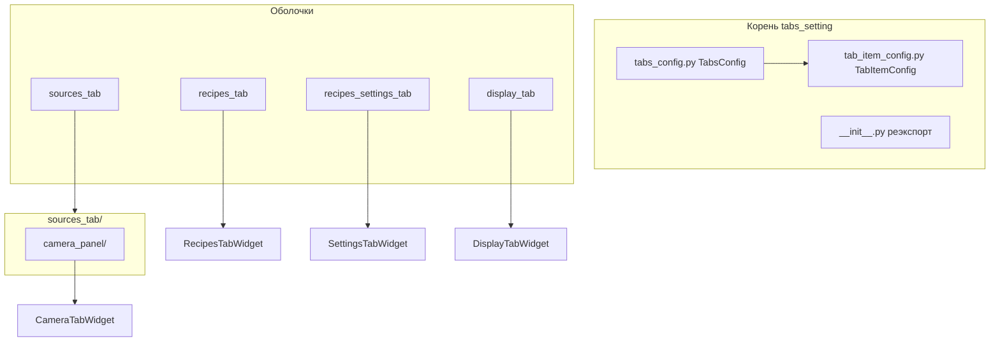

# tabs_setting — полоса вкладок и оболочки

Здесь живут **`TabItemConfig`**, **`TabsConfig`** и тонкие вкладки **`BaseTab`**, которые либо показывают placeholder без `RegistersManager`, либо встраивают фиче-виджеты из `widgets/`.

Папки **`recipes_tab/`** и **`recipes_settings_tab/`** — оболочки вкладок; ключи фабрики по-прежнему **`recipes`** и **`settings`** (см. `tab_factory.py`).

`CameraTabWidget` архитектурно является подкомпонентом Sources tab и расположен в `sources_tab/camera_panel/`.

## Состав пакета

## Подпакеты

| Папка | Виджет | Встраиваемый фиче-пакет | README |
|-------|--------|-------------------------|--------|
| `sources_tab/camera_panel/` | `CameraTabWidget` | `camera_common`, `hikvision_widget` | [sources_tab/camera_panel/README.md](sources_tab/camera_panel/README.md) |
| `recipes_tab/` | `RecipesTabWidget` | `recipes_widget` | [recipes_tab/README.md](recipes_tab/README.md) |
| `recipes_settings_tab/` | `SettingsTabWidget` | `settings_recipe_widget` | [recipes_settings_tab/README.md](recipes_settings_tab/README.md) |
| `display_tab/` | `DisplayTabWidget` | — | — |

## Файлы верхнего уровня

| Файл | Назначение |
|------|------------|
| `tab_item_config.py` | `TabItemConfig` — `id`, `title`, `widget` (ключ фабрики) |
| `tabs_config.py` | `TabsConfig` — список вкладок по умолчанию, `to_tabs_dict_list()` |
| `__init__.py` | Публичный API для `widgets/__init__.py` |

## Связь с `tab_factory`

Ключ **`widget`** в `TabItemConfig` сопоставляется фабрике главного окна (`recipes`, `settings`, `sources`, `display`). См. документацию лаунчера / `FRONTEND_MAP.md`.

## Документация фреймворка

- [TAB_STRUCTURE.md](../../../../multiprocess_framework/modules/frontend_module/widgets/tabs/TAB_STRUCTURE.md)
