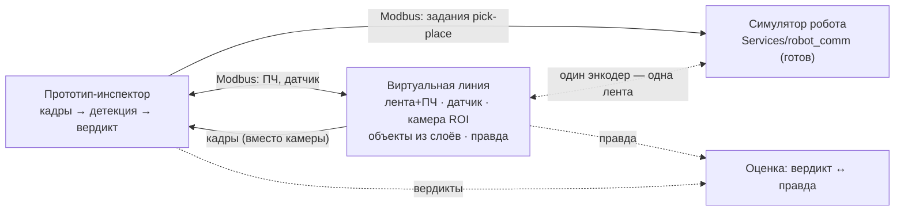

# Виртуальная линия (line_sim) — описание продукта

**Статус:** согласовано владельцем · ред. 4 (все решения закрыты) · 2026-08-13
**Рядом:** [vision.html](vision.html) — та же редакция с рисунками ·
[артефакт](https://claude.ai/code/artifact/0fc2df17-e1b0-4dc5-8366-7d0f19637e80)
**План:** `plan.md` в этом каталоге — будет создан через `/dev:plan` после этого документа.

## Суть

Отдельный сервис, который притворяется участком производственной линии: лента везёт
объекты, датчик срабатывает, «камера» отдаёт кадры из нарисованной сцены, а инспектор
и робот разговаривают с ним по Modbus — тем же протоколом, что с железом.
**Прототип не знает, что мир ненастоящий.**

## Решения владельца (2026-08-13)

| Решение | Формулировка |
|---|---|
| Первый пресет | **Буквы-диски, вид сверху** — проект живёт на реальном стенде со SCARA, симулятор есть с чем сверять. Бутылки (вид сбоку) — следующий проект |
| Универсальность | Движок объект-агностичный с первого дня; пресет = набор слоёв + правила |
| Сборки | v1 — **встроенная в прототип**: вкладка управления (по образцу `tabs/pipeline`), кадры — в штатные дисплеи, в тракт — source-плагин. Своё автономное окно — **отложено**, разъёмы фасада сохраняются |
| Запуск | **Механикой фреймворка**: процессы линии — в топологии прототипа (SystemLauncher → ProcessManager), не скрипт |
| Точность мира | **Примерная — достаточно.** Ключевой измеряемый инвариант v1: **один объект → одна команда роботу**, а не «два задания на одну деталь» |
| Правда | Функция правды (паспорт объекта + оценка вердиктов) — в v1 |
| Камера | Виртуальная камера настраивается: fps, размер кадра, цвет/моно — как настоящая |
| Рецепты | Общие с инспектором: выбранный рецепт определяет и содержимое сцены |
| Спрайты из реальности | Прототип снимает боевой камерой → вырезка в RGBA → каталог пресета; лента ездит с настоящей фактурой |
| Переиспользование | По максимуму готовое из framework / Services / Plugins / прототипа; что нужно линии, но заперто в прототипе — **выделяется в сервис/плагин** (продолжение carve-out Phase 4–5), не копируется |
| Робот | **Отдельным процессом** (robot_comm как есть); общая с линией — только правда о ленте (один энкодер) через канал |
| Сим-секция рецепта | **Опциональная секция в том же YAML** (не парный файл); боевые рецепты без неё валидация не трогает |
| ПЧ и датчик в v1 | **Через Modbus-фасад** там, где боевой тракт ходит по Modbus; командами фреймворка — только то, что и на железе идёт командами |

## Сцена

- Лента с фоном из **фотографии реальной ленты**, зацикленной (луп) для правдоподобия.
- Скорость — из **виртуального ПЧ по Modbus**; она крутит **тот же энкодер**, который
  читает робот (константы трекинга общие с прошивкой: `FACTOR_MM`, вектор хода).
  Инспектор может притормозить или остановить конвейер — как на железе.
- Два пресета вида: **сверху** (диски с буквами) и **сбоку** (бутылки).
- Спавн объектов: поток одинаковых или с вариациями, интервал/плотность с пульта.

## Объект — группа слоёв, а не картинка

«Объект» — набор спрайтов-слоёв с правилами. Бутылка: тара + наполнение + этикетка +
крышка + кольцо. Диск: диск + буква. Новый продукт = новый пресет из картинок, движок
не правится.

Каждый слой независимо в одном из режимов:

- **статика** — одинаковый у всех объектов;
- **аугментация** — варьируется в пределах (уровень налива, сдвиг/поворот этикетки, оттенок);
- **дефект** — вариант-брак (нет крышки, недолив, перекос), включается вероятностью
  или кнопкой с пульта («выпусти брак сейчас»).

**Главный выигрыш:** симулятор собирал объект сам — значит, знает правду. У каждого
объекта паспорт: класс, угол, дефекты. Вердикты инспектора сверяются с истиной
автоматически → матрица ошибок: «пропустил 2 недолива из 40» вместо «вроде работает».

**Спрайты — в том числе из реальных фото (закольцовка с прототипом).** Снял объект
боевой камерой через прототип → вырезал в RGBA-эталон → положил в каталог пресета —
лента ездит с настоящей фактурой (блики, износ) без вложений в фотореализм. Для дисков
конвейер уже есть целиком: `Services/dataset_gen/tools/cut_real_disks` (детекция круга
HoughCircles → вырез RGBA → приведение к вертикали → каталог классов). Каталог спрайтов
общий с генератором датасетов — одна съёмка кормит и симулятор, и обучение.

## Виртуальная камера

- **Рамка ROI на сцене** — двигается и растягивается мышью; что в рамке, то уходит
  кадрами в прототип вместо вебки/Hikvision (прототип выбирает «sim-камеру» в рецепте
  как обычный источник).
- **Настраивается как настоящая:** fps, размер кадра, цвет/моно — та же поверхность
  настроек, что у боевых камер прототипа (пресеты + actual).
- Поверх кадра — фотометрия из `Services/dataset_gen`: блик, смаз движения, тень,
  баланс белого, гамма, виньетка.
- Режимы: свободный прогон или триггер от датчика.
- **Картинки — в штатные дисплеи**: сцена целиком и вид камеры публикуются в именованные
  SHM-каналы `display_module` (реестр `DisplayRegistry`, просмотр — `DisplaysTab` /
  `PreviewWindow`, подписка через broadcast-route). Свои виджеты отображения не пишем.

## Датчик

**Уточнено кодом при планировании (2026-08-13):** в боевом рецепте
`hikvision_letter_robot` «объект пересёк линию» реализован зрением
(`line_filter`, триггер по кадру) — физического Modbus-датчика в `devices:` нет.
Поэтому в v1 виртуальный датчик — это то, что `line_filter` одинаково срабатывает
на синтетических кадрах line_sim; отдельный Modbus-регистр датчика не строится
(решение «Modbus-фасад там, где боевой тракт ходит по Modbus» выполняется буквально).
Когда появится рецепт с физическим фотоэлементом — Modbus-фасад датчика добавляется
по образцу задач Ф2, без переделки движка.

## Пульт и sim-диалог

Пульт — **вкладка в GUI прототипа** по образцу существующих
(`multiprocess_prototype/frontend/widgets/tabs/pipeline/` — MVP: `tab.py` + presenter,
`DiffScrollTabLayout`, AppServices DI): скорость, поток объектов, доля дефектов, пауза,
кнопка «выпусти брак». Там же — журнал обмена в духе окна-монитора робота: две колонки
«принято от инспектора ↔ ответила линия». Отдельное окно не строим — используем готовую
механику вкладок.

## Петля целиком

Линия и робот — два независимых Modbus-собеседника прототипа, но делят одну правду
о ленте: **энкодер один**. Забрал робот объект — объект исчез со сцены.

## Запуск и рецепты

- v1: процессы линии поднимаются **в топологии прототипа** той же механикой
  SystemLauncher → ProcessManager — ещё один процесс(ы) рецепта, как devices или gui.
  Автономное мини-приложение с собственным окном — отложено; фасад с разъёмами делает
  его сборкой «потом», а не переделкой.
- **Рецепт — единый** (решение владельца). Симулятор читает тот же YAML, что выбран
  в инспекторе: `hikvision_letter_robot` → на ленте буквы-диски; рецепт бутылок →
  бутылки. Сим-часть рецепта **опциональна**: без неё рецепт остаётся чисто боевым.
- При подмене в рецепте меняются две вещи: источник кадров («sim-камера») и адреса
  устройств (на симулятор). Остальной прототип о подмене не знает.

## Один движок — две сборки

Ядро одно и не знает, куда воткнуто (принцип RobotSimCore: чистая логика отдельно,
транспорт отдельно). Каждая способность — на своём разъёме. **v1 — правая колонка**;
автономная сборка отложена, но разъёмы держат её возможной:

| Разъём | Сборка в прототипе (**v1**) | Автономная сборка (отложена) |
|---|---|---|
| управление | вкладка → команды и регистры фреймворка; Modbus-фасад ленты — там, где боевой тракт ходит по Modbus | Modbus TCP целиком — неотличимо от железа |
| кадры | source-плагин, кадры внутри процесса | sim-камера по сети |
| отображение | штатные дисплеи (`display_module`) + вкладка-пульт | своё Qt-окно с пультом |
| правда | канал в оценку «вердикт ↔ правда» | журнал паспортов объектов |

## Из чего собираем

Принцип: **сначала готовое**. Движок ничего не изобретает там, где у фреймворка/сервисов
уже есть инструмент (процессы, каналы, конфиг, стейт, виджеты). Если нужное линии сейчас
заперто внутри `multiprocess_prototype` — оно **выделяется в Services/Plugins** для
переиспользования (продолжение carve-out Phase 4–5), а не копируется в симулятор.

| Кусок | Что даёт | Статус |
|---|---|---|
| `Services/robot_comm/server` | Modbus-петля, симулятор робота, окно-монитор, реалистичный тайминг | готов (worktree `sim-monitor` — закоммитить, шаг 0 плана) |
| `Services/dataset_gen` | аугментации, спрайты RGBA, пресеты YAML | готов |
| `dataset_gen/realcut` + `tools/cut_real_disks` | вырезка реальных фото в RGBA-эталоны (диски — уже целиком) | готов |
| `Create_bottles` (история git) | слои LayerImage/BottleGroup, наполнение, PyQt-стенд | в истории (авг–сен 2025, свежее бэкапа на `D:\Рабочий стол бэкап\bottels`); достаётся из коммита `6116adf3` |
| `Plugins/sources/synthetic_frame_source` | образец source-плагина «кадры без камеры» | готов |

## Чем продукт НЕ является

- **Не 3D и не физика** — спрайты на плоскости; геометрию движения проверяет
  Virtual Robot в DRAStudio.
- **Не фотореализм** — правдоподобная картинка для тракта, а не рендер. Точность
  нейронки по синтетике не мерить — сим проверяет логику тракта.
- **Не генератор датасетов** — это `dataset_gen`; линия переиспользует, не дублирует.
- **Не Rust** — композиция ROI 1–2 Мп @ 30 fps — рядовая задача OpenCV/NumPy.

## Осталось решить

Открытых вопросов нет — три последних (робот отдельным процессом; сим-секция в том же
YAML; ПЧ/датчик через Modbus-фасад) закрыты владельцем 2026-08-13 и перенесены в таблицу
решений выше.
