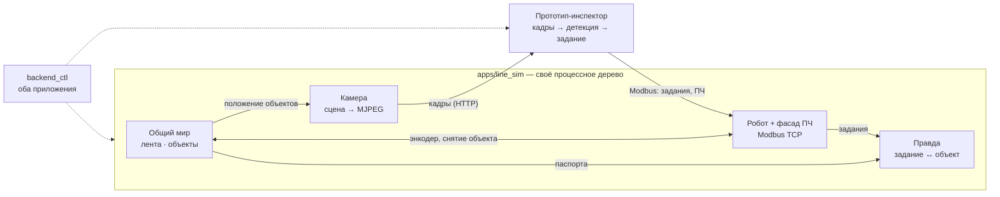

# Виртуальная линия (line_sim) — описание продукта

**Статус:** ред. 5 · 2026-09-21 · владелец делегировал доработку формулировки («сделай как
лучше и правильнее») — правки этой редакции перечислены в конце, в таблице «Что изменилось».
**Рядом:** [vision.html](vision.html) и
[артефакт](https://claude.ai/code/artifact/0fc2df17-e1b0-4dc5-8366-7d0f19637e80) —
**остались на ред. 4 и устарели** (встроенная сборка, вкладка в прототипе). Источник истины — этот файл.
**План:** [`plan.md`](plan.md).

## Суть

`line_sim` — **автономное приложение на фреймворке: стенд из моделей устройств.**
Робот, преобразователь частоты с конвейером, камера, датчик — каждое устройство живёт в
симуляторе отдельной моделью и разговаривает с внешним миром **тем же протоколом, что и
железо**. Состав стенда задаётся конфигом, устройства комбинируются и влияют друг на друга
через общий мир (лента, объекты на ней). Прототип-инспектор подключается к стенду как к
настоящей линии и отличается от боевого запуска **только адресами в данных**.

**Прототип не знает, что мир ненастоящий.**

Первый стенд (v1) — участок с буквами-дисками: лента, SCARA-робот, ПЧ через мост робота,
камера сверху. Главный измеряемый инвариант — **один объект → одна команда роботу**.

## Принципы (по ним проверяется любое решение в плане)

1. **Подмена — только данными.** В прототипе меняются адрес устройства (`data/devices.yaml`)
   и тип источника кадров (рецепт). Ни строки кода инспектора, ни одной секции «для
   симулятора» в боевых рецептах.
2. **Верность протоколу — на проводе, а не во внутренностях.** Эмулируем то, что прототип
   реально видит: карту регистров, тайминги ответа, ограничения прошивки (пример уже в коде:
   зеркало ПЧ обновляется только по команде — как в боевой Lua). Внутри модель может быть
   сколь угодно простой.
3. **Одна карта регистров на драйвер и на модель.** Адреса, масштабы и порядок слов модель
   берёт оттуда же, откуда драйвер (`Services/robot_comm/core/registers.py`,
   `Services/vfd_comm/protocols/*.yaml`), либо сверяется с ними контракт-тестом. Две копии
   карты — это тихий дрейф «симулятор зелёный, железо красное».
4. **Устройство = ядро без транспорта + плагин-хост.** Ядро — чистая логика без Qt, Modbus
   и IPC (принцип `RobotSimCore`), живёт в `Services/`. Хост — тонкий `ProcessModulePlugin`
   в `Plugins/sim/`, поднимает боевой протокол и отдаёт команды/метрики фреймворку.
5. **Устройства не зовут друг друга — они делят мир.** Лента и объекты — общее состояние
   (`StateProxy` внутри дерева симулятора). ПЧ меняет скорость ленты, лента крутит энкодер,
   энкодер двигает объекты, робот забирает объект — и он исчезает из кадра камеры. Ни одна
   модель не импортирует другую.
6. **Сначала готовое.** Каталог устройств — это реестр плагинов фреймворка; комбинация —
   `pipeline.yaml`; управление — `backend_ctl`; наблюдаемость — порт наблюдений. Нового
   «фреймворка устройств» не строим.
7. **Честные тайминги и отказы.** Урок sim-monitor: «мгновенный» робот прятал дефект трёх
   заданий на одну деталь. Задержки ответа и отказы (обрыв, таймаут, fault ПЧ) — ручки
   модели, а не случайность: дубли заданий рождаются именно на повторах после таймаута.
8. **Наблюдаемость наследуется, а не пишется.** Симулятор — такой же гражданин фреймворка,
   как прототип: те же плоскости (логи, ошибки, числа, история, состояние), тот же
   `backend_ctl`, **та же приёмка тем же зондом**. Модель устройства отдаёт уровни
   (`publish_metric` на своём такте), слагаемые (`record_metric`), ошибки и отказы — штатными
   дорогами; счётчик «для людей» в дереве состояний мира — обход порта наблюдений. Чего
   generic-приложению не хватает против прототипа, выделяется во фреймворк, а не
   обходится в симуляторе.

## Каталог устройств

| Устройство | Как прототип говорит с железом | Модель в симуляторе | Статус |
|---|---|---|---|
| Робот SCARA | Modbus TCP (`RobotDriver`) | ядро `RobotSimCore` + хост `SimRobotHostPlugin` | готов (план Ф1.1) |
| ПЧ + конвейер | Modbus через мост робота: mailbox `0x1200` команда / `0x1210` зеркало | фасад ПЧ в регистрах робота (как на стенде) + модель ленты `BeltDrive`: частота → мм/с → энкодер | фасад есть, лента — Ф2.1 |
| Камера | боевая — Hikvision MVS SDK (GigE); вебкамера — `cv2.VideoCapture` | сцена → MJPEG по HTTP; прототип читает боевым `camera_service`, тип `stream` | Ф1.2 |
| Датчик «объект пересёк линию» | в боевом рецепте — зрением (`line_filter`), Modbus-датчика нет | отдельной модели нет: `line_filter` одинаково срабатывает на кадрах сима | не нужен в v1 |
| *следующие* — ПЧ напрямую (`gd20_direct`), Modbus-датчик, отбраковщик, второй робот | по своему протоколу | новый каталог в `Plugins/sim/` | по мере появления рецептов |

**Камера — честная граница.** Поток GigE промышленной камеры в v1 не эмулируется: сим-прогон
идёт через `camera_service/stream`, то есть подмена происходит уровнем выше SDK. Эмуляторы
GigE Vision существуют (например, fake-камера из Aravis), но увидит ли такую MVS SDK —
**не проверено**; это отдельный эксперимент, а не обещание плана.

### Как добавить устройство

1. Ядро в `Services/<домен>/` — класс с `tick()` и регистрами/состоянием, без транспорта.
   Юнит-тесты без сети.
2. Хост в `Plugins/sim/<устройство>/` — `@register_plugin`, `configure/start/shutdown`,
   боевой протокол, команда `<устройство>.status`; наблюдаемость — по принципу 8:
   уровни через `publish_metric` на своём такте, слагаемые через `ctx.record_metric`,
   ошибки через `ctx.health.report_error`.
3. Строка в `pipeline.yaml` стенда. Другая комбинация устройств — другой yaml.
4. Если устройство влияет на мир или зависит от него — читает/пишет общий мир через
   `ctx.state_proxy`, а не соседнюю модель.

Общий базовый класс для хостов **заранее не вводим**: он уже есть — `ProcessModulePlugin`.
Когда появится второй Modbus-хост, общая часть первого (проба порта, деградация в `error`,
счётчик записей, `status`) выносится в базу — по факту дублирования, не по предчувствию.

## Общий мир

- **Лента.** Энкодер один на весь стенд. Его значение отдаётся роботу регистром (как на
  железе) и публикуется в мир для сцены. Константы трекинга общие с прошивкой
  (`FACTOR_MM`, вектор хода). Инспектор может притормозить или остановить конвейер — как
  на железе, дискретной командой ПЧ.
- **Объекты.** У каждого паспорт: класс, угол, дефекты, энкодер спавна. Позиция в любой
  момент вычисляется из энкодера — отдельно её никто не хранит.
- **Взаимодействия v1:** ПЧ → скорость ленты → энкодер → положение объектов → кадр камеры;
  задание роботу → объект снят с ленты → исчез из следующих кадров.

## Сцена

- Лента с фоном из **фотографии реальной ленты**, зацикленной (луп).
- Два пресета вида: **сверху** (диски с буквами, v1) и **сбоку** (бутылки, следующий проект).
- Спавн объектов: поток одинаковых или с вариациями, интервал/плотность — командами.
- **Воспроизводимость:** у стенда есть `seed`; прогон с тем же seed и теми же командами
  даёт ту же последовательность объектов — упавший прогон можно повторить.

## Объект — группа слоёв, а не картинка

«Объект» — набор спрайтов-слоёв с правилами. Бутылка: тара + наполнение + этикетка +
крышка + кольцо. Диск: диск + буква. Новый продукт = новый пресет из картинок, движок
не правится.

Каждый слой независимо в одном из режимов:

- **статика** — одинаковый у всех объектов;
- **аугментация** — варьируется в пределах (уровень налива, сдвиг/поворот этикетки, оттенок);
- **дефект** — вариант-брак (нет крышки, недолив, перекос), включается вероятностью
  или командой («выпусти брак сейчас»).

**Спрайты — в том числе из реальных фото.** Снял объект боевой камерой через прототип →
вырезал в RGBA-эталон → положил в каталог пресета. Для дисков конвейер готов целиком:
`Services/dataset_gen/tools/cut_real_disks`. Каталог спрайтов общий с генератором
датасетов — одна съёмка кормит и симулятор, и обучение.

## Виртуальная камера

- **Рамка ROI на сцене:** что в рамке, то уходит кадрами в поток. Положение и размер —
  командами симулятора (мышью — когда у сима появится своё окно).
- **Настраивается как настоящая:** fps, размер кадра, цвет/моно.
- Поверх кадра — фотометрия из `Services/dataset_gen`: блик, смаз, тень, баланс белого,
  гамма, виньетка.
- Режимы: свободный прогон или триггер.

## Правда

Симулятор собирал объект сам — значит, знает правду. Сверка идёт **на проводе, внутри
симулятора**: задание роботу несёт координаты и снимок энкодера (`job_x`, `job_y`,
`job_ecap`), по ним задание сопоставляется с объектом, который в этот момент был в этой
точке ленты.

| Исход | Как определяется |
|---|---|
| поймал | объекту досталось ровно одно задание |
| дубль | объекту досталось больше одного (готовый детектор `SimJournal`) |
| пропустил | объект покинул зону захвата без задания |
| ложная тревога | заданию не соответствует ни один объект |
| ошибка захвата, мм | невязка координат задания и истинного положения |

Метаданные «прицепом на кадре» (ред. 4) **отменены**: по видеопотоку они не едут, а узел
сверки внутри конвейера прототипа нарушил бы принцип 1. Сверка вердиктов *класса и угла*
(их в задании роботу нет) — внешним наблюдателем, который читает оба приложения через
`backend_ctl` и соединяет записи по снимку энкодера; это отдельная задача после v1-ядра.

## Пульт

v1 — **командами и регистрами плагинов симулятора через его `backend_ctl`** (свой порт):
скорость, поток объектов, доля дефектов, пауза, «выпусти брак», ручки отказов. Журнал
обмена с роботом — готовое окно `SimMonitorWindow`. Собственное Qt-окно стенда — после
того, как у generic-приложений фреймворка появится GUI-загрузка; вкладки в прототипе
не будет (принцип 1).

## Петля целиком

## Запуск

- Два приложения, два процессных дерева: `python apps/line_sim/run.py` и
  `python multiprocess_prototype/run.py letter_robot_sim`. Порты стенда зафиксированы в
  [`phase-1`](phase-1-vertical-slice.md): `backend_ctl` прототипа 8765, сима 8766, Modbus
  сим-робота 5021, MJPEG 8090.
- Сим-вариант рецепта прототипа отличается от боевого ровно одним блоком (источник кадров)
  — проверяется тестом-диффом. Адрес робота — в `data/devices.yaml`.
- **Сцену выбирает стенд симулятора** (пресет в его конфиге), а не рецепт инспектора.
  Общим остаётся каталог спрайтов, а не YAML.

## Из чего собираем

| Кусок | Что даёт | Статус |
|---|---|---|
| `app_module.run_app`, `GenericProcess` | второе приложение: процессы, конфиг, команды, наблюдаемость, `backend_ctl` | готов (Ф1.0–1.1) |
| `Services/robot_comm/server` | Modbus-петля, ядро робота, окно-монитор, детектор дублей, реалистичный тайминг | готов |
| `Plugins/sources/camera_service` | боевой источник кадров; тип `stream` — дверь для кадров сима | Ф1.2 |
| `state_store_module` (`StateProxy`) | общий мир между процессами стенда | carve-out для generic-приложений — Ф2.0 |
| `Services/dataset_gen` | композиция RGBA, фотометрия, пресеты, вырезка реальных фото | готов |
| `Create_bottles` (история git, `6116adf3`) | идея слоёв `LayerImage`/`BottleGroup` | идейная основа, код не копируется |

## Чем продукт НЕ является

- **Не фреймворк устройств** — реестр, композиция и управление берутся у фреймворка как есть.
- **Не 3D и не физика** — спрайты на плоскости; геометрию движения проверяет Virtual Robot
  в DRAStudio.
- **Не фотореализм** — правдоподобная картинка для тракта. Точность нейронки по синтетике
  не мерить — сим проверяет логику тракта.
- **Не генератор датасетов** — это `dataset_gen`; линия переиспользует, не дублирует.
- **Не Rust** — композиция ROI 1–2 Мп @ 30 fps — рядовая задача OpenCV/NumPy.

## Что изменилось относительно ред. 4

| ред. 4 (2026-08-13) | ред. 5 | причина |
|---|---|---|
| v1 — встроенная в прототип сборка | автономное приложение | решение владельца 2026-08-31 |
| сим-секция в том же YAML рецепта | у сима свой конфиг; у прототипа сим-вариант рецепта с одним отличием | то же: секция `sim:` = прототип знает о симе |
| пульт — вкладка в GUI прототипа | команды через `backend_ctl` сима, своё окно позже | то же |
| кадры — source-плагин внутри прототипа | MJPEG → боевой `camera_service/stream` | решение владельца 2026-09-20 (вариант «а») |
| рецепт инспектора определяет сцену | сцену выбирает стенд сима | следствие автономной формы |
| правда — sidecar `sim_truth` на кадре + узел сверки в прототипе | сверка на проводе внутри сима по `job_ecap` | по видеопотоку метаданные не едут; узел в прототипе нарушает принцип 1 |
| «линия» как единое целое | **стенд из моделей устройств**: каталог, контракт, общий мир | пожелание владельца 2026-09-21: устройства дополняются и комбинируются |
| — | принципы 3 (одна карта регистров) и 7 (отказы как ручки), `seed` | советы этой редакции |
| «наблюдаемость достаётся готовой» — обещание | принцип 8 + приёмка тем же зондом, что у прототипа (план, Task 1.4) | пожелание владельца 2026-09-21: симулятор перенимает наблюдаемость, как прототип |

## Осталось решить (не блокирует Ф1–Ф4)

1. **Как инспектор выражает «брак» на проводе?** Если бракованный объект просто не получает
   задания — «пропуск брака» и «верный отказ от захвата» на проводе неразличимы без знания
   вердикта. От ответа зависит, хватит ли сверки на проводе или внешний наблюдатель нужен
   уже в v1 (план Ф5).
2. **Эмуляция GigE** — стоит ли тратить день на эксперимент с fake-камерой и MVS SDK, или
   подмена уровнем выше SDK достаточна навсегда.
