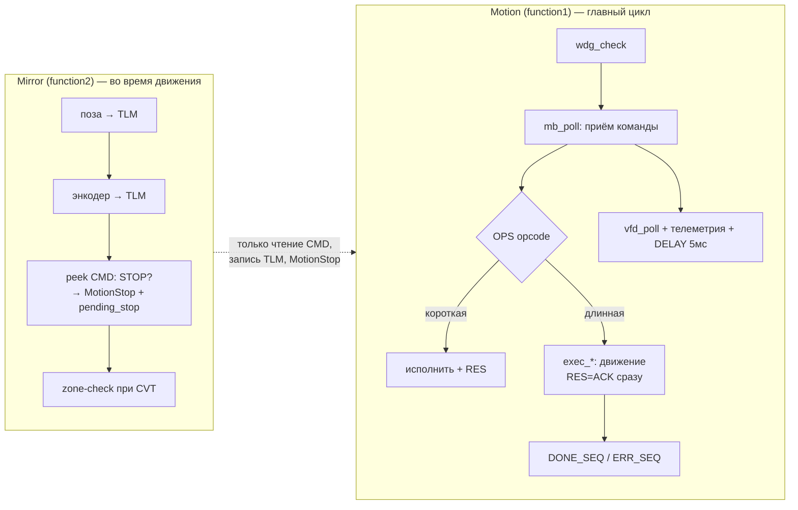
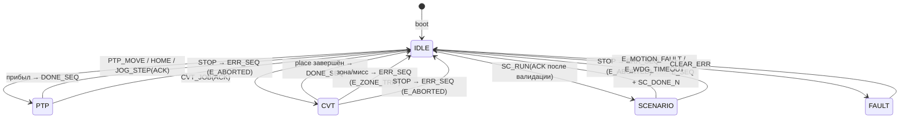
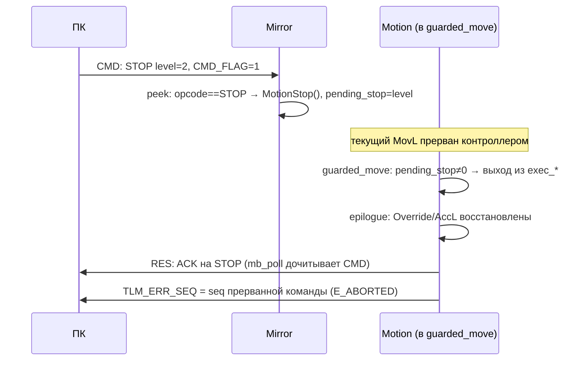

# Архитектура прошивки v2 (`robot/v2/`)

Справочник для исполнителя Ф4 (Opus). Контракт протокола — [protocol-spec.md](protocol-spec.md); брифы задач — [tasks.md](tasks.md). Донор проверенных механик — `robot/main_actual.lua` (v1).

## 1. Принципы

1. **Модули в репозитории, один файл на контроллере.** Исходники — `robot/v2/src/NN_имя.lua` (нумерованный порядок сборки); `build_fw.py` собирает артефакт `robot/v2/main_v2.lua`. Ручное редактирование артефакта запрещено — только пересборка.
2. **Прошивка глупая, ПК умный.** Прошивка не знает про «перо», «возврат», «инструмент» — только примитивы: точки, действия, параметры. Вся генерация траекторий — на ПК.
3. **Никаких busy-флагов.** Модель seq: ACK → DONE_SEQ/ERR_SEQ. Ответ пишется всегда, даже при внутренней ошибке (recovery).
4. **Валидация на входе.** Любая цель движения проходит `in_workspace`; любой параметр — min/max; сценарий валидируется целиком ДО первого движения.
5. **Восстановление состояния на всех выходах.** Скорость/ускорение возвращаются к параметрам через `motion_epilogue()` в happy-path, при стопе и при ошибке — одинаково.

## 2. Карта секций (файлы `src/`)

| Файл | Владеет | Экспортирует (глобалы) | Запрещено |
|---|---|---|---|
| `00_header.lua` | шапка, версия | — | код |
| `10_generated.lua` | константы из YAML (кодоген) | таблицы `REG`, `OP`, `ERR`, `PDEF` | ручные правки |
| `20_util.lua` | утилиты | `rdW/rdDW/wrW`, `iround/clamp`, `to_s16/from_s16` | обращение к движению |
| `30_vfd.lua` | RS-485 мост + legacy VFD-mailbox 0x1200 | `vfd_poll()` | изменения логики (перенос из v1 дословно) |
| `40_params.lua` | параметры | таблица `P`, `param_set(id,v)`, `params_boot()` | прямые WriteModbus мимо зеркала |
| `50_safety.lua` | безопасность | `in_workspace(x,y,z)`, `pending_stop`, `wdg_check()` | — |
| `60_mailbox.lua` | приём/ответ команд | `OPS`-таблица, `mb_poll()`, `mb_poll_light()`, `res_ack/res_nak` | движение |
| `70_motion.lua` | дисциплина движения | `motion_prologue(spd)`, `motion_epilogue()`, `guarded_move(fn)` | — |
| `71_exec.lua` | PTP/JOG/HOME | `exec_ptp`, `exec_jog`, `exec_home` | Modbus в цикле движения |
| `73_cvt.lua` | CVT-трекинг | `exec_cvt` | — |
| `74_scenario.lua` | сценарный исполнитель | `exec_scenario` | Modbus между LINE_PASS-точками |
| `80_mirror.lua` | параллельный монитор | `Mirror()` | `while` / `WAIT` / `DELAY` (линт сборщика) |
| `90_motion.lua` | главный цикл | `Motion()`, `motion_body()` | — |
| `99_boot.lua` | старт | — | логика (только инициализация + MultiTask) |

Дисциплина глобалов: каждая секция экспортирует ТОЛЬКО перечисленное; всё остальное — `local`. Константы — только таблицами (Lua 5.1: лимит 200 locals на chunk). Сборщик линтит дубли глобалов между секциями.

## 3. Потоковая модель

Разделение ответственности:
- **Motion** — единственный, кто читает mailbox с побочными эффектами (сбрасывает CMD_FLAG, пишет RES), исполняет движение, обслуживает VFD и телеметрию. Телеметрия и VFD обслуживаются при ЛЮБОЙ активности (v1-находка 7: DRAW-глухота).
- **Mirror** — только наблюдает: публикует позу/энкодер, «подглядывает» в CMD (не сбрасывая флаг!) на предмет STOP → немедленный `MotionStop()` + защёлка `pending_stop`. Штатный ACK на STOP допишет Motion, когда выйдет из прерванного примитива.
- Оба тела — целиком в `pcall`. Смерть Mirror невозможна тихо: ошибка инкрементирует TLM_ERR_COUNT (v1-находка 5).

## 4. Состояния активности

JOG публикуется как ACTIVITY=JOG (2), семантика идентична PTP. В IDLE разрешены все опкоды; в остальных состояниях — только STOP/PING (прочим NAK E_BUSY).

## 5. Обработка STOP во время движения

Ключевое (v1-находка 6): `guarded_move` проверяет `pending_stop` **после каждого примитива движения** — «лишний ход после стопа» исключён структурно, а не расстановкой проверок вручную.

## 6. Дисциплина ошибок

| Уровень | Механизм | Результат |
|---|---|---|
| Валидация команды | проверки в обработчике до старта | NAK + errno, ничего не исполнено |
| Ошибка в обработчике | pcall в `mb_poll` вокруг `OPS[op].fn` | NAK E_INTERNAL, ERR_COUNT++ |
| Ошибка в движении | pcall в `Motion` вокруг `motion_body` + recovery | epilogue, ACTIVITY=IDLE, ERR_SEQ=seq (E_INTERNAL), ERR_COUNT++ |
| Ошибка в Mirror | pcall всего тела Mirror | ERR_COUNT++, монитор продолжает жить |
| Fault контроллера | nil от RobotX/геттеров → rdW-guard'ы | E_MOTION_FAULT async, FAULT-состояние |

Инвариант: **RES пишется всегда** (v1-находка 10 — «залипание busy» — невозможна по построению: busy-регистров нет, а recovery публикует ERR_SEQ).

## 7. Дисциплина скорости (v1-находки 1 и 2)

1. `motion_prologue(spd_pct)` — в начале КАЖДОГО исполнителя: `Override(spd_pct или P.SPD_DEFAULT)`, `AccL/DecL(P.ACC_DEFAULT)`.
2. Внутри сценария скорость меняют только ACTION=SPEED_PCT/ACCEL_MMSS.
3. `motion_epilogue()` — на ВСЕХ путях выхода (happy/stop/error): `Override(P.SPD_DEFAULT)`, `AccL/DecL(P.ACC_DEFAULT)`, публикация DONE/ERR.
4. Ни одного «голого» `Override(...)` вне prologue/ACTION/epilogue — проверяется на ревью grep'ом.

## 8. Сценарный исполнитель (74_scenario.lua)

1. **Пред-чтение**: весь буфер читается чанками ≤30 рег в Lua-таблицы ДО движения (паттерн v1 execute_path — в цикле движения нет Modbus-чтений). Короткое чтение → NAK E_BUF_SHORT (не молчаливое усечение — v1-грех).
2. **Тотальная валидация до старта**: kind/action ∈ словарю, координаты in_workspace, последняя точка не LINE_PASS → NAK E_SC_RECORD + rval0=индекс.
3. **Цикл**: KIND-диспатч (`MovL` / `MovL+PASS()` / `MovP` через guarded_move) → ACTION после прихода → на EXACT-точках: TLM_SC_INDEX, `mb_poll_light()` (только STOP/PING), wdg_check.
4. **Финал**: SC_DONE_N, DONE_SEQ, epilogue. Сценарий не знает про «домой» — заезд домой присылает ПК точкой KIND=JOINT.

## 9. Ловушки платформы DRAStudio (обязательны к соблюдению)

| Ловушка | Правило |
|---|---|
| Mirror без `while/WAIT/DELAY` | линт сборщика; pcall разрешён |
| Частый WriteModbus между PASS-движениями рвёт look-ahead | Modbus только на EXACT-точках |
| `ReadModbus` вне выделенного пространства → nil | все чтения через `rdW/rdDW` (`or default`) |
| Геттеры позы в fault → nil → краш | publish-поза только через guard'ы |
| DW только на чётных адресах | контролируется схемным тестом YAML |
| Lua 5.1: нет битовых операторов | xor16/crc16 из v1 (30_vfd), константы таблицами |
| 200 locals на chunk | константы — таблицы REG/OP/ERR/PDEF |
| Имя 4-й оси в WritePoint (R/C/A) зависит от модели | одна константа AXIS_R в 00_header, использовать всюду |
| WritePoint скретч-точки | всегда ВСЕ координаты X/Y/Z/R (v1-находка 3) |

## 10. Таблица закрытия находок v1-ревью (приёмка Ф4)

| # | Находка v1 | Механизм v2 | Секция |
|---|---|---|---|
| 1 | Утечка Override между режимами | motion_prologue в каждом исполнителе | 70 |
| 2 | REG_DRAW_SPD мёртв (Override(100)) | скорость только через ACTION=SPEED_PCT + epilogue | 74, 70 |
| 3 | GL_PLACE «грязнится» (восстановлен только R) | WritePoint скретч-точек всегда полный X/Y/Z/R | 71, 73, 74 |
| 4 | Рассинхрон instrument при аборте | состояние инструмента в прошивке не хранится (ПК) | — (драйвер) |
| 5 | Mirror без pcall — тихая смерть монитора | pcall всего тела + ERR_COUNT | 80 |
| 6 | Пропуски stop-check между MovL | guarded_move после каждого примитива | 70 |
| 7 | DRAW-ветка глухая (STOP/SERVO/VFD/телеметрия) | единый цикл: vfd_poll+телеметрия при любой активности; STOP через Mirror-peek всегда | 90, 80 |
| 8 | Нет валидации координат от ПК | in_workspace на всех целях + E_RANGE/E_SC_RECORD | 50, 71, 73, 74 |
| 9 | Непоследовательные nil-guard'ы | rdW/rdDW — единственный способ чтения шины | 20 |
| 10 | Залипание BUSY при Lua-ошибке | seq-модель + recovery: RES/ERR_SEQ пишутся всегда | 60, 90 |

Плюс: NAK-канал (60), watchdog (50), запрет стейл-комментариев (ревью REVIEW-4 проверяет: каждый комментарий — про инвариант, не про историю правок).
