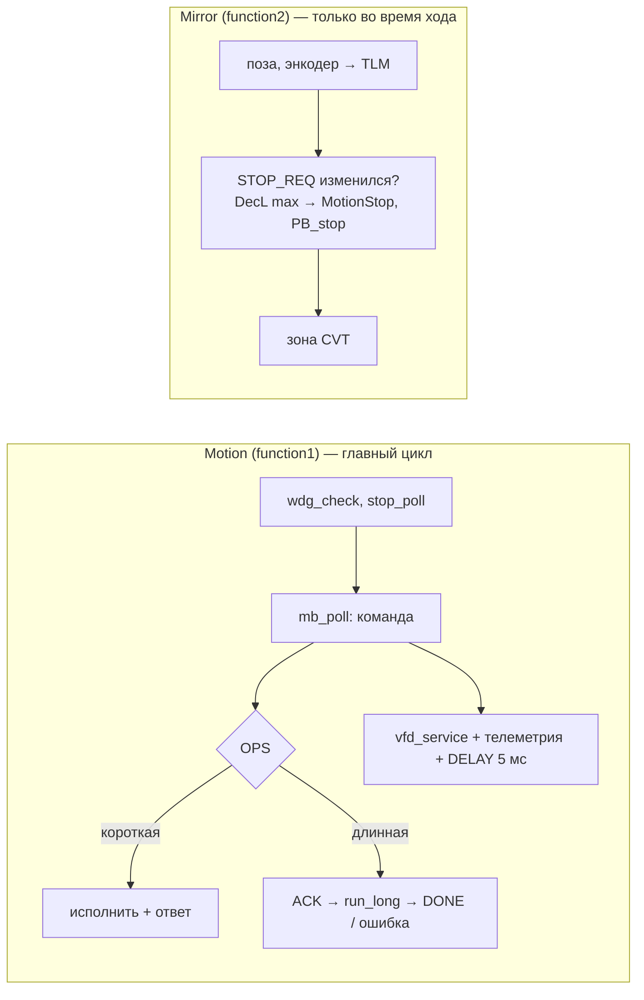

# Архитектура прошивки v2 (`robot/v2/`) — редакция 2

Справочник исполнителя Ф4. Контракт — [protocol-spec.md](protocol-spec.md) и [params.md](params.md); план —
[plan.md](plan.md). Доноры проверенных механик: `robot/main_actual.lua` (v1) и проба
`robot/pc_platform_probe/probe.lua` (мост ПЧ, `pose()` без nil, ответ «маркер последним», сверка точки,
непрерывный jog, быстрый стоп). Номера страниц — мануал RL 2024. ⚑ — зависит от отчёта пробы (GATE-1).

## 1. Принципы

1. **Модули в репозитории, один файл на контроллере.** Исходники — `robot/v2/src/NN_имя.lua`, сборщик
   `build_fw.py` склеивает их в `robot/v2/main_v2.lua` и вставляет GENERATED-блок кодогена. Артефакт руками не
   правится.
2. **Прошивка исполняет, ПК решает.** Прошивка не знает про перо, букву, инструмент и программу — только точки,
   действия, параметры.
3. **Ответ всегда, busy-флагов нет.** seq → ACK/NAK → DONE_SEQ или событие ошибки.
4. **Проверка на входе.** Каждая цель — зона SCARA (кольцо + отрезок + ограждение); каждый параметр — диапазон;
   сценарий — целиком до первого движения.
5. **Одна дорога к движению.** Любой ход — через `move()`; любая длинная команда — через `run_long()`. Стоп,
   эпилог скорости и ответ — в одном месте, а не расставлены по исполнителям.
6. **Подмножество языка.** Lua ≥ 5.2 по мануалу (ключевое слово `goto`), точная версия — в отчёте пробы.
   До него — только то, что доказали v1 и проба: `#`, `%`, `pcall`, `tostring`, `type`, `string.char/byte/sub`,
   `math.floor`, локальные функции, таблицы. Остальное — после проверки `type(...)`.

## 2. Секции (файлы `src/`)

| Файл | Владеет | Экспортирует | Запрещено |
|---|---|---|---|
| `00_header.lua` | шапка, версия, версия прошивки контроллера, на которой проверено | — | код |
| `10_generated.lua` | константы YAML (кодоген) | таблицы `REG`, `OP`, `ERR`, `PDEF`, `KIND`, `ACT` | ручные правки |
| `20_util.lua` | чтение/запись шины, преобразования | `rd/rdDW/wr`, `s16/u16`, `abs`, `join` | движение |
| `25_clock.lua` | время | `clock_boot()`, `now_ms()` на `TimerRead` ⚑ | `os.clock` (процессорное время) |
| `30_vfd.lua` | мост ПЧ | `vfd_service(allow_poll)`, `vfd_stop()` | логика ленты сверх моста |
| `40_params.lua` | параметры | таблица `P`, `param_set`, `param_apply`, `params_boot` (зеркало: MAGIC + CRC + отпечаток словаря + диапазон каждого слота) | запись мимо зеркала |
| `45_points.lua` | рабочие точки | `pt_set(id, x, y, z, rz)`, `pt_verify(...)` | запись 4-й оси под другим именем, чем `"RZ"` |
| `50_safety.lua` | безопасность | `in_workspace`, `segment_ok`, `stop_poll`, `wdg_check`, `lease_ok` | — |
| `60_mailbox.lua` | приём и ответ | `OPS`, `mb_poll(full)`, `answer()` | движение |
| `70_motion.lua` | дисциплина движения | `move(kind, pt)`, `run_long(seq, act, fn, a)`, `prologue/epilogue` | «голый» `Override`/`MovL` вне этого файла |
| `71_exec.lua` | PTP, HOME, JOG_STEP, JOG_CONT, DO_SET | `exec_*` | Modbus внутри хода |
| `73_cvt.lua` | CVT-трекинг | `exec_cvt` | — |
| `74_scenario.lua` | сценарий | `exec_scenario` | Modbus между LINE_PASS-точками |
| `80_mirror.lua` | монитор во время хода | `Mirror()` | `while` / `WAIT` / `DELAY` |
| `90_motion.lua` | главный цикл | `Motion()` | — |
| `99_boot.lua` | старт | — | движение; серво не трогаем |

Константы — только таблицами (лимит 200 locals на chunk). Общее состояние Motion ↔ Mirror — глобалы с
префиксом (как v1 и проба), пока проба не подтвердит видимость `local` из Mirror. Сборщик: склейка, GENERATED,
`FW_BUILD` (CRC16 исходников); проверки — `luacheck` (стабы DRAS в `.luacheckrc`) и один grep на
`while|WAIT|DELAY` в `80_mirror.lua`. Своих линтеров не пишем.

## 3. Ядро: `move` и `run_long`

```lua
local ABORT = {}                                   -- маркер нелокального выхода

function move(kind, pt)                            -- единственный путь к MovL/MovP
  if kind == KIND.JOINT then MovP(pt)
  elseif kind == KIND.LINE_PASS then MovL(pt, PASS())
  else MovL(pt) end
  if PB_stop ~= 0 then error(ABORT) end            -- чтение переменной, Modbus не трогаем
end

function run_long(seq, act, fn, a)                 -- обёртка ВСЕХ длинных команд
  tlm_activity(act); prologue(a.spd)
  local ok, err = pcall(fn, a)
  epilogue()                                       -- Override/AccL/DecL/Accur — один раз, на любом выходе
  tlm_activity(ACT.IDLE)
  if ok then tlm_done(seq)
  elseif err == ABORT then tlm_err(seq, ERR.ABORTED)
  elseif type(err) == "table" and err.errno then tlm_err(seq, err.errno)
  else tlm_err(seq, ERR.INTERNAL); print(err) end
end

OPS[OP.PTP_MOVE] = {argc = 6, busy = false, check = check_ptp, act = ACT.PTP, fn = exec_ptp}
```

`check` выполняется до ACK (путь NAK), `fn` — после. Новая команда = строка в YAML + запись в `OPS` + функция.
`error(ABORT)` проверен пробой (тест 32: `pcall` ловит таблицу после `MovL`, следующий ход работает ⚑).

## 4. Потоки (MultiTask)


```mermaid
flowchart LR
  subgraph Motion["Motion (function1) — главный цикл"]
    A[wdg_check, stop_poll] --> B[mb_poll: команда]
    B --> C{OPS}
    C -->|короткая| D[исполнить + ответ]
    C -->|длинная| E[ACK → run_long → DONE / ошибка]
    B --> G[vfd_service + телеметрия + DELAY 5 мс]
  end
  subgraph Mirror["Mirror (function2) — только во время хода"]
    M1[поза, энкодер → TLM] --> M2[STOP_REQ изменился?<br/>DecL max → MotionStop, PB_stop]
    M2 --> M3[зона CVT]
  end
```

- `MultiTask` помечен устаревшим (RL 11-6), но только он даёт function2 **во время** хода; `AuxTasks` режет по
  15 мс, и блокирующий `MovL` держит свой кусок до конца (так v1 и перешла на `MultiTask`). Версию прошивки
  контроллера, на которой это проверено, пишем в шапку. Исчезнет `MultiTask` — ADR: стоп только между
  примитивами.
- В простое function2 не получает управления (v1, проба «цикл» ⚑): всё обслуживание простоя — в Motion.
- Mirror только наблюдает и тормозит: mailbox не читает (флаг команды не трогает), `DELAY` не делает.
- `JOG_CONT` не блокирует (`ContinueCartesianJOG`, RL 1-52): Motion сам крутит цикл по 10 мс и проверяет
  поводок, `STOP_REQ`, зону, сторожевой таймер; при любом — `MotionStop` (проба, тест 35 ⚑).

## 5. Стоп, ошибки, скорость

- **Стоп.** `STOP_REQ` отличается от обработанного → Mirror: `DecL(P_DEC_STOP)` (для HARD/HALT) → `MotionStop()` →
  `PB_stop = level`; `move()` выходит `error(ABORT)`; `run_long` пишет `E_ABORTED`. HALT доделывает Motion
  (серво OFF, стоп ПЧ: RS-485 требует `DELAY`). При старте текущее значение `STOP_REQ` считается обработанным.
  Стоп прерывает и PASS-цепочку: проверка после каждого `MovL` ⚑ (проба смотрит, сбрасывает ли `MotionStop`
  очередь PASS-ходов).
- **Ошибки.** Проверка команды → NAK; ошибка в `fn` → `E_INTERNAL` через `run_long`; ошибка в `motion_body` —
  `pcall` + восстановление (IDLE, эпилог, событие ошибки); Mirror целиком в `pcall` + `ERR_COUNT`; нет позы
  (геттер вернул nil) → `E_MOTION_FAULT`, FAULT до `CLEAR_ERR`.
- **Скорость.** `prologue(spd)` в начале каждого исполнителя; внутри сценария — только действия SPEED/ACCEL/ACCUR;
  `epilogue()` на любом выходе возвращает `P_SPD_DEFAULT`, `P_ACC_L`, `P_ACCUR_DEFAULT`, `DecL(P_ACC_L)`.
  Параметры `live` применяются в точках опроса.

## 6. Точки

- Рабочие точки — пул: одна для PTP/JOG, 55 под сценарий, по одной для CVT. Локальные (1001+), если их можно
  завести в проекте (RL 5-5, проба тест 24 ⚑): не пишутся во внутреннюю память. Иначе — глобальные, как v1.
- `pt_set` пишет X, Y, Z и **`"RZ"`** (RL 5-9..5-10) и руку `P_HAND`; `pt_verify` читает их обратно через
  `ReadPoint` и отказывает при расхождении больше 0.05 мм/° — ловит «принятую, но не записанную» координату.
- В v1 ось пишется как `"R"` (`main_actual.lua:501,511`) — это находка 11 (§8).

## 7. Сценарий

1. Пред-чтение всех записей `offset..offset+count-1` чанками ≤ 30 рег; короткое чтение → `E_BUF_SHORT`.
2. Проверка всего до движения: коды, зона каждой точки, отрезки LINE от текущей позы, последняя не PASS, рука.
3. Цикл: `pt_set` + `move(kind)`; действие после прихода; на EXACT-точках — `TLM_SC_INDEX`, `mb_poll(false)`
   (только `busy = allow`), `vfd_service(false)` (команды ленты без опроса статуса), `wdg_check`.
4. DO при стопе не трогается. Финал — `TLM_SC_DONE_N`, DONE_SEQ, эпилог.

## 8. Находки v1 → закрытие в v2 (приёмка Ф4)

| # | Находка v1 | Механизм v2 | Секция |
|---|---|---|---|
| 1 | Override утекает между режимами | `prologue` в каждом исполнителе | 70 |
| 2 | `REG_DRAW_SPD` мёртв | скорость — действия сценария + `epilogue` | 70, 74 |
| 3 | `GL_PLACE` «грязнится» | `pt_set` всегда пишет все четыре оси | 45 |
| 4 | Рассинхрон инструмента при аборте | состояние инструмента на ПК | — |
| 5 | Mirror без `pcall` | `pcall` всего тела + `ERR_COUNT` | 80 |
| 6 | Пропуски стоп-проверки между `MovL` | `move()` + `error(ABORT)` | 70 |
| 7 | DRAW глух к STOP/SERVO/ПЧ/телеметрии | единый цикл при любой активности | 80, 90 |
| 8 | Нет проверки координат | зона SCARA + отрезки + NAK с причиной | 50 |
| 9 | Непоследовательные nil-guard | `rd`/`pose()` — единственный путь чтения | 20 |
| 10 | Залипание BUSY | seq-модель + восстановление | 60, 90 |
| 11 | Ось `"R"` в `WritePoint` (по мануалу — `"RZ"`) | `pt_set` + сверка `ReadPoint` | 45 |
| 12 | Нет сторожевого таймера; `os.clock` не годится | `now_ms()` на `TimerRead` | 25, 50 |

Каждая строка — именованный тест в `sim_core_v2` **и** в сухом прогоне прошивки.

## 9. Ловушки платформы

| Ловушка | Правило | Откуда знаем |
|---|---|---|
| Mirror без `while/WAIT/DELAY` | grep сборщика | RL 11-6, v1 |
| Запись Modbus между PASS-ходами рвёт упреждение | Modbus только на EXACT-точках | v1 (ADR-RC-006), проба ⚑ |
| Чтение вне пространства → nil; геттер позы в fault → nil | `rd`, `pose()` без nil; нет позы — нет хода | v1, проба |
| `DW` только на чётных адресах; `W` — ±32767 | схемный тест YAML | RL 12-2 |
| 4-я ось — `"RZ"`, не `"R"` | `pt_set` | RL 5-9, 5-10 |
| `os.clock()` — процессорное время | часы только `TimerRead` | сухой прогон пробы |
| `a and f() or b` при `f() == nil` отдаёт `b` | явный `if`; ревью ищет этот шаблон | ревью пробы (реальная ошибка) |
| `WritePoint` только для заведённой точки | точки объявляются при старте | RL 5-9 |
| Глобальные точки пишутся во внутреннюю память | рабочие точки — локальные, если можно | RL 5-2 ⚑ |
| 200 locals на chunk | константы таблицами | Lua |

## 10. Сухой прогон прошивки (часть Ф4, не stretch)

Техника пробы (`robot/pc_platform_probe/dry_run.py`): собранный `main_v2.lua` исполняется в настоящем Lua
(lupa, 5.1 и 5.4) с заглушками DRAS, а Modbus-регистры — живой список локального TCP-сервера. Заглушки
выносятся в общий модуль (`robot/v2/harness/fake_dras.py`) и расширяются под команды v2. Тот же набор
контрактных тестов гоняется против `sim_core_v2` и против прошивки: расхождение = дефект одной из сторон.
`lupa` — dev-зависимость (группа `firmware` в `pyproject.toml`); без неё тесты пропускаются, а не падают.

## 11. Bring-up на железе (Ф7, чек-лист)

1. Версия прошивки контроллера → шапка `00_header.lua`; `PROTO_VER` читается.
2. Проба ПК-клиента: v2-клиент на v1-прошивке не пишет ни одного регистра.
3. Параметры: отправка при подключении, `PARAM_APPLY`, выключение питания → робот стартует с теми же значениями.
4. Серво, STOP SOFT/HARD/HALT на ходу и в PASS-цепочке; быстрый стоп — длина торможения.
5. Сторожевой таймер: выдернуть сеть ПК → лента встала за `P_WDG_TIMEOUT_MS`; остановить программу робота →
   ПЧ встал по своему таймауту связи.
6. Непрерывный jog: отпустить кнопку, заморозить GUI, оборвать сеть — каждый раз робот встаёт за `P_JOG_LEASE_MS`.
7. CVT на пустой ленте, затем с объектами; промах → `E_ZONE_TRIP`.
8. Рисование: тот же файл букв на v1 и v2 — сравнить глазами и временем.
9. Смена инструмента с абортом посередине → оператор подтверждает состояние.
10. Переключение v1 ↔ v2 записью `protocol` в реестре устройств — в обе стороны.
11. Штатная зона DRAStudio (`OpenWorkSpace`/`WorkSpace`, RL 9-6..9-7) настроена по паспорту и включена: проверка
    прошивки (кольцо + сектор + ограждение) необходима, но не достаточна — точные пределы осей знает контроллер.
