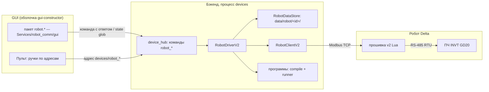
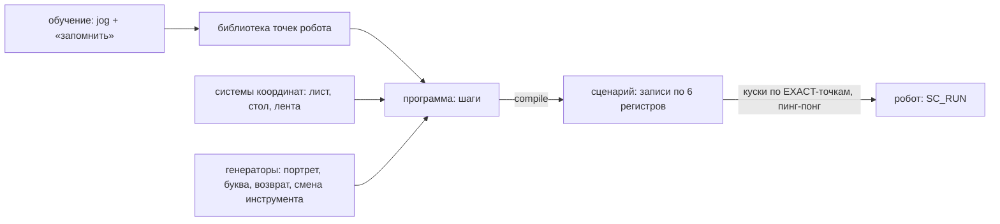

# План: протокол робота v2 — единый mailbox, программы точек, параметры с ПК, пакет GUI

- **Slug:** `robot-protocol-v2` · **Ветка:** `feat/robot-protocol-v2` (пересоздана от `main` 2026-09-27)
- **Редакция:** 2 (2026-09-27). Редакция 1 (2026-07-19) утверждена, но не исполнялась (сделан только T-00).
  Ред. 2 пересобрана под решения владельца 09-23…09-27, мануал RL и новую архитектуру GUI — см. «Что изменилось».
- **Статус:** ждёт ревью владельца (GATE-0 теперь покрывает и эту редакцию, и YAML).
- **Сопутствующие:** [protocol-spec.md](protocol-spec.md) — контракт протокола; [params.md](params.md) — словарь
  параметров; [firmware-architecture.md](firmware-architecture.md) — прошивка; [tasks.md](tasks.md) — брифы задач;
  проба платформы — [`robot/pc_platform_probe/`](../../robot/pc_platform_probe/README.md) (готова, коммит `288a8d69`).

## 1. Зачем — цели владельца

| # | Цель (слова владельца, 2026-09-26/27) | Где закрыта |
|---|---|---|
| Ц1 | «Управлять всеми параметрами через GUI на ПК и не перезаписывать робота» | §4.3 параметры, [params.md](params.md) |
| Ц2 | Вкладка в GUI, «легко и удобно» | §4.6 пакет `robot.*` |
| Ц3 | Вкладка и функция калибровки | §4.5 |
| Ц4 | Сценарии точек: учить точки, собирать программу, отправлять роботу; портреты — одно из применений | §4.4 программы |
| Ц5 | В будущем — несколько роботов | §4.7 |
| Ц6 | ПЧ подключён к роботу по RTU, ПК говорит только с роботом по TCP | §4.2, [protocol-spec §10](protocol-spec.md) |
| Ц7 | Без костылей и багов, архитектурно правильно, удобная связь с фреймворком и прототипом | §3, §4.1 |
| Ц8 | Код под Delta DRAStudio; версия языка неизвестна | §2, [firmware-architecture.md](firmware-architecture.md) |

## 2. Факты платформы: мануал + проба

Источник — официальный мануал `DELTA_IA-ROBOT_DRAStudio_RL_EN_20240920` (RL, 246 стр., лежит в
`PROJECT_INNOTECH/knowledge-base/inbox/books/`). Каждый факт перепроверяет проба на железе (GATE-1): мануал
говорит, как задумано, проба — как на этом контроллере. До отчёта пробы решения, зависящие от факта, помечены
**⚑ GATE-1** и имеют запасной вариант.

| Факт (стр. мануала) | Следствие для v2 | Статус |
|---|---|---|
| Пользовательский Modbus `0x1000..0x1FFF`; **`0x3000..0x3FFF` сохраняется при выключении** (12-2) | карта v2 в официальном диапазоне; зеркало параметров — в сохраняемой области: робот после перезапуска работает на последних применённых значениях | ⚑ GATE-1 (`retain-check`) |
| 4-я ось в `WritePoint`/`ReadPoint` — **`"RZ"`** (5-9, 5-10) | v1 пишет `"R"` (`main_actual.lua:501,511`) — поворот укладки v1, скорее всего, не работает; v2 пишет только `"RZ"` | ⚑ GATE-1 (тесты 13, 34) |
| `ReadPoint` есть (5-9) | прошивка сверяет точку перед ходом; teach читает точки обратно | ⚑ GATE-1 |
| Таймер `TimerOn/TimerRead`, мс (3-4..3-5) | сторожевой таймер на настоящих часах, а не на оценке циклов | ⚑ GATE-1 (тест 6, Mirror) |
| `MultiTask` помечен устаревшим; `AuxTasks` режет по 15 мс (11-4..11-6) | v2 остаётся на `MultiTask` осознанно: только он даёт стоп и энкодер ВО ВРЕМЯ хода. Риск — исчезновение в новой прошивке контроллера (§7) | мануал + v1 |
| `MotionStop` тормозит с текущим замедлением (1-51), `DecL` до 25000 (2-8) | уровень HARD поднимает `DecL` до `P_DEC_STOP` перед `MotionStop` | ⚑ GATE-1 (быстрый стоп) |
| Встроенный мастер RS-485 `RSmasterRead/RSmasterWrite` (12-6) | мост к ПЧ без своего CRC и `SCM_FreePort` — если порт можно перевести в режим мастера | ⚑ GATE-1 (тест 22) |
| `ContinueCartesianJOG` — не блокирует, едет до `MotionStop` (1-52) | непрерывный jog «держи кнопку — едет» с поводком по `TimerRead` | ⚑ GATE-1 (тест 35) |
| Локальные точки 1001..31000 не пишутся во внутреннюю память, но должны быть заведены в проекте (5-5); глобальные — пишутся (5-2) | рабочие точки прошивки — локальные, если их можно завести; иначе глобальные, как v1 | ⚑ GATE-1 (тест 24) |
| В ключевых словах есть `goto` (ii) | Lua ≥ 5.2; прошивка — на подмножестве, доказанном v1, до отчёта пробы | мануал |
| Есть `MovLR`, `MArchP/MArchL`, `OpenWorkSpace/WorkSpace`, `registerErrorHandleFile` | арочный ход — резерв KIND для pick-and-place; штатная зона DRAStudio — второй слой защиты рядом с проверкой прошивки | мануал |
| Режим **Virtual Robot** в DRAStudio (FAQ Delta 2336) | если исполняет Lua и отдаёт Modbus TCP — официальный стенд прошивки без железа | шаг 0 пробы |

Сухой прогон пробы уже нашёл: `os.clock()` — процессорное время, во время `DELAY` оно стоит. Таймер на нём не
сработал бы никогда. Часы v2 — только `TimerRead`.

## 3. Как было → как будет (сводка)

| | v1 (`robot/main_actual.lua`, 1195 строк) | v2 |
|---|---|---|
| Режимы | 5 режимов по регистру `REG_MODE`, переключать «только когда свободен» | режима нет: активность выводится из команды |
| Команды | 5 пар флаг/busy, у каждой свой протокол | один mailbox: seq, ACK/NAK, код ошибки |
| Ошибки | «залипший busy», молчаливое усечение точек, ошибка видна только в консоли DRAStudio | ответ всегда; async-ошибки счётчиком; текст для оператора |
| Стоп | регистр со значениями, разными по режимам; в DRAW глухо | `STOP_REQ` вне mailbox, одна запись, работает при любой активности |
| Параметры | 11 регистров CFG + константы в Lua; менять — перезаливать | ~70 параметров с ПК, классы применения, хранятся на ПК и на роботе |
| Рисование, возврат, смена инструмента | зашиты в прошивку (~350 строк) | программы точек на ПК; прошивка исполняет точки |
| Безопасность | нет проверки координат; стоп проверяется вручную после каждого хода | кольцевая зона SCARA + отрезки; стоп — структурно после каждого примитива; сторожевой таймер |
| Карта регистров | 4 рукописные копии (Lua, `registers.py`, YAML, симулятор) | одна YAML → кодоген |
| GUI | вкладка прототипа, 33 вызова `draw_*` | пакет `robot.*` сервиса + ручки Пульта по адресам |
| Роботов | один | сколько угодно, данные и калибровка — по роботу |

## 4. Архитектура

### 4.1 Слои и владельцы

Правило слоёв проекта (`framework → Services → Plugins → prototype`) не нарушается:

| Где | Что | Слой |
|---|---|---|
| `Services/robot_comm/protocols/delta_v2.yaml` | единственный источник карты, опкодов, errno, параметров | Services |
| `Services/robot_comm/codegen.py` → `core/protocol_v2.py`, `core/params_v2.py`, Lua-блок | производные копии (freshness-тест) | Services |
| `Services/robot_comm/core/client_v2.py` | транзакции mailbox, пробa `PROTO_VER`, пинг-понг буфера | Services |
| `Services/robot_comm/programs/` | точки, системы координат, программы, компиляция в сценарий, генераторы (рисование, возврат, смена инструмента) | Services |
| `Services/robot_comm/calibration/` | лента, пользовательские СК, точки инструмента (Qt-free) | Services |
| `Services/robot_comm/store.py` | `RobotDataStore` — данные робота на диске, ревизия при записи | Services |
| `Services/robot_comm/server/sim_core_v2.py` | исполняемая спека протокола | Services |
| `Services/robot_comm/gui/` | пакет виджетов `robot.*` (единственное место с Qt) | Services/gui |
| `Services/device_hub/drivers/robot_driver_v2.py` | драйвер v2; v1-драйвер не трогается | Services |
| `Plugins/io/robot_draw`, `robot_io`, `Plugins/sim/robot_host` | потребители: генератор рисования, подача CVT, робот v2 в симуляторе линии | Plugins |
| `multiprocess_prototype/` | только сборка: пакет подключён в раскладку; старая вкладка — для устройств v1 | prototype |

Драйвер выбирается фабрикой хаба по полю `protocol` записи устройства (`delta_universal3` → v1,
`delta_v2` → v2): второе поле `params.protocol` не нужно (`Services/device_hub/manager.py:107-112`).

### 4.2 Протокол (детали — [protocol-spec.md](protocol-spec.md))

Четыре плоскости: команды (mailbox), безопасность (`HB_PC`, `STOP_REQ`), параметры (словарь + зеркало),
данные (телеметрия, буфер сценария). ПЧ — замороженный mailbox `0x1200` как в v1 (на нём работают
`Services/vfd_comm` и `belt.*` симулятора), мост в прошивке: опрос по периоду, keepalive для таймаута связи ПЧ,
`E_VFD_LINK` при обрыве.

### 4.3 Параметры — один путь от YAML до кнопки (Ц1)

1. YAML `params:` → кодоген → Lua-таблица `PDEF`, Python `PARAMS`, `RobotParamsV2(SchemaBase)` с `FieldMeta`
   (подпись, единицы, min/max, группа) — **форма GUI строится из метаданных**, новый параметр = строка YAML.
2. Запись: виджет, Пульт или `backend_ctl` → команда `robot_param_set{device_id, name, value}` (с ответом) →
   драйвер → `PARAM_SET` → ACK → `RobotDataStore` сохраняет → `devices.state.<id>.params` обновляется.
   NAK → ответ с кодом и русским текстом, хранилище не трогается.
3. Регистр фреймворка (`register_update`) для этого **не подходит**: он синхронный и локальный
   (`plugin_orchestrator.py:422`), а NAK робота приходит позже по Modbus.
4. Хранение — на ПК (источник истины) и на роботе в сохраняемой области (последние применённые, ⚑ GATE-1).
   Метка `P_CONFIG_EPOCH` ловит расхождение (перезапуск программы, чужой ПК) → ПК отправляет свои значения.
5. Классы применения: `live` (можно на ходу — скорость), `idle` (между командами), `reinit` (CVT, порт ПЧ —
   после `PARAM_APPLY`). Перезаливка прошивки нужна только при изменении её кода.

### 4.4 Программы точек (Ц4)

- **Точка** — имя, X/Y/Z/RZ, рука, система координат (СК). Обучается jog'ом (непрерывным или шагом) и
  кнопкой «запомнить» (поза из телеметрии).
- **СК** (пользовательская) — задаётся тремя обученными точками (начало, ось X, плоскость). Программа в СК листа
  или стола **переносится между роботами** и после перестановки стола: переобучаются три точки, не программа.
- **Программа** — шаги: ход (к точке или координате; LINE / LINE_PASS / JOINT; скорость), выход DO,
  пауза, скорость, ускорение, точность. `compile()` проверяет зону SCARA и отрезки, переводит СК в базу робота
  и выдаёт записи сценария. Прошивка программу не знает — только точки и действия.
- **Длинные программы** исполняются кусками по EXACT-точкам с подкачкой второй половины буфера, пока робот
  исполняет первую; пауза между кусками — один оборот mailbox.
- **Генераторы** выдают программы: портрет/буквы (штрихи → П-переезды, высоты пера, скорости), возврат на
  ленту, смена инструмента. Рисование в прошивке больше не живёт.
- Точки расширения (без правки уже написанного): новое действие (например, «ждать вход» — `WAIT_DI`), новый вид
  хода (арочный `MArchP` для pick-and-place), новый генератор.

### 4.5 Калибровка (Ц3)

| Калибровка | Как | Результат |
|---|---|---|
| Камера ↔ робот | существующий `Plugins/calibration/camera_robot` (читает `robot_get_telemetry` — форма ответа в v2 сохраняется) | матрица камеры |
| Пользовательская СК (лист, стол) | три обученные точки | СК в хранилище робота |
| Лента | отметить объект на ленте в двух положениях, энкодер в обоих → мм/импульс и направление | `P_BELT_FACTOR`, `P_BELT_DIR` → `PARAM_APPLY` |
| Точки инструментов | обучение over/sock/exit для смены инструмента | точки в библиотеке |
| Зона | радиусы и Z из паспорта модели (DRS40L/60L/70L: вылет 400/600/700 мм) + проверка обучением крайних точек | `P_WS_*` |

Мастера калибровки — команды бэкенда `robot_calib_*` (Qt-free, тестируются без GUI) + виджет `robot.calibration`.

### 4.6 Пакет GUI `robot.*` (Ц2)

По решению владельца 09-26 ([constructor-layers.md](../frontend-constructor/constructor-layers.md)) виджеты
сервиса живут в `Services/robot_comm/gui/` и видят мир только через контекст виджета: команда с ответом,
glob-подписка на состояние. Друг на друга не ссылаются.

| Виджет | Что делает |
|---|---|
| `robot.status` | активность, поза, серво, ошибки с текстом, ПЧ, кнопки СТОП / ВЫКЛ серво |
| `robot.params` | форма из метаданных YAML по группам; NAK подсвечивает поле текстом ошибки; «применить» для `reinit` |
| `robot.jog` | непрерывный jog (держи — едет, поводок), шаг 0.1/1/10 мм, «запомнить точку» |
| `robot.programs` | библиотека точек и программ, редактор шагов, запуск / стоп / прогресс по кускам |
| `robot.calibration` | мастера §4.5 |

Те же действия доступны **ручками Пульта** и `backend_ctl` по адресам `devices/robot_*` — без виджета.
Зависимости: `gui-constructor` Task 1.0 (правило `Services/<x>/gui/`), 1.5 (контекст виджета); движок форм
промоутится из прототипа (`frontend-constructor` T3.6) — пакет робота его второй потребитель, поэтому Ф6
выполняет промоушен сама, если T3.6 к её старту не сделан.

### 4.7 Несколько роботов (Ц5)

- Каждый робот — запись в реестре устройств со своим `device_id`, адресом и протоколом; драйвер на робота.
- В драйвере и клиенте нет глобального состояния; всё — поле экземпляра.
- Данные — `data/robot/<device_id>/` (параметры, точки, СК, программы, калибровка).
- Каждый виджет пакета привязан к выбранному `device_id`; два робота — два экземпляра виджета в раскладке.
- Программы в пользовательских СК переносимы между роботами.
- Мост к ПЧ — свойство конкретного робота (у второго робота ПЧ может не быть).
- Вне плана: общая рабочая зона двух роботов (резервирование зон на ПК) — отдельный план, когда появится.

### 4.8 Прошивка (детали — [firmware-architecture.md](firmware-architecture.md))

Исходники модулями `robot/v2/src/NN_*.lua`, на контроллер — один собранный `main_v2.lua`. Одна обёртка
длинной команды (`run_long`) и один путь к движению (`move`): стоп — нелокальный выход `error(ABORT)`, пролог и
эпилог скорости на любом выходе. Подмножество языка — доказанное v1 и пробой. **Сухой прогон прошивки** —
та же техника, что у пробы (`dry_run.py`: настоящий Lua через lupa + заглушки DRAS), из «необязательного»
стала базовой частью Ф4.

### 4.9 Работа без робота

1. `sim_core_v2` — исполняемая спека протокола на Python (Ф2), на нём приложение целиком.
2. Сухой прогон прошивки v2 в lupa (Ф4) — Lua-логика против той же спеки.
3. DRAStudio Virtual Robot — если шаг 0 пробы покажет, что он исполняет Lua и отдаёт Modbus TCP.
4. Симулятор линии: `Plugins/sim/robot_host` понимает v2 (задача Ф2, была пробелом ред. 1).

## 5. Фазы

| Ф | Что | Условие старта | Приёмка |
|---|---|---|---|
| **GATE-1** | Визит к роботу: `pc_probe.py all` (+ шаг 0 дома) | проба готова ✓ | отчёт `reports/` в git; факты §2 → YAML |
| Ф0 | YAML `delta_v2.yaml` + ADR RC-009..014 + `scripts.sync` | — (∥ GATE-1) | GATE-0: владелец принял YAML и ред. 2 |
| Ф1 | кодоген (Python, Lua, `RobotParamsV2`) + сборщик прошивки + схемные инварианты | GATE-0 | freshness; инварианты карты; форма рендерится |
| Ф2 | `sim_core_v2` + `robot_host` v2 в симуляторе линии | Ф1 | юнит на каждый опкод и ошибку; STOP, wdg, сценарий, CVT |
| Ф3 | `client_v2` + программы (модель, СК, compile, куски) + генераторы | Ф2 (клиент), Ф1 (модель) | e2e против sim; property-тесты compile |
| Ф4 | прошивка v2 + её сухой прогон | Ф1 + GATE-1 | luacheck 0; сухой прогон против контракта sim; 12 находок — именованные тесты |
| Ф5 | `RobotDriverV2`, `RobotDataStore`, команды хаба, калибровка (бэкенд), плагины | Ф3 | приложение против sim v2 без GUI: параметры, программа, калибровка ленты |
| Ф6 | пакет `robot.*` + ручки Пульта | Ф5 + gui-constructor 1.0/1.5 | headless-тесты виджетов; ручка Пульта двигает sim |
| Ф7 | bring-up на железе | Ф4 + Ф5 | чек-лист [firmware-architecture §11](firmware-architecture.md); v1 ↔ v2 переключаются |

Параллельно: GATE-1 ∥ Ф0; Ф4 ∥ Ф3; Ф6 — после Ф5, но виджеты можно начинать против sim сразу после Ф2.
Честная оценка: многонедельная переработка подсистемы; самые длинные — Ф3 (программы) и Ф4 + Ф7.

## 6. Как исполняется (конвенция проекта, `.claude/CLAUDE.md`)

Каждый механизм: независимый `tester` **до** кода, в worktree на коммите до реализации → реализация
(`developer` / `teamlead` по сложности) → инъекции ведущим против обоих наборов тестов → синхронный
`reviewer` после каждой задачи → `cto` на приёмке фазы. Коммиты — `Why:`/`Layer:`/`Refs: plans/robot-protocol-v2/plan.md`.
v1-тесты зелёные на всех фазах: v1 — рабочий канон до конца Ф7.

## 7. Риски

| Риск | Уровень | Что делаем |
|---|---|---|
| `MultiTask` уберут в новой прошивке контроллера (помечен устаревшим) | средний | версия прошивки контроллера фиксируется в README; при исчезновении — `AuxTasks` + стоп только между примитивами (задержка = примитив), решение через ADR |
| Факты мануала не совпадут с железом | средний | всё под ⚑ GATE-1, у каждого запасной вариант |
| Перенос рисования на ПК ухудшит качество | средний | property-тесты генератора + сравнение тем же файлом букв на Ф7 |
| Зависимость Ф6 от gui-constructor | средний | Ф5 даёт всё без GUI (Пульт, `backend_ctl`); виджеты — поверх готового бэкенда |
| Частые записи глобальных точек во внутреннюю память | низкий–средний | локальные точки, если заводятся (тест 24); спросить мануал контроллера |
| Потолок адресов | снят мануалом | проба подтверждает |

## 8. Соседние планы

| План | Что там про робота | Отношение |
|---|---|---|
| [`robot-place-pose`](../robot-place-pose.md) | P3 (забор вместе с укладкой) не сделан; P2 пишет ось `"R"` | P3 делается на v2 (`CVT_JOB` с флагами); правка `"R"` → `"RZ"` в v1 — по отчёту пробы, одной строкой |
| [`letter-robot-cycle`](../letter-robot-cycle/plan.md) | цикл на режимах v1 (RETURN, TOOLCHANGE) | переписывается на программы v2 (§4.4) |
| [`draw-mode-rework`](../draw-mode-rework/plan.md) | хвост B1–B3 на DRAW v1 | закрывается генератором рисования Ф3 |
| [`camera-robot-calibration`](../camera-robot-calibration.md) | калибровка читает `robot_get_telemetry` | форма ответа в v2 сохраняется; Ч.2 на железе — после Ф7 |
| [`device-tree-recipe`](../device-tree-recipe.md) | Ф E убирает `devices.yaml` (вопрос О-7) | данные робота v2 живут в `data/robot/<id>/`, от О-7 не зависят |
| [`line-sim`](../line-sim/plan.md) | `robot_host` на ядре v1 | задача Ф2 этого плана: `robot_host` понимает v2 |
| [`gui-constructor`](../gui-constructor/plan.md) | контекст виджета, пакеты `Services/<x>/gui/` | пакет `robot.*` — потребитель Task 1.0 и 1.5 |
| [`frontend-constructor`](../frontend-constructor/plan.md) | промоушен движка форм (T3.6) | форма параметров — второй потребитель |
| [`framework-architecture-rework`](../framework-architecture-rework/plan.md) | `ServiceContext`, формы поставки | `client_v2` — обычный класс с внедрённым транспортом, переезд не мешает |

## 9. Решения владельца

**Ред. 1 (2026-07-19), сохраняются:** режимы v2 выводятся (IDLE/PTP/JOG/CVT/SCENARIO); чистый разрыв с v1,
v1 заморожен как запасной; полный объём (протокол + прошивка + sim + клиент + драйвер + GUI); прошивка —
чистовая переработка; полноценная имитация робота без железа.

**Решено владельцем 2026-09-27:**
- Решение №2 «все команды через mailbox» — **исключение для стопа**: `STOP_REQ` отдельным регистром. Причина —
  стоп обязан пройти, когда mailbox занят или транзакция ПК оборвалась (ADR-RC-012).
- Параметры шире слова W (±32767) **не урезать**: решить протоколом (вариант — два регистра, сумма на роботе,
  вопрос 4 ниже); что умеет контроллер со старшим битом слова, проверяет проба GATE-1.

**Изменено в ред. 2 (предложение, ждёт подтверждения на GATE-0):**
- RETURN и TOOLCHANGE — не «сценарии», а программы точек общего вида (Ц4): тот же механизм, что у обучения.
- GUI — пакет сервиса, а не вкладка прототипа (решение 09-26).

**Открытые вопросы (ответ владельца нужен до указанной фазы):**
1. Модель робота с шильдика (DRS40L / DRS60L / DRS70L…) — до Ф0 (зона по умолчанию).
2. Мануал на контроллер (владелец предложил найти): число TCP-соединений, режим порта RS-485 под
   `RSmasterRead`, заведение локальных точек, ресурс внутренней памяти — до Ф4.
3. ~~Стоп отдельным регистром вместо опкода~~ — принято 2026-09-27.
4. Схема широких параметров (`P_BELT_FACTOR`, `P_CONFIG_EPOCH`, `P_WDG_TIMEOUT_MS`) и предел `P_ACC_L`
   (мануал RL: ускорение 1..25000) — до T1.1.
5. Параметры порта ПЧ по мануалу RL §12.6.1 `SCM_FreePort`: диапазоны и нужен ли `P_VFD_MODE` параметром — до T1.1.

**Замечания к вопросам 4–5 (2026-09-27, не внесены в YAML — владелец смотрит после пробы 09-28):**

- **`P_ACC_L`:** мануал RL во всех командах даёт ускорение/замедление 1..25000 → max 50000 в params.md — ошибка
  спеки, а не нужда в широком параметре. Предложение: max 25000 (предел контроллера).
- **Широкие параметры** (`P_BELT_FACTOR`, `P_CONFIG_EPOCH`, `P_WDG_TIMEOUT_MS`) — два регистра, сумма на роботе:
  `значение = старшее × 32768 + младшее`, обе половины 0..32767. Основание 32768, а не 65536 — иначе младшая
  половина сама выходит за слово W. Номер младшей — прежний id, старшей — из свободного блока 112..127 (прежние
  id не сдвигаются). Запись одной командой `PARAM_SET_WIDE (id, младшее, старшее)`: прошивка проверяет диапазон
  целого числа и применяет его сразу, без промежуточного значения между половинами. `PARAM_GET` возвращает обе
  половины, зеркало держит две ячейки. Запасной вариант — беззнаковое слово 0..65535: проба (тест адресов
  пишет с ПК `0xA55A`) покажет, проходит ли старший бит, но при записи из Lua остаётся дыра на значении 32768
  (→ запрещённое −32768).
- **Порт к ПЧ — `SCM_FreePort(port, rate, protocol, mode, …)`, мануал RL §12.6.1** (v1: `1, 0x2, 0xD, 0x11`):
  - `P_VFD_BAUD` (`rate`): 0 = 4800, 1 = 9600, 2 = 19200, 3 = 38400, 4 = 57600, 5 = 115200 → диапазон 0..5 вместо 0..32767;
  - `P_VFD_FRAME` (`protocol`): 0x9 7N2, 0xA 7E1, 0xB 7O1, 0xC 8N2, 0xD 8E1, 0xE 8O1 (freeport); коды 0..8 в мануале
    не расписаны → пока 0..14, сузить после теста 22 (`RSmasterRead`);
  - `P_VFD_MODE` (`mode`, биты `00YX`: Y slave/master, X RS-232/RS-485): для нашей проводки верно только 0x11
    (Modbus Master RS-485) → предложение убрать из параметров и зашить в прошивку;
  - скорость и формат обязаны совпадать с настройкой ПЧ (INVT GD20, группа P14): в GUI — с предупреждением.

## 10. Что изменилось против ред. 1

Таблица «было → стало» с причинами — [changes-rev2.md](changes-rev2.md).
