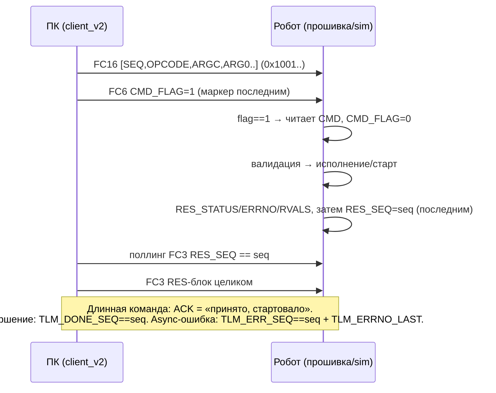

# Спецификация протокола Delta SCARA v2 (mailbox)

- **Версия протокола:** 0x0200 (v2.0). Регистр `TLM_PROTO_VER` (0x1040).
- **Транспорт:** Modbus TCP, робот — slave (unit_id 2). Функции: FC3 чтение, FC6 одиночная запись, FC16 блочная (≤30 рег/транзакцию, чтение ≤125 рег).
- **Статус:** контракт для Ф0 (`protocols/delta_v2.yaml` пишется 1:1 по этому документу). Расхождение YAML↔спека = дефект Ф0.
- **Назначение:** единый справочник для исполнителей прошивки (Ф4), симулятора (Ф2), клиента (Ф3), драйвера (Ф5).

## 1. Три плоскости

| Плоскость | Механизм | Регистры |
|---|---|---|
| Командная | mailbox CMD/RES: одна команда в полёте, seq/ACK/NAK+errno | 0x1000..0x101F |
| Параметрическая | словарь id→значение: PARAM_SET/GET + read-only зеркало | 0x1300..0x137F |
| Данных | телеметрия (FC3-блок), буфер сценария (bulk FC16), heartbeat | 0x1040.., 0x1400.., 0x1020 |

**Режим не задаётся** — активность выводится из исполняемой команды и публикуется read-only в `TLM_ACTIVITY`.

## 2. Карта регистров

### 2.1 CMD — командный mailbox (ПК → робот), 0x1000..0x100F

| Адрес | Имя | Семантика |
|---|---|---|
| 0x1000 | CMD_FLAG | ПК пишет 1 **последним, отдельным FC6** в конце транзакции; прошивка сбрасывает в 0 при приёме |
| 0x1001 | CMD_SEQ | 1..65535 (0 запрещён); ПК инкрементирует на каждую команду; повтор seq = идемпотентный повтор ответа |
| 0x1002 | CMD_OPCODE | код команды (§4) |
| 0x1003 | CMD_ARGC | число аргументов; несовпадение с таблицей опкода → NAK E_BAD_ARGC |
| 0x1004..0x100F | CMD_ARG0..ARG11 | аргументы; ARG0=0x1004 чётный → DW-аргументы кладутся на чётные слоты (ARG0/2/4…) |

### 2.2 RES — результат (робот → ПК), 0x1010..0x101F

| Адрес | Имя | Семантика |
|---|---|---|
| 0x1010 | RES_SEQ | эхо seq; прошивка пишет **последним** (маркер готовности ответа) |
| 0x1011 | RES_STATUS | 1 = ACK, 2 = NAK |
| 0x1012 | RES_ERRNO | код ошибки при NAK (§5); 0 при ACK |
| 0x1013 | RES_RVALC | число возвращаемых значений |
| 0x1014..0x101B | RES_RVAL0..7 | возвраты (0x1014 чётный — DW возможны) |
| 0x101C..0x101F | — | резерв |

### 2.3 Liveness

| Адрес | Имя | Семантика |
|---|---|---|
| 0x1020 | HB_PC | ПК периодически инкрементирует (watchdog-kick, вне mailbox, период ≤ P_WDG_TIMEOUT/4) |

### 2.4 TLM — телеметрия (read-only, один FC3), 0x1040..0x107F

| Адрес | Имя | Тип | Семантика |
|---|---|---|---|
| 0x1040 | TLM_PROTO_VER | u16 | константа 0x0200; **probe при коннекте обязателен до любых записей** (на v1-прошивке читается 0) |
| 0x1041 | TLM_FW_BUILD | u16 | метка сборки (CRC16 исходников, генерит build_fw) |
| 0x1042 | TLM_HB_ROBOT | u16 | инкремент каждый цикл Motion (живость прошивки) |
| 0x1043 | TLM_ACTIVITY | u16 | 0 IDLE / 1 PTP / 2 JOG / 3 CVT / 4 SCENARIO / 5 FAULT |
| 0x1044..0x1047 | TLM_X/Y/Z/RZ | s16 | поза; X/Y/Z ×0.1 мм, RZ ×0.1° |
| 0x1048 | TLM_MOVING | u16 | 1 = в движении |
| 0x1049 | TLM_SERVO | u16 | 1 = серво ON |
| 0x104A | TLM_SPD_PCT | u16 | текущий Override % |
| 0x104B | TLM_GRIP | u16 | состояние DO захвата |
| 0x104C | TLM_ENC | DW (чётный) | живой энкодер ленты |
| 0x104E | TLM_BELT_MMS | s16 | скорость ленты |
| 0x104F | TLM_WDG_STATE | u16 | 0 выкл / 1 armed / 2 tripped |
| 0x1050 | TLM_ACK_SEQ | u16 | последняя принятая команда |
| 0x1051 | TLM_DONE_SEQ | u16 | последняя завершённая длинная команда |
| 0x1052 | TLM_ERR_SEQ | u16 | seq команды с async-ошибкой |
| 0x1053 | TLM_ERRNO_LAST | u16 | защёлка до CLEAR_ERR |
| 0x1054 | TLM_ERR_COUNT | u16 | нарастающий счётчик ошибок (включая пойманные pcall) |
| 0x1055 | TLM_SC_ID | u16 | метка активного/последнего сценария (opaque от ПК) |
| 0x1056 | TLM_SC_TOTAL | u16 | точек в сценарии |
| 0x1057 | TLM_SC_INDEX | u16 | выполнено точек; пишется ТОЛЬКО на EXACT-точках |
| 0x1058 | TLM_SC_DONE_N | u16 | эхо факта исполнения (страховка E_BUF_SHORT) |
| 0x1059 | TLM_MISS_COUNT | u16 | CVT-промахи |
| 0x105A..0x107F | — | | резерв |

### 2.5 Прочие блоки

| Диапазон | Назначение |
|---|---|
| 0x1200..0x121F | VFD-mailbox — **ЗАМОРОЖЕН** как в v1 (0x1200..0x1204 команда ПЧ, 0x1210..0x1217 статус); владелец — `Services/vfd_comm` |
| 0x1300..0x137F | PMIR — read-only зеркало параметров: адрес = 0x1300 + param_id; прошивка пишет write-through при PARAM_SET и целиком при boot; ПК читает FC3 по фактическому max id |
| 0x1400..0x16FF | SC — буфер сценария: 96 записей × 8 рег (⚠️ ёмкость финализируется после GATE-1 — пробы адресного потолка) |
| 0x1700..0x17FF | резерв расширения буфера |

## 3. Хендшейк mailbox

Правила:
1. Mailbox однослотовый: ПК не шлёт следующую команду до `RES_SEQ == seq` предыдущей. Исключение — `STOP` и `PING` (allow_busy): принимаются во время длинной команды.
2. Занято (длинная команда в полёте) + не-allow_busy опкод → немедленный NAK `E_BUSY`.
3. Повтор того же `seq` → повтор последнего RES без переисполнения (идемпотентность при ретраях ПК).
4. Прошивка пишет RES **всегда** — даже при внутренней ошибке (E_INTERNAL из recovery). «Залипшего busy» в v2 не существует по построению.

## 4. Опкоды

| Код | Имя | argc | Аргументы (слоты) | ACK-семантика | Завершение |
|---|---|---|---|---|---|
| 0x01 | PING | 0 | — | мгновенно; rvals=[PROTO_VER, FW_BUILD] | — |
| 0x02 | CLEAR_ERR | 0 | — | сброс TLM_ERRNO_LAST/ERR_SEQ | — |
| 0x10 | PTP_MOVE | 6 | x,y,z,rz (s16 ×0.1), kind (0 LINE/1 JOINT), spd_pct (0=P_SPD_DEFAULT) | валидация workspace → старт | TLM_DONE_SEQ |
| 0x11 | HOME | 0 | — | PTP в P_HOME_* на P_SPD_DEFAULT | TLM_DONE_SEQ |
| 0x12 | JOG_STEP | 5 | dx,dy,dz,drz (s16 ×0.1, относительные), spd_pct (0=P_SPD_JOG) | цель = поза+дельта, валидация → старт | TLM_DONE_SEQ |
| 0x20 | CVT_JOB | 10 | ecap_lo,ecap_hi (DW на ARG0/1), pick_x,pick_y,pick_z, place_mode (0=из параметров/1=из args), place_x,place_y,place_z,place_rz | старт трекинг-цикла | TLM_DONE_SEQ / miss → async E_ZONE_TRIP + MISS_COUNT |
| 0x30 | SC_RUN | 3 | count, sc_id, start_idx (резерв resume, 0) | пред-чтение + валидация ВСЕХ записей → старт; ошибка записи → NAK E_SC_RECORD, rval0=индекс | TLM_DONE_SEQ, SC_DONE_N |
| 0x40 | STOP | 1 | level: 1 SOFT (достоять примитив) / 2 HARD (MotionStop) / 3 HARD+HOME / 4 ESTOP (MotionStop+серво OFF+VFD stop) | allow_busy; прерванная команда → async E_ABORTED | мгновенно/по остановке |
| 0x41 | SERVO | 1 | 0 off / 1 on | мгновенно | — |
| 0x50 | PARAM_SET | 2 | id, value (raw; знаковость по словарю) | валидация min/max → запись + зеркало | — |
| 0x51 | PARAM_GET | 1 | id | rval0=value | — |

## 5. Errno

| Код | Имя | Когда | Русский текст (для GUI) |
|---|---|---|---|
| 0 | E_OK | — | ОК |
| 1 | E_BAD_OPCODE | sync | Неизвестная команда |
| 2 | E_BAD_ARGC | sync | Неверное число аргументов |
| 3 | E_RANGE | sync | Значение/координата вне допустимого диапазона |
| 4 | E_BUSY | sync | Робот занят другой командой |
| 5 | E_BAD_PARAM | sync | Неизвестный параметр |
| 6 | E_NO_SERVO | sync | Серво выключено — движение невозможно |
| 7 | E_SC_COUNT | sync | Недопустимое число точек сценария |
| 8 | E_SC_RECORD | sync | Ошибка в записи сценария (rval0 = индекс) |
| 9 | E_BUF_SHORT | sync | Буфер прочитан не полностью (обрыв связи?) |
| 10 | E_WDG_TIMEOUT | async | Пропал heartbeat ПК — лента остановлена |
| 11 | E_MOTION_FAULT | async | Контроллер движения в ошибке |
| 12 | E_ZONE_TRIP | async | Цель вышла из рабочей зоны (CVT) |
| 13 | E_ABORTED | async | Движение прервано стопом |
| 14 | E_INTERNAL | оба | Внутренняя ошибка прошивки (pcall) |

sync = в RES на команду; async = через TLM_ERR_SEQ/ERRNO_LAST (+ERR_COUNT), защёлка до CLEAR_ERR.

## 6. Сценарная точка (запись буфера, stride 8)

| Смещение | Поле | Тип | Семантика |
|---|---|---|---|
| +0 | PT_X | s16 ×0.1 мм | |
| +1 | PT_Y | s16 ×0.1 мм | |
| +2 | PT_Z | s16 ×0.1 мм | |
| +3 | PT_RZ | s16 ×0.1° | |
| +4 | PT_KIND | u16 | 0 LINE (MovL, точный стоп) / 1 LINE_PASS (MovL+PASS, блендинг) / 2 JOINT (MovP) |
| +5 | PT_ACTION | u16 | 0 NONE / 1 DO_ON / 2 DO_OFF / 3 DELAY_MS / 4 SPEED_PCT / 5 ACCEL_MMSS |
| +6 | PT_APARAM | u16 | аргумент действия: канал DO / мс / % / мм/с² |
| +7 | — | | резерв (0) |

Правила исполнения:
1. Действие исполняется **после** прихода в точку. «Действие до движения» выражается дубль-точкой (те же координаты, KIND=LINE, ACTION).
2. Прогресс (TLM_SC_INDEX) и лёгкий опрос mailbox (STOP/PING) — **только** на точках KIND≠LINE_PASS. Между LINE_PASS-точками Modbus не трогается — сохранение look-ahead блендинга контроллера.
3. Последняя точка сценария не может быть LINE_PASS (валидация E_SC_RECORD).
4. SPEED_PCT/ACCEL действуют до следующего изменения или конца сценария; на выходе из сценария прошивка восстанавливает P_SPD_DEFAULT/P_ACC_DEFAULT (epilogue).

**Пример** (фрагмент: конец штриха → переезд к следующему штриху, «П-образно»):

| # | X | Y | Z | KIND | ACTION | APARAM | Комментарий |
|---|---|---|---|---|---|---|---|
| k | 120.0 | −310.0 | pen_down | LINE | NONE | | конец штриха (EXACT — угол не срезается) |
| k+1 | 120.0 | −310.0 | pen_up | LINE | SPEED_PCT | 100 | подъём вертикально + скорость переезда |
| k+2 | 150.0 | −280.0 | pen_up | LINE | NONE | | переезд на высоте |
| k+3 | 150.0 | −280.0 | pen_down | LINE | SPEED_PCT | 30 | опускание + скорость пера |
| k+4 | 151.0 | −280.5 | pen_down | LINE_PASS | NONE | | штрих (блендинг) |

## 7. Словарь параметров v1.0

| id | Имя | Ед. (шкала) | min..max | default | Группа |
|---|---|---|---|---|---|
| 0 | P_SPD_DEFAULT | % | 1..100 | 80 | motion |
| 1 | P_SPD_JOG | % | 1..100 | 30 | motion |
| 2 | P_ACC_DEFAULT | мм/с² | 100..50000 | 25000 | motion |
| 3 | P_OVERLAP | мм ×0.1 | 1..100 | 5 | motion |
| 8..11 | P_HOME_X/Y/Z/RZ | ×0.1 s16 | workspace | 3000/−2100/−400/−1000 | points |
| 12 | P_PICK_Z | ×0.1 s16 | workspace | −1000 | points |
| 13..16 | P_PLACE_X/Y/Z/RZ | ×0.1 s16 | workspace | 4500/−3000/−900/−1000 | points |
| 20 | P_GRIP_MS | мс | 0..5000 | 400 | cvt |
| 21 | P_ZONE_MIN | мм ×0.1 | 0..32767 | 1200 | cvt |
| 22 | P_ZONE_MAX | мм ×0.1 | 0..32767 | 5000 | cvt |
| 24..29 | P_WS_X_MIN/X_MAX/Y_MIN/Y_MAX/Z_MIN/Z_MAX | мм ×0.1 s16 | — | 1000/6000/−6000/0/−1500/0 ⚠️ placeholder до Ф7 | workspace |
| 32 | P_WDG_TIMEOUT_MS | мс | 0 (выкл)..60000 | 0 (bring-up); боевой 1500 | system |
| 33 | P_TLM_EVERY | циклов | 1..100 | 5 | system |
| 34 | P_DO_GRIP_CH | канал | 1..16 | 1 | system |

Id стабильны навсегда (snapshot-тест); дыры между группами — для расширения. Персистентность — на ПК (`data/devices.yaml`, push-on-connect + сверка по зеркалу).

## 8. Watchdog

1. ПК инкрементирует HB_PC с периодом ≤ P_WDG_TIMEOUT_MS/4.
2. Прошивка проверяет «HB_PC менялся?» в idle-цикле и на EXACT-остановках сценария.
3. Просрочка → стоп ПЧ (RS-485 мост), MotionStop, WDG_STATE=2, async E_WDG_TIMEOUT, ACTIVITY=IDLE. Серво остаётся ON.
4. Возврат ПК (HB снова тикает) → WDG_STATE=1; ленту ПК запускает явно.
5. ⚠️ Источник времени: Systime DRAS; fallback «счётчик итераций ×2» — только bring-up, до калибровки на железе watchdog выключен (P_WDG_TIMEOUT_MS=0).

## 9. Совместимость и безопасность подключения

1. **Probe обязателен:** клиент читает TLM_PROTO_VER до любых записей. 0 → в контроллере v1-прошивка → отказ с понятной ошибкой (v2-клиент не пишет ни одного регистра).
2. v2-блоки не пересекаются с v1-флагами по адресам записи команд; единственное пересечение пространства — SC-буфер поверх v1 DRAW-зоны (0x1400+), что безопасно при выполненном probe.
3. VFD-mailbox идентичен v1 — `Services/vfd_comm` работает без изменений на обеих прошивках.
4. Версионирование: минорные добавления (новые опкоды/параметры/TLM-поля в резерве) не меняют PROTO_VER major; смена раскладки существующего — новый major.
