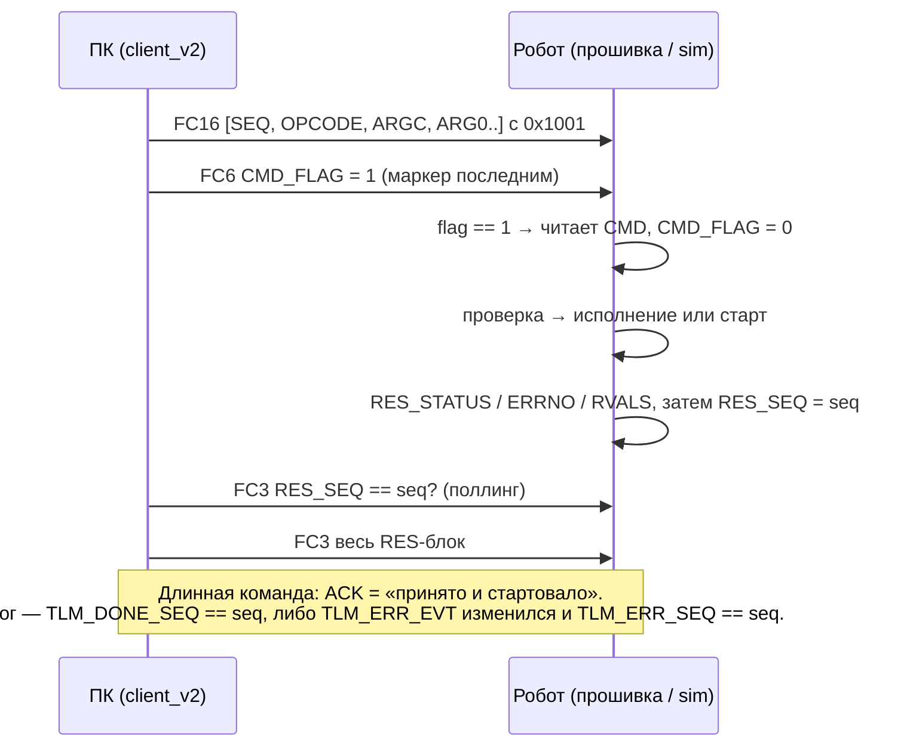

# Спецификация протокола Delta SCARA v2

- **Версия протокола:** 0x0200 (v2.0), регистр `TLM_PROTO_VER`.
- **Редакция документа:** 2 (2026-09-27). Что изменилось против ред. 1 — [changes-rev2.md](changes-rev2.md). Факты платформы — мануал RL 2024 (номера страниц в тексте), перепроверка — проба GATE-1 ([`robot/pc_platform_probe/`](../../robot/pc_platform_probe/README.md)); зависящее от неё помечено ⚑.
- **Транспорт:** Modbus TCP, робот (контроллер Delta ASD-MS, программа DRAStudio/Lua) — slave. FC3 чтение (≤125 рег), FC6 одиночная запись, FC16 блочная запись (≤30 рег за транзакцию).
- **Статус:** контракт. `Services/robot_comm/protocols/delta_v2.yaml` пишется по этому документу 1:1, расхождение YAML и спеки — дефект.
- **Потребители:** прошивка (`robot/v2/`), симулятор (`sim_core_v2.py`), клиент (`client_v2.py`), драйвер (`robot_driver_v2.py`), симулятор линии (`Plugins/sim/robot_host`).

## 1. Принципы

Робот исполняет точки и действия, ПК решает (траектории, программы, калибровка, инструмент); всё настраиваемое —
параметр (перезаливка — только при изменении кода); режим выводится из команды (`TLM_ACTIVITY`); одна карта в
YAML → кодоген; ответ пишется всегда. Подробно — [plan.md](plan.md) §3–§4.

## 2. Четыре плоскости

| Плоскость | Механизм | Регистры |
|---|---|---|
| Командная | mailbox CMD/RES: одна команда в полёте, seq + ACK/NAK + errno | 0x1000..0x101F |
| Безопасность | `HB_PC` (сторожевой таймер), `STOP_REQ` (стоп одной записью), `JOG_LEASE` (поводок jog) — **вне mailbox** | 0x1020..0x1022 |
| Параметры | словарь id → значение: `PARAM_SET/GET/APPLY` + зеркало в сохраняемой области ⚑ | 0x3000..0x3082 |
| Данные | телеметрия (один FC3), буфер сценария (FC16 блоками) | 0x1040..0x107F, 0x1400.. |

Почему стоп вне mailbox — §8 и ADR-RC-012 (исключение из решения владельца №2 ред. 1).

## 3. Карта регистров

### 3.1 CMD — mailbox, ПК → робот (0x1000..0x100F)

| Адрес | Имя | Семантика |
|---|---|---|
| 0x1000 | CMD_FLAG | ПК пишет 1 **последним, отдельным FC6**; прошивка сбрасывает в 0 при приёме |
| 0x1001 | CMD_SEQ | 1..65535, 0 запрещён; ПК увеличивает на каждую команду |
| 0x1002 | CMD_OPCODE | код команды (§5) |
| 0x1003 | CMD_ARGC | число аргументов; не совпало с таблицей → NAK `E_BAD_ARGC` |
| 0x1004..0x100F | CMD_ARG0..ARG11 | аргументы; ARG0 чётный → DW-аргументы на чётных слотах |

### 3.2 RES — ответ, робот → ПК (0x1010..0x101F)

| Адрес | Имя | Семантика |
|---|---|---|
| 0x1010 | RES_SEQ | эхо seq; прошивка пишет **последним** — маркер готовности ответа |
| 0x1011 | RES_STATUS | 1 ACK, 2 NAK |
| 0x1012 | RES_ERRNO | код при NAK (§6), 0 при ACK |
| 0x1013 | RES_RVALC | число возвращаемых значений |
| 0x1014..0x101B | RES_RVAL0..7 | возвраты |
| 0x101C..0x101F | — | резерв |

### 3.3 Безопасность (0x1020..0x1022)

| Адрес | Имя | Семантика |
|---|---|---|
| 0x1020 | HB_PC | ПК увеличивает с периодом ≤ `P_WDG_TIMEOUT_MS / 4` (§9) |
| 0x1021 | STOP_REQ | `seq·4 + level`, пишет ПК одним FC6 (§8) |
| 0x1022 | JOG_LEASE | ПК увеличивает с периодом ≤ `P_JOG_LEASE_MS / 3`, пока **оператор держит кнопку** jog (§5, `JOG_CONT`); не путать с `HB_PC` |

### 3.4 TLM — телеметрия, только чтение, один FC3 на 32 рег (0x1040..0x105F)

| Адрес | Имя | Тип | Семантика | Писатель |
|---|---|---|---|---|
| 0x1040 | TLM_PROTO_VER | u16 | 0x0200; **probe до любых записей** | boot |
| 0x1041 | TLM_FW_BUILD | u16 | CRC16 исходников прошивки (сборщик) | boot |
| 0x1042 | TLM_HB_ROBOT | u16 | +1 на каждый цикл Motion | Motion |
| 0x1043 | TLM_ACTIVITY | u16 | 0 IDLE / 1 PTP / 2 JOG / 3 CVT / 4 SCENARIO / 5 FAULT | Motion |
| 0x1044..0x1047 | TLM_X/Y/Z/RZ | s16 | поза ×0.1 мм / ×0.1° | поза* |
| 0x1048 | TLM_MOVING | u16 | 1 — в движении | поза* |
| 0x1049 | TLM_SERVO | u16 | 1 — серво ON | Motion |
| 0x104A | TLM_SPD_PCT | u16 | текущий Override, % | Motion |
| 0x104B | TLM_DO_MASK | u16 | теневая маска DO1..DO16, которые писала прошивка (бит 0 = DO1) | Motion |
| 0x104C..0x104D | TLM_ENC | DW | энкодер ленты (чётный адрес) | поза* |
| 0x104E | TLM_BELT_MMS | s16 | скорость ленты | Motion |
| 0x104F | TLM_WDG_STATE | u16 | 0 выкл / 1 взведён / 2 сработал / 3 взведён по оценочным часам | Motion |
| 0x1050 | TLM_ACK_SEQ | u16 | последняя принятая команда | Motion |
| 0x1051 | TLM_DONE_SEQ | u16 | последняя успешно завершённая длинная команда | Motion |
| 0x1052 | TLM_ERR_SEQ | u16 | seq команды, прерванной асинхронной ошибкой (0 — ошибка не привязана к команде) | Motion |
| 0x1053 | TLM_ERRNO_LAST | u16 | защёлка до `CLEAR_ERR` | Motion |
| 0x1054 | TLM_ERR_EVT | u16 | +1 на каждое асинхронное событие ошибки — ПК реагирует на его изменение | Motion |
| 0x1055 | TLM_ERR_COUNT | u16 | диагностический счётчик всех пойманных ошибок, включая `pcall` в Mirror | Motion, Mirror |
| 0x1056 | TLM_SC_ID | u16 | метка активного/последнего сценария (от ПК, непрозрачна) | Motion |
| 0x1057 | TLM_SC_TOTAL | u16 | точек в сценарии | Motion |
| 0x1058 | TLM_SC_INDEX | u16 | пройдено точек; пишется **только на EXACT-точках** | Motion |
| 0x1059 | TLM_SC_DONE_N | u16 | итог исполнения сценария | Motion |
| 0x105A | TLM_MISS_COUNT | u16 | промахи CVT | Motion |
| 0x105B | TLM_HAND | u16 | конфигурация руки, как её возвращает `RobotHand()` | поза* |
| 0x105C | TLM_STOP_ACK | u16 | эхо последнего обработанного `STOP_REQ` | Motion |
| 0x105D | TLM_CFG_EPOCH | u16 | эхо `P_CONFIG_EPOCH`; 0 после старта программы | Motion |
| 0x105E | TLM_CFG_PENDING | u16 | 1 — есть принятые параметры класса `reinit`, ждущие `PARAM_APPLY` | Motion |
| 0x105F | — | | резерв | |

\* **Группа позы** (X/Y/Z/RZ, MOVING, ENC, HAND): во время хода её пишет Mirror, в простое — Motion. В DRAS function2 получает управление только во время хода function1 (проверено в v1, `robot/universal/cvt_universal_mt.lua:12-16`), поэтому писатели не пересекаются во времени.

**Порядок записи событий.** Прошивка пишет блок событий одной `MultiWriteModbus`, а `TLM_DONE_SEQ` и `TLM_ERR_EVT` — **отдельной записью после** остального блока. ПК, увидев изменение `DONE_SEQ` или `ERR_EVT`, читает согласованный блок.

### 3.5 Прочие блоки

| Диапазон | Назначение |
|---|---|
| 0x1060..0x107F | резерв телеметрии |
| 0x1200..0x121F | mailbox ПЧ — **заморожен как в v1** (§10); владелец — `Services/vfd_comm` |
| 0x3000..0x307F | PMIR — зеркало параметров: адрес = 0x3000 + id; **сохраняется при выключении** (RL 12-2) ⚑. ПК читает одним FC3 до max id. Запасной вариант, если проба не подтвердит сохранение, — 0x1300 + id |
| 0x3080..0x3082 | PMIR_MAGIC (0x5632), PMIR_CRC (CRC16 значений), PMIR_DICT (отпечаток словаря: CRC16 списка id/min/max/default, генерирует кодоген). При старте прошивка берёт зеркало, только если все три сходятся с её словарём, и дополнительно проверяет диапазон каждого слота (вне диапазона → значение по умолчанию). Новая сборка с другим словарём → зеркало отвергается целиком, метка = 0 |
| 0x1400..0x1549 | SC — буфер сценария: `SC_CAP = 55` записей × 6 рег (§7) |
| 0x154A..0x17FF | резерв роста буфера: после GATE-1 меняется только константа `SC_CAP` |

**Адресное пространство.** По мануалу пользовательские регистры — `0x1000..0x1FFF` (сбрасываются при выключении) и `0x3000..0x3FFF` (сохраняются) (RL 12-2); вся карта v2 в них. На железе v1 уже работает на 0x1100..0x1144, 0x1200..0x1217, 0x1300..0x130B, 0x1340..0x1363, 0x1400..0x154B; остальное подтверждает проба. Слово `W` — от −32767 до 32767 (RL 12-2): значение −32768 в полях s16 запрещено. Если адрес окажется недоступен, меняется база блока в YAML.

## 4. Хендшейк mailbox

```mermaid
sequenceDiagram
    participant PC as ПК (client_v2)
    participant FW as Робот (прошивка / sim)
    PC->>FW: FC16 [SEQ, OPCODE, ARGC, ARG0..] с 0x1001
    PC->>FW: FC6 CMD_FLAG = 1 (маркер последним)
    FW->>FW: flag == 1 → читает CMD, CMD_FLAG = 0
    FW->>FW: проверка → исполнение или старт
    FW->>FW: RES_STATUS / ERRNO / RVALS, затем RES_SEQ = seq
    PC->>FW: FC3 RES_SEQ == seq? (поллинг)
    PC->>FW: FC3 весь RES-блок
    Note over PC,FW: Длинная команда: ACK = «принято и стартовало».<br/>Итог — TLM_DONE_SEQ == seq, либо TLM_ERR_EVT изменился и TLM_ERR_SEQ == seq.
```

Правила:
1. Однослотовый: следующая команда — только после `RES_SEQ == seq` предыдущей.
2. Пока идёт длинная команда (ACTIVITY ≠ IDLE), принимаются только опкоды с `busy: allow` (§5), прочие получают NAK `E_BUSY`.
3. **Задержка ответа во время хода.** Motion занят примитивом движения, поэтому команды, пришедшие во время хода, обрабатываются в ближайшей точке опроса: между примитивами и на EXACT-точках сценария. Таймаут ответа на ПК должен быть больше самого длинного примитива (настройка драйвера, по умолчанию 2 с). Стоп от этой задержки не зависит (§8).
4. Повтор того же seq — повтор последнего RES без повторного исполнения (идемпотентность ретраев ПК).
5. RES пишется всегда, включая внутреннюю ошибку (`E_INTERNAL`).

## 5. Опкоды

| Код | Имя | argc | Аргументы | busy | Итог |
|---|---|---|---|---|---|
| 0x01 | PING | 0 | — | allow | rvals = [PROTO_VER, FW_BUILD] |
| 0x02 | CLEAR_ERR | 0 | — | allow | сброс `ERRNO_LAST`/`ERR_SEQ`; FAULT → IDLE |
| 0x10 | PTP_MOVE | 6 | x, y, z, rz (s16 ×0.1), kind (0 LINE / 2 JOINT), spd_pct (0 → `P_SPD_DEFAULT`) | deny | DONE_SEQ |
| 0x11 | HOME | 1 | spd_pct (0 → `P_SPD_DEFAULT`) | deny | JOINT в `P_HOME_*`; DONE_SEQ |
| 0x12 | JOG_STEP | 5 | dx, dy, dz, drz (s16 ×0.1, относительно текущей позы), spd_pct (0 → `P_SPD_JOG`) | deny | LINE; длина ≤ `P_JOG_MAX`; DONE_SEQ |
| 0x13 | JOG_CONT | 2 | направление (1 X+ / 2 X− / 3 Y+ / 4 Y− / 5 Z+ / 6 Z− / 7 RZ+ / 8 RZ−), скорость мм/с или °/с (≤ `P_JOG_CONT_MAX`) | deny | `ContinueCartesianJOG` (RL 1-52) ⚑; едет, пока растёт `JOG_LEASE`; стоп — поводок старше `P_JOG_LEASE_MS`, `STOP_REQ`, край зоны (§7.3), сторожевой таймер; итог — DONE_SEQ |
| 0x20 | CVT_JOB | 10 | ecap_lo, ecap_hi (DW на ARG0/1), pick_x, pick_y, pick_z, flags, place_x, place_y, place_z, place_rz | deny | DONE_SEQ; промах → async `E_ZONE_TRIP` |
| 0x30 | SC_RUN | 3 | count (1..SC_CAP), sc_id, offset (индекс первой записи в буфере) | deny | DONE_SEQ + `TLM_SC_DONE_N` |
| 0x41 | SERVO | 1 | 0 off / 1 on | deny | мгновенно |
| 0x42 | DO_SET | 2 | канал 1..16, значение 0/1 | deny | мгновенно; `TLM_DO_MASK` |
| 0x50 | PARAM_SET | 2 | id, value (сырое; знак — по словарю) | по классу | мгновенно; зеркало |
| 0x51 | PARAM_GET | 1 | id | allow | rval0 = value |
| 0x52 | PARAM_APPLY | 0 | — | deny | переинициализация подсистем с `reinit`-параметрами; `TLM_CFG_PENDING = 0` |

`CVT_JOB.flags`: бит 0 — `pick_z` из аргумента (иначе `P_PICK_Z`); бит 1 — укладка в `place_*` из аргументов (иначе `P_PLACE_*`). Нулевая координата — законное значение, поэтому «брать из параметров» задаётся флагом, а не нулём.

**В состоянии FAULT** принимаются PING, CLEAR_ERR, PARAM_GET/SET, SERVO; движение → NAK `E_BUSY`.

**Добавление опкода** (без смены PROTO_VER major): строка в YAML → регенерация → функция в прошивке + запись в таблице `OPS` → ветка в sim → обёртка в клиенте.

## 6. Errno

| Код | Имя | Вид | Текст для GUI |
|---|---|---|---|
| 0 | E_OK | — | ОК |
| 1 | E_BAD_OPCODE | sync | Неизвестная команда |
| 2 | E_BAD_ARGC | sync | Неверное число аргументов |
| 3 | E_RANGE | sync | Значение или цель вне допустимого диапазона (rval0 — причина) |
| 4 | E_BUSY | sync | Робот занят другой командой |
| 5 | E_BAD_PARAM | sync | Неизвестный параметр |
| 6 | E_NO_SERVO | sync | Серво выключено — движение невозможно |
| 7 | E_SC_COUNT | sync | Недопустимое число точек или смещение в буфере |
| 8 | E_SC_RECORD | sync | Ошибка в точке сценария (rval0 — индекс, rval1 — причина) |
| 9 | E_BUF_SHORT | sync | Буфер сценария прочитан не полностью |
| 10 | E_WDG_TIMEOUT | async | Пропала связь с ПК — лента и движение остановлены |
| 11 | E_MOTION_FAULT | async | Контроллер движения в ошибке |
| 12 | E_ZONE_TRIP | async | Объект вышел из рабочей зоны ленты |
| 13 | E_ABORTED | async | Движение прервано стопом |
| 14 | E_INTERNAL | оба | Внутренняя ошибка прошивки |
| 15 | E_CFG_PENDING | sync | Параметры приняты, но не применены — выполните «Применить» |
| 16 | E_VFD_LINK | async | ПЧ не отвечает по RS-485 |

**Коды причины** (rval0 у `E_RANGE`, rval1 у `E_SC_RECORD`): 1 KIND, 2 ACTION, 3 APARAM, 4 точка вне зоны, 5 отрезок LINE проходит через мёртвую зону у оси J1, 6 последняя точка LINE_PASS, 7 чужая конфигурация руки, 8 JOG длиннее `P_JOG_MAX`.

## 7. Сценарий

### 7.1 Запись буфера (stride 6)

| Смещение | Поле | Тип | Семантика |
|---|---|---|---|
| +0 | X | s16 ×0.1 мм | |
| +1 | Y | s16 ×0.1 мм | |
| +2 | Z | s16 ×0.1 мм | |
| +3 | RZ | s16 ×0.1° | |
| +4 | OP | u16 | `KIND + 256 · ACTION` |
| +5 | APARAM | u16 | аргумент действия |

KIND: 0 LINE (`MovL`, точный стоп) / 1 LINE_PASS (`MovL` + `PASS()`, сглаживание) / 2 JOINT (`MovP`). Код 3 — резерв под арочный ход `MArchP` (RL 1-33) для pick-and-place.

Точки, которые пишет прошивка, задаются по X/Y/Z/**RZ** — имя пункта 4-й оси в `WritePoint`/`ReadPoint` именно `"RZ"` (RL 5-9..5-10; v1 пишет `"R"`). Перед ходом прошивка сверяет точку через `ReadPoint` ⚑.

ACTION: 0 NONE / 1 DO_ON (APARAM = канал) / 2 DO_OFF / 3 DELAY_MS (мс) / 4 SPEED_PCT (%) / 5 ACCEL (мм/с²) / 6 ACCUR (0 грубо / 1 точно). Коды 7+ — резерв; первым кандидатом записан WAIT_DI (ожидание входа — для обучаемых программ с датчиками), добавляется как опкод (§5).

### 7.2 Правила исполнения

1. `SC_RUN(count, sc_id, offset)` читает записи `offset .. offset+count-1` целиком в таблицы **до** первого движения. Короткое чтение → NAK `E_BUF_SHORT`.
2. До первого движения проверяется **весь** сценарий: коды KIND/ACTION, диапазоны APARAM, каждая точка в рабочей зоне, каждый отрезок LINE/LINE_PASS вне мёртвой зоны (первый отрезок — от текущей позы), последняя точка не LINE_PASS, рука (§7.3). Первая ошибка → NAK `E_SC_RECORD`, rval0 = индекс, rval1 = причина.
3. Действие исполняется **после** прихода в точку. «Действие до движения» — дубль-точка с теми же координатами, KIND = LINE.
4. `TLM_SC_INDEX`, опрос mailbox, стоп мягкого уровня, сторожевой таймер и команда ПЧ обслуживаются **только на EXACT-точках** (KIND ≠ LINE_PASS). Между LINE_PASS-точками Modbus не трогается — иначе контроллер теряет упреждение и тормозит на каждой точке (установлено в v1, `robot/main_actual.lua:576-580`; проба измеряет цену записи числом ⚑).
5. SPEED_PCT / ACCEL / ACCUR действуют до следующего изменения или до конца сценария. На любом выходе (успех, стоп, ошибка) прошивка восстанавливает `P_SPD_DEFAULT`, `P_ACC_L`, `P_ACCUR_DEFAULT`.
6. При стопе прошивка **не трогает DO**: удерживаемая деталь остаётся в схвате, решение за ПК.
7. Сценарий не знает про «домой»: возврат — точка KIND = JOINT, которую добавляет ПК.

### 7.3 Рабочая зона SCARA

Точка допустима, если одновременно:
- `P_WS_R_MIN ≤ √(x² + y²) ≤ P_WS_R_MAX` — зона SCARA кольцевая: у оси J1 мёртвая зона, углы прямоугольника недостижимы;
- `P_WS_Z_MIN ≤ z ≤ P_WS_Z_MAX`, `P_WS_RZ_MIN ≤ rz ≤ P_WS_RZ_MAX`;
- угол `atan2(y, x)` внутри сектора `P_WS_ANG_MIN..P_WS_ANG_MAX`: J1 серии DRS поворачивается не на полный круг, точки «за спиной» недостижимы;
- при `P_WS_BOX_EN = 1` — внутри прямоугольника `P_WS_X/Y_MIN/MAX` (ограждение, стол, соседнее оборудование).

Эта проверка — необходимая, но не достаточная: точные пределы осей знает только контроллер. Поэтому штатная зона DRAStudio (`OpenWorkSpace`/`WorkSpace`, RL 9-6..9-7) настраивается на объекте и включается — пункт чек-листа Ф7.

Отрезок LINE/LINE_PASS допустим, если минимальное расстояние от оси J1 (0, 0) до отрезка ≥ `P_WS_R_MIN` (аналитически) и все точки отрезка через каждые 5 мм лежат в секторе (выборкой — сектор с дырой не выпуклый): прямая между двумя достижимыми точками может пройти через мёртвую зону, и контроллер встанет в аварию посреди траектории. Для JOINT проверка отрезка не нужна — путь идёт в пространстве осей.

Рука: `MovL` не меняет конфигурацию руки. Все точки, которые пишет прошивка, получают руку из `P_HAND`. Если текущая `RobotHand()` ≠ `P_HAND`, а первое движение — LINE, это NAK с причиной 7; первым ходом нужен JOINT.

### 7.4 Длинные программы (сторона ПК)

`offset` позволяет пинг-понг: ПК делит буфер на две половины, запускает `SC_RUN` на одной и во время её исполнения загружает следующий кусок во вторую. Куски режутся **только на EXACT-точках**, где робот и так стоит, поэтому пауза между кусками — один оборот mailbox. Протоколу этого достаточно, прошивке ничего знать о кусках не нужно.

## 8. Стоп

`STOP_REQ = seq · 4 + level`, seq 1..16383 по кругу, ПК пишет одним FC6.

| level | Имя | Действие |
|---|---|---|
| 1 | SOFT | довести текущий примитив и прервать команду |
| 2 | HARD | `DecL(P_DEC_STOP)`, затем `MotionStop()` немедленно (Mirror); `MotionStop` тормозит с текущим замедлением (RL 1-51) ⚑ |
| 3 | HALT | как HARD + серво OFF + стоп ПЧ |

Правила:
1. Прошивка обрабатывает значение, если оно **отличается** от последнего обработанного, затем пишет его в `TLM_STOP_ACK`. ПК при подключении читает `TLM_STOP_ACK` и начинает свой seq со следующего — иначе первый стоп после перезапуска ПК мог бы совпасть со старым значением и молча потеряться. Регистр `STOP_REQ` прошивка не очищает — гонки «ПК пишет новый стоп, прошивка стирает старый» нет по построению.
2. При старте программы прошивка запоминает текущее значение `STOP_REQ` как обработанное — стоп, оставшийся от прошлой сессии, не срабатывает повторно.
3. Во время хода `STOP_REQ` читает Mirror (одно чтение за тик); в простое и на EXACT-точках — Motion.
4. Прерванная команда → `TLM_ERR_SEQ = seq`, `TLM_ERRNO_LAST = E_ABORTED`, `TLM_ERR_EVT + 1`. Стоп в простое — только эхо в `TLM_STOP_ACK` (HALT при этом выполняет серво OFF и стоп ПЧ).
5. `HALT` выполняет Motion после выхода из прерванного примитива: запрос к ПЧ по RS-485 требует `DELAY`, а в Mirror он запрещён.

⚠️ **Стоп по Modbus — функциональный, а не аварийный.** Аварийная остановка обеспечивается аппаратной цепью E-stop контроллера ASD-MS и в протокол не входит.

## 9. Сторожевой таймер

1. ПК увеличивает `HB_PC` с периодом ≤ `P_WDG_TIMEOUT_MS / 4`.
2. Таймер взводится после первого изменения `HB_PC` с момента старта программы — без ПК робот не срабатывает сам на себя.
3. Прошивка проверяет «`HB_PC` менялся за `P_WDG_TIMEOUT_MS`?» в цикле простоя, между примитивами и на EXACT-точках.
4. Просрочка: стоп ПЧ, прерывание активности (`E_WDG_TIMEOUT`, `ERR_EVT + 1`), `TLM_WDG_STATE = 2`, ACTIVITY → IDLE. Серво остаётся ON. ПЧ после восстановления связи ПК запускает явно.
5. **По умолчанию таймер включён** (`P_WDG_TIMEOUT_MS = 3000`). Лентой управляет только робот, поэтому цена ошибок несимметрична: ложное срабатывание останавливает ленту (безопасно), выключенный таймер при падении ПК оставляет ленту крутиться без присмотра.
6. **Источник времени** — `TimerRead()` (мс от `TimerOn()`, RL 3-4) ⚑: `TimerOn()` один раз при старте, дальше разности. `os.clock()` запрещён — это процессорное время, во время `DELAY` оно стоит (найдено сухим прогоном пробы). Если проба покажет, что `TimerRead` непригоден, остаётся оценка по числу циклов простоя (срабатывает не раньше таймаута, но может опоздать; `TLM_WDG_STATE = 3`, GUI показывает «таймер по оценочным часам»).
7. **Второй слой — таймаут связи в самом ПЧ.** Прошивка опрашивает ПЧ каждые `P_VFD_POLL_MS` при любой активности, кроме хода. Если Lua-программа остановилась или контроллер завис, опрос прекращается, и ПЧ останавливает ленту сам. Параметр таймаута связи ПЧ (у INVT GD20 — группа P14, номер сверить по мануалу) настраивается на объекте, пункт чек-листа bring-up.

## 10. Мост к ПЧ (RS-485)

ПЧ подключён к роботу по Modbus RTU, ПК общается только с роботом по Modbus TCP. Прошивка — единственный путь к ПЧ.

1. Mailbox ПЧ 0x1200..0x121F заморожен как в v1: `0x1200` RUN, `0x1201` DIR, `0x1202` FREQ, `0x1203` RESET, `0x1204` FLAG, `0x1210..0x1217` статус. `Services/vfd_comm` и симулятор линии (`belt.*`) работают с ним без изменений. Подтверждение применения команды ПК получает чтением статус-блока (фактические RUN и частота).
2. **Команды** (флаг `0x1204`) обслуживаются в цикле простоя, между примитивами и на EXACT-точках; в ПЧ пишется только изменившееся значение.
3. **Опрос статуса** — не чаще `P_VFD_POLL_MS` и только вне хода. Одна транзакция RTU ждёт ответа до `P_VFD_RX_TRIES × 5 мс`, и частый опрос задерживал бы ответы mailbox.
4. **Во время хода ПЧ не обслуживается:** Motion занят примитивом, а Mirror не может делать `DELAY`. Команда ленте, пришедшая посреди хода, исполнится после примитива. Для CVT это доли секунды, для длинной LINE_PASS-цепочки — до ближайшей EXACT-точки.
5. `P_VFD_LINK_FAILS` опросов подряд без ответа → async `E_VFD_LINK` (одно событие на обрыв, следующее — только после восстановления связи).
6. Адреса и коды команд ПЧ — таблица профиля в прошивке, выбор по `P_VFD_PROFILE` (0 = INVT GD20). Другая модель ПЧ = новый профиль в коде прошивки; связь (адрес slave, скорость, формат кадра) — параметры.
7. Транспорт к ПЧ ⚑: встроенный мастер `RSmasterRead/RSmasterWrite` (RL 12-6), если порт переводится в режим мастера; иначе — свободный порт `SCM_*` с CRC в прошивке, как v1. Выбор фиксируется по тесту 22 пробы; mailbox `0x1200` от выбора не зависит.

## 11. Параметры

Словарь, классы применения и синхронизация с ПК — в [params.md](params.md) (часть контракта).

## 12. Совместимость и версии

1. **Probe обязателен:** клиент читает `TLM_PROTO_VER` до любых записей. 0 или не 0x02xx → в контроллере другая прошивка → отказ с понятной ошибкой, ни одного записанного регистра.
2. Минорные добавления (опкод, параметр, поле TLM в резерве, код действия) не меняют major. Смена раскладки существующего — новый major.
3. Mailbox ПЧ одинаков в v1 и v2 — `Services/vfd_comm` работает с обеими прошивками.

Изменения против редакции 1 — в [changes-rev2.md](changes-rev2.md).
